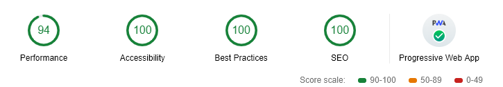

<p align="center">
  <a href="https://navin-moorthy.github.io">
    
  </a>
</p>

<p align="center">
  <a href="https://github.com/navin-navi">
    
  </a>
  <a href="https://travis-ci.org/navin-navi/navin-moorthy.github.io">
    
  </a>
  <a href="https://lgtm.com/projects/g/navin-navi/navin-moorthy.github.io/alerts/">
    
  </a>
  <a href="https://lgtm.com/projects/g/navin-navi/navin-moorthy.github.io/context:javascript">
    
  </a>
  <a href="https://github.com/styled-components/styled-components">
    
  </a>
  <a href="https://github.com/tailwindcss/tailwindcss">
    
  </a>
</p>

<p align="center">
  <a href="https://github.com/prettier/prettier">
    
  </a>
  <a href="https://renovatebot.com" target="_blank" rel="noopener">
    
  </a>
  <a href="https://david-dm.org/navin-navi/navin-moorthy.github.io">
    
  </a>
  <a href="https://david-dm.org/navin-navi/navin-moorthy.github.io?type=dev">
    
  </a>
</p>

<p align="center">
  My personal portfolio & blog. Built with Gatsby.js.
</p>

<p align="center">
  Playful & colorful blog with Parallax effect
</p>

<p align="center">
  Developed upon <a href="https://github.com/LekoArts/gatsby-starter-portfolio-cara">Gatsby Starter Portfolio: Cara</a>
</p>

<p align="center">
  <strong>
  Checkout my site at <a href="https://navin-moorthy.github.io">Navin-Navi</a>
  </strong>
</p>

<p align="center">
  <a href="https://codesandbox.io/s/navin-navigithubio-egxzq?fontsize=14">
    
  </a>
</p>

<p align="center">
  <a href="https://twitter.com/navin_navi19">
    
  </a>
</p>

---

## 🖥 Tech Stack

- Developed with [Gatsby](https://www.gatsbyjs.org)
- Contents served from [Github](https://github.com) as Markdown files
- [TravisCI](https://travis-ci.org/) for CI and Build checks
- Hosted on [GithubPages](https://pages.github.com/)
- [Renovate](https://renovatebot.com) for auto dependency updates
- [LGTM](https://lgtm.com/) Automated Code Review Enabled

## 🧐 Features

**Google Lighthouse Audit Result**



- [React Spring](https://github.com/drcmda/react-spring) (Used for Parallax effect)
- [TailwindCSS](https://tailwindcss.com/) & [styled-components](https://www.styled-components.com/) for styling
  - Use the full power of TailwindCSS while generating small styles (as unused data gets deleted)
  - Uses `tailwind.macro` (Babel macro) to have hot-reloading of Tailwind styles
- 🤖 Google Analytics Support.
- Generate Sitemap XML.
- 🧙 Offline Support PWA
- WebApp Manifest Support
- Blogging with Markdown usign Markdown Remark
- Supports Pagination with multiple posts.
- 💄 Code syntax highlighting by [Prismjs](https://prismjs.com/) With [Fira Code](https://github.com/tonsky/FiraCode)
- Responsive images
  - The right image size for every screen size
  - Traced SVG Loading (Lazy-Loading)
  - WebP Support
- SEO
  - Schema.org JSONLD
  - OpenGraph Tags
  - Twitter Tags
- [Typefaces](https://github.com/KyleAMathews/typefaces) for quicker font loading
- ⚙ Easily Configurable

> 💡 The parallax effect can be quite heavy for some older CPUs and the site uses some newer CSS features which will result in incompatibility with older browsers.

## 🚀 Quick start

### ❗️ Pre-requisite

Check your development environment! You'll need [Node.js](https://nodejs.org/en/), the [Gatsby CLI](https://www.gatsbyjs.org/docs/) and [node-gyp](https://github.com/nodejs/node-gyp#installation) installed. The official Gatsby website also lists two articles regarding this topic:

- [Gatsby on Windows](https://www.gatsbyjs.org/docs/gatsby-on-windows/)
- [Check your development environment](https://www.gatsbyjs.org/tutorial/part-zero/)

### ⚛️ Create a Gatsby Site

Use the Gatsby CLI to create a new site, specifying the blog starter.

```sh
gatsby new <project-name> https://github.com/navin-navi/navin-moorthy.github.io
cd <project-name>
npm start
```

Your site is now running at `http://0.0.0.0:8080`!

> 💡 You'll also see a second link: `http://0.0.0.0:8080/___graphql`. This is a tool you can use to experiment with querying your data. Learn more about using this tool in the [Gatsby tutorial](https://www.gatsbyjs.org/tutorial/part-five/#introducing-graphiql).\_

Edit `src/pages/index.js`, save your changes and the browser will update in real time!

### ⚒ Building your site

```sh
npm run build
```

Copy the content of the `public` folder to your webhost or use a website like Netlify which automates that for you.

### ⚒ Build and deploy with Github Pages

1. Install `npm install [gh-pages](https://www.npmjs.com/package/gh-pages) --save-dev`.
2. Use the `config/deploy-github.js` to configure your `public` folder to get deployed in mentioned github repository and branch.
3. Now run `npm run deploy:github`.

> 💡 You will be asked to enter your Github Username and Password.

Alternatively, this flow can be automated using Travis CI - [Docs](https://docs.travis-ci.com/user/deployment/pages/)

### 🆕 Adding new features/plugins

You can add other features by having a look at the official [plugins page](https://www.gatsbyjs.org/docs/plugins/).

## 😎 Configuration

You have multiple options to configure this project.

### ❗️ Important Configurations

1. Use the `config/website.js` to configure data passed to the **SEO component** and other parts of the Gatsby site

2. Use the `tailwind.js` file to configure TailwindCSS. Their [documentation](https://tailwindcss.com/docs/configuration) explains it step-by-step.

3. For changing the animation or styles, modify the files in the `src/styles` directory.

4. Modify the sections in the `src/views` directory. They contain the Dividers & SVG icons.

5. You can also place the icons somewhere else on the page, modify their animation and hide them on smaller screens.

6. Blog contents can be found in `content/blog` and blog templates in `src/blog-components/...`

### 🛠 Icons Configuration

```JSX
  <SVG icon="triangle" hideMobile width={48} stroke={colors.orange} left="10%" top="20%" />
  <SVG icon="hexa" width={48} stroke={colors.red} left="60%" top="70%" />
  <SVG icon="box" width={6} fill={colors['grey-darker']} left="60%" top="15%" />
```

- For `icon`, you have the options: `triangle, circle, arrowUp, upDown, box, hexa, cross`
- If you want the SVG to be hidden on mobile view, add `hideMobile` to the SVG component
- You can define the width via the TailwindCSS width [option](https://tailwindcss.com/docs/width)
- The colors get defined via the TailwindCSS color [option](https://tailwindcss.com/docs/colors)
  - 💡 You will either have to define the color in `stroke` **or** `fill` depending on the icon. For reference, have a look at the currently used SVGs
- The options `left` and `top` position the icon relatively to its parent container
- You can also wrap the SVGs with `<UpDown />` or `<UpDownWide />` to animate them

### 🖊 Typography

Instead of relying on Google's CDN to host its fonts, this site self-hosts the fonts and therefore benefits from increased performance. The installed fonts and global styles import can be found in `gatsby-browser.js`:

This starter uses [typefaces](https://github.com/KyleAMathews/typefaces) by Kyle Mathews. Have a look at the repository if you want to install & use other fonts.

You'll also need to configure `fonts` in `tailwind.js` or in `src/styles/globalStyles.css` to reflect the changes.

#### 🗃 Folder Structure View

##### ⚙ Gatsby config

```
/root
├── gatsby-browser.js // font, polyfill, onClientRender ...
├── gatsby-config.js // Gatsby config
├── config/website.js // Template meta SEO config
└── gatsby-node.js // Gatsby Node config
```

##### ⛑ Source Structure

```
src
├── blog-components // Blog templates and associated components
│   ├── Blog.jsx // Blog Home
│   └── BlogPostTemplate.jsx // Markdown Pages Template
├── components // Reusable components
│   └── SEO.jsx // SEO customization with REACT HELMET here
├── elements // Small elements to be used within components
├── images // Avatar and SVG's
├── pages // routing
│   ├── 404.jsx
│   └── index.jsx
└── styles // Styles that are used across the site
```

##### 🎨 Style

You can customize styles in `src/styles` directory.

```
src/styles
├── animation.jsx // All Animations are exported from here
├── color.jsx // Tailwind Color Shortcut
├── globalStyles.css // Global Styles
├── prism-a11y-dark.css // Prism JS Code Highlighting
└── utils.jsx // Mobile Display Hide Utils
```

##### 🍭 Tips (You can change...)

- Profile image! (replace file in `src/images/avatar.jpg`)
- Favicon image! (replace file in `static/favicon.ico`)
- Logo image! (replace file in `static/logo.png`)
- PWA theme customization! (edit file in `static/browserconfig.xml`)
- Edit robot.txt! (file in `static/robots.txt`)
- Google Verification (file in `static/google051e1d59950b0532.html`)

## 💫 Thanks and Credits

### [LekoArts](https://www.lekoarts.de)

> Design based on [LekoArts](https://www.lekoarts.de) - [gatsby-starter-portfolio-cara](https://github.com/LekoArts/gatsby-starter-portfolio-cara)

If you want to quickly bootstrap a design/photography portfolio or use it as a foundation for your personal site, the starters in _gatsby-starter-portfolio_ are a perfect fit for you! The project's goal is to offer minimalistic and fast websites.

I hope thier like my starters and create something awesome! To see some of thier other works, you can visit [website](https://www.lekoarts.de) or support them on [Patreon](https://www.patreon.com/lekoarts) to get some neat rewards (4K images, project files, tutorial insights). Every pledge on Patreon helps them create more free starters!

Also, check out the other starters for _gatsby-starter-portfolio_:

- [gatsby-starter-portfolio-emma](https://github.com/LekoArts/gatsby-starter-portfolio-emma)
- [gatsby-starter-portfolio-emilia](https://github.com/LekoArts/gatsby-starter-portfolio-emilia)
- [gatsby-starter-portfolio-bella](https://github.com/LekoArts/gatsby-starter-portfolio-bella)
- [gatsby-starter-portfolio-jodie](https://github.com/LekoArts/gatsby-starter-portfolio-jodie)

Check out the [Gatsby Starter Portfolio Overview](https://gatsby-starter-portfolio.netlify.com/)!

> Pagination based on [Nicky Starter Blog](https://github.com/NickyMeuleman/gatsby-paginated-blog)

> Dark/Light Theme and more based on [JaeYeopHan's Starter Blog](https://github.com/JaeYeopHan/gatsby-starter-bee)

> Thanks to [@bradlc](https://github.com/bradlc)’s work on [babel-plugin-tailwind-components](https://github.com/bradlc/babel-plugin-tailwind-components), we can easily get the power of Tailwind without the stylesheet bloat by passing Tailwind classes into styled-components with **Babel macros** 🎉.

## 🤔 If...

If you are currently writing in the Medium, consider migration with [medium-to-own-blog](https://github.com/mathieudutour/medium-to-own-blog)!

## :bug: Bug reporting

[Issue](https://github.com/navin-navi/navin-moorthy.github.io/issues)

## ™️ LICENSE

[MIT](./LICENSE)

<div align="center">

<sub><sup>Project by <a href="https://github.com/navin-navi"> @Navin Navi</a></sup></sub><small>✌</small>

</div>
