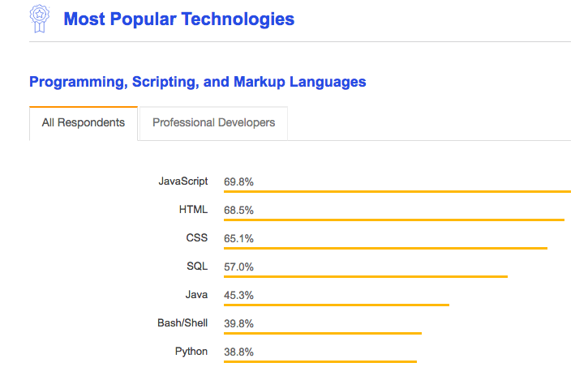

[11 JavaScript Utility Libraries you Should Know in 2019](https://blog.bitsrc.io/11-javascript-utility-libraries-you-should-know-in-2018-3646fb31ade) by [Jonathan Saring](https://blog.bitsrc.io/@JonathanSaring)

> **Tip:** Use [Bit](https://github.com/teambit/bit) to discover and install specific functions from these libraries. You can find many of them in the Bit community, or share your own. Take a look.

## Notes

[2018 Insights](https://insights.stackoverflow.com/survey/2018/#most-popular-technologies)

### 1. Underscore & Lodash (dah)

[Lodash](https://github.com/lodash/lodash) - Lodash, NPM’s most downloaded and most dependent-upon package, was built to provide more consistent cross-environment iteration support for arrays, strings, objects, and arguments objects.

[Underscore](https://github.com/jashkenas/underscore) - Underscore was built to provide utility functions for common tasks in Javascript.

### 2. Ramda

[Ramda](https://github.com/ramda/ramda) - This JS utility library is designed for functional programming, making it easy to create functional pipelines that don’t mutate user data.

**Worth Noting:** [Immutable.js](https://github.com/immutable-js/immutable-js)

### 3. MathJS

[MathJS](https://github.com/josdejong/mathjs) - Math.js is an extensive math library for JavaScript and Node.js, which is compatible with JavaScript’s built-in Math library.

### 4. Moment/date-fns

[Moment](https://github.com/moment/moment) - moment.js is a JavaScript date and time manipulation library for parsing, validating, manipulating, and formatting dates.

[Date-fns](https://github.com/date-fns/date-fns) - Date-fns is a growingly popular (11K stars, over half a million weekly NPM installs) time manipulation library for Javascript, chosen by many developers to replace moment.js (see comparison) providing over 130 functions to manipulate dates in the browser and Node.js.

### 5. Sugar

[Sugar](https://github.com/andrewplummer/Sugar) - Sugar is a Javascript utility library for working with native objects.

### 6. Lazy

[Lazy](https://github.com/dtao/lazy.js) - lazy.js is a functional utility library for JavaScript with a lazy engine that “strives to do as little work as possible” while still being flexible enough.

### 7. CollectJS

[CollectJS](https://github.com/ecrmnn/collect.js) - collect.js is a very promising and dependency free wrapper for working with arrays and objects in Javascript with dozens of useful functionalities in and API which is (almost) identical to Laravel Collections

### 8. ChanceJS

[ChanceJS](https://github.com/chancejs/chancejs) - Chance is a minimalist generator of random strings, numbers, etc. to help reduce some monotony, while writing automated tests or anywhere else you need anything random.

### 9. ChartJS

[ChartJS](https://github.com/chartjs/Chart.js) - chart.js is a great example of how sometimes less is more with 8 different data visualization types, each of them animated and customizable.

### 10. Polished

[Polished](https://github.com/styled-components/polished) - Polished is a great lightweight toolset for writing styles in JavaScript with Sass-style helper functions and mixins.

### 11. Mout

[Mout](https://github.com/mout/mout) - Mout.js is a collection of modular JavaScript utilities that can be used in the browser as AMD modules or on node.js, providing helper methods similar to those found on other languages standart libraries (Python, Ruby, PHP etc).

### Honourable Mentions

[Voca](https://github.com/panzerdp/voca) - A Javascript library for string manipulations.

[Licia](https://github.com/liriliri/licia) - A simple collection of useful JavaScript snippets with high docs and test coverage
