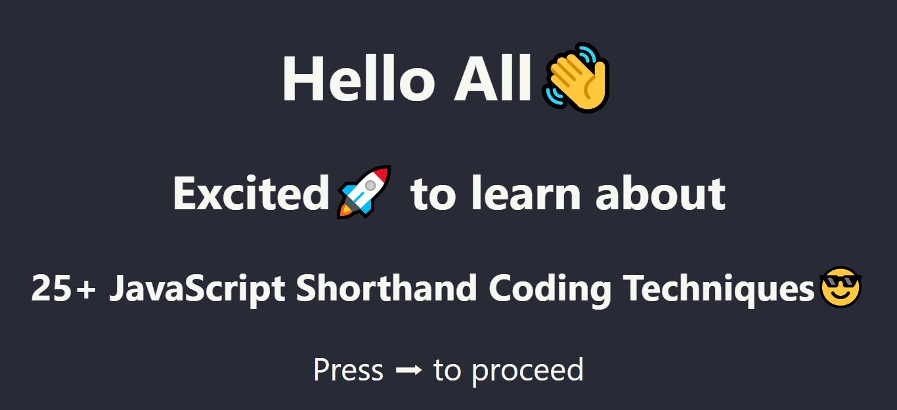

[Click here](https://modest-haibt-c12a49.netlify.com/) to see the Presentation version of this blog

Website - [SitePoint](https://www.sitepoint.com/shorthand-javascript-techniques/)
Authors - [Michael Wanyoike](https://www.sitepoint.com/author/mwanyoike/) & [Sam Deering](https://www.sitepoint.com/author/sdeering/)

Reference:

- [es6console](https://es6console.com)

## Notes

### 1. The Ternary Operator

Longhand:

```js
const x = 20;
let answer;

if (x > 10) {
  answer = "greater than 10";
} else {
  answer = "less than 10";
}
```

Shorthand:

```js
const answer = x > 10 ? "greater than 10" : "less than 10";
```

You can also nest your if statement like this:

```js
const answer =
  x > 10 ? "greater than 10" : x < 5 ? "less than 5" : "between 5 and 10";
```

### 2. Short-circuit Evaluation Shorthand

Longhand:

```js
if (variable1 !== null || variable1 !== undefined || variable1 !== "") {
  let variable2 = variable1;
}
```

Shorthand:

```js
const variable2 = variable1 || "new";
```

Example:

```js
let variable1;
let variable2 = variable1 || "bar";

console.log(variable2 === "bar"); // prints true

variable1 = "foo";
variable2 = variable1 || "bar";

console.log(variable2); // prints foo
```

### 3. Declaring Variables Shorthand

Longhand:

```js
let x;
let y;
let z = 3;
```

Shorthand:

```js
let x,
  y,
  z = 3;
```

### 4. If Presence Shorthand

Longhand:

```js
if (likeJavaScript === true)
```

Shorthand:

```js
if (likeJavaScript)
```

Example:

Longhand:

```js
let a;
if (a !== true) {
  // do something...
}
```

Shorthand:

```js
let a;
if (!a) {
  // do something...
}
```

### 5. JavaScript For Loop Shorthand

Longhand:

```js
const fruits = ['mango', 'peach', 'banana'];
for (let i = 0; i < fruits.length; i++)
```

Shorthand:

```js
const fruits = ['mango', 'peach', 'banana'];
for (let fruit of fruits)
```

For accessing 'index' in an array:

```js
const fruits = ['mango', 'peach', 'banana'];
for (let index in fruits)
```

For accessing 'keys' in an object:

```js
const obj = { continent: "Africa", country: "Kenya", city: "Nairobi" };
for (let keys in obj) console.log(keys); // output: continent, country, city
```

forEach():

```js
function logArrayElements(element, index, array) {
  console.log("a[" + index + "] = " + element);
}
[2, 5, 9].forEach(logArrayElements);
// a[0] = 2
// a[1] = 5
// a[2] = 9
```

### 6. Decimal Base Exponents

Longhand:

```js
for (let i = 0; i < 10000; i++) {}
```

Shorthand:

```js
for (let i = 0; i < 1e7; i++) {}

// All the below will evaluate to true
1 === 1;
1e1 === 10;
1e2 === 100;
1e3 === 1000;
1e4 === 10000;
1e5 === 100000;
```

### 7. Object Property Shorthand

Longhand:

```js
const x = 1920,
  y = 1080;
const obj = { x: x, y: y };
```

Shorthand:

```js
const obj = { x, y };
```

### 8. Arrow Functions Shorthand

Longhand:

```js
function sayHello(name) {
  console.log("Hello", name);
}

setTimeout(function() {
  console.log("Loaded");
}, 2000);

list.forEach(function(item) {
  console.log(item);
});
```

Shorthand:

```js
sayHello = name => console.log("Hello", name);

setTimeout(() => console.log("Loaded"), 2000);

list.forEach(item => console.log(item));
```

### 9. Implicit Return Shorthand

Longhand:

```js
function calcCircumference(diameter) {
  return Math.PI * diameter;
}
```

Shorthand:

```js
calcCircumference = diameter => (
  Math.PI * diameter;
)
```

### 10. Default Parameter Values

Longhand:

```js
function volume(l, w, h) {
  if (w === undefined) w = 3;
  if (h === undefined) h = 4;
  return l * w * h;
}

volume(2);
```

Shorthand:

```js
volume = (l, w = 3, h = 4) => l * w * h;

volume(2);
```

### 11. Template Literals

Longhand:

```js
const welcome = "You have logged in as " + first + " " + last + ".";

const db = "http://" + host + ":" + port + "/" + database;
```

Shorthand:

```js
const welcome = `You have logged in as ${first} ${last}`;

const db = `http://${host}:${port}/${database}`;
```

### 12. Destructuring Assignment Shorthand

Longhand:

```js
const observable = require("mobx/observable");
const action = require("mobx/action");
const runInAction = require("mobx/runInAction");

const store = this.props.store;
const form = this.props.form;
const loading = this.props.loading;
const errors = this.props.errors;
const entity = this.props.entity;
```

Shorthand:

```js
import { observable, action, runInAction } from "mobx";

const { store, form, loading, errors, entity } = this.props;

const { store, form, loading, errors, entity: contact } = this.props;
```

### 13. Multi-line String Shorthand

Longhand:

```js
const lorem =
  "Lorem ipsum dolor sit amet, consectetur\n\t" +
  "adipisicing elit, sed do eiusmod tempor incididunt\n\t" +
  "ut labore et dolore magna aliqua. Ut enim ad minim\n\t" +
  "veniam, quis nostrud exercitation ullamco laboris\n\t" +
  "nisi ut aliquip ex ea commodo consequat. Duis aute\n\t" +
  "irure dolor in reprehenderit in voluptate velit esse.\n\t";
```

Shorthand:

```js
const lorem = `Lorem ipsum dolor sit amet, consectetur
    adipisicing elit, sed do eiusmod tempor incididunt
    ut labore et dolore magna aliqua. Ut enim ad minim
    veniam, quis nostrud exercitation ullamco laboris
    nisi ut aliquip ex ea commodo consequat. Duis aute
    irure dolor in reprehenderit in voluptate velit esse.`;
```

### 14. Spread Operator Shorthand

Longhand:

```js
// joining arrays
const odd = [1, 3, 5];
const nums = [2, 4, 6].concat(odd);

// cloning arrays
const arr = [1, 2, 3, 4];
const arr2 = arr.slice();
```

Shorthand:

```js
// joining arrays
const odd = [1, 3, 5];
const nums = [2, 4, 6, ...odd];
const nums = [2, ...odd, 4, 6];
console.log(nums); // [ 2, 4, 6, 1, 3, 5 ]

// cloning arrays
const arr = [1, 2, 3, 4];
const arr2 = [...arr]; // [1, 2, 3, 4]

// object destructuring
const { a, b, ...z } = { a: 1, b: 2, c: 3, d: 4 };
console.log(a); // 1
console.log(b); // 2
console.log(z); // { c: 3, d: 4 }
```

### 15. Mandatory Parameter Shorthand

Longhand:

```js
function foo(bar) {
  if (bar === undefined) {
    throw new Error("Missing parameter!");
  }
  return bar;
}
```

Shorthand:

```js
mandatory = () => {
  throw new Error("Missing parameter!");
};

foo = (bar = mandatory()) => {
  return bar;
};
```

### 16. Array.find Shorthand

Longhand:

```js
const pets = [
  { type: "Dog", name: "Max" },
  { type: "Cat", name: "Karl" },
  { type: "Dog", name: "Tommy" }
];

function findDog(name) {
  for (let i = 0; i < pets.length; ++i) {
    if (pets[i].type === "Dog" && pets[i].name === name) {
      return pets[i];
    }
  }
}
```

Shorthand:

```js
pet = pets.find(pet => pet.type === "Dog" && pet.name === "Tommy");
console.log(pet); // { type: 'Dog', name: 'Tommy' }
```

### 17. Object [key] Shorthand(Form Validation)

Longhand:

```js
function validate(values) {
  if (!values.first) return false;
  if (!values.last) return false;
  return true;
}

console.log(validate({ first: "Bruce", last: "Wayne" })); // true
```

Shorthand:

```js
// object validation rules
const schema = {
  first: {
    required: true
  },
  last: {
    required: true
  }
};

// universal validation function
const validate = (schema, values) => {
  for (field in schema) {
    if (schema[field].required) {
      if (!values[field]) {
        return false;
      }
    }
  }
  return true;
};

console.log(validate(schema, { first: "Bruce" })); // false
console.log(validate(schema, { first: "Bruce", last: "Wayne" })); // true
```

### 18. Double Bitwise NOT Shorthand

Bitwise operators are one of those features you learn about in beginner JavaScript tutorials and you never get to implement them anywhere. Besides, who wants to work with ones and zeroes if you are not dealing with binary?

There is, however, a very practical use case for the Double Bitwise NOT operator. You can use it as a replacement for Math.floor(). The advantage of the Double Bitwise NOT operator is that it performs the same operation much faster. You can read more about Bitwise operators [here](https://developer.mozilla.org/en/docs/Web/JavaScript/Reference/Operators/Bitwise_Operators).

Longhand:

```js
Math.floor(4.9) === 4; //true
```

Shorthand:

```js
~~4.9 === 4; //true
```

### 19. Exponent Power Shorthand

Longhand:

```js
Math.pow(2, 3); // 8
Math.pow(2, 2); // 4
Math.pow(4, 3); // 64
```

Shorthand:

```js
2 ** 3; // 8
2 ** 4; // 4
4 ** 3; // 64
```

### 20. Converting a String into a Number

Longhand:

```js
const num1 = parseInt("100");
const num2 = parseFloat("100.01");
```

Shorthand:

```js
const num1 = +"100"; // converts to int data type
const num2 = +"100.01"; // converts to float data type
```

### 21. Object Property Assignment

Longhand:

```js
var _extends = function(target) {
  for (var i = 1; i < arguments.length; i++) {
    var source = arguments[i];
    for (var key in source) {
      if (Object.prototype.hasOwnProperty.call(source, key)) {
        target[key] = source[key];
      }
    }
  }
  return target;
};

var fname = { firstName: "Black" };
var lname = { lastName: "Panther" };

var full_name = _extends({}, fname, { middleName: "Magic" }, lname);
console.log(full_name);
```

Shorthand:

```js
const fname = { firstName: "Black" };
const lname = { lastName: "Panther" };

let full_names = Object.assign({}, fname, lname);
```

```js
const fname = { firstName: "Black" };
const lname = { lastName: "Panther" };

const full_name = { ...fname, middleName: "Magic", ...lname };
console.log(full_name);
```

### 22. Bitwise IndexOf Shorthand

Longhand:

```js
if (arr.indexOf(item) > -1) {
  // Confirm item IS found
}

if (arr.indexOf(item) === -1) {
  // Confirm item IS NOT found
}
```

Shorthand:

```js
if (~arr.indexOf(item)) {
  // Confirm item IS found
}

if (!~arr.indexOf(item)) {
  // Confirm item IS NOT found
}
```

```js
if (arr.includes(item)) {
  // Returns true if the item exists, false if it doesn't
}
```

### 23. Object.entries()

This is a feature that was introduced in ES8 that allows you to convert a literal object into a key/value pair array.

```js
const credits = { producer: "John", director: "Jane", assistant: "Peter" };
const arr = Object.entries(credits);
console.log(arr);

/** Output:
[ [ 'producer', 'John' ],
  [ 'director', 'Jane' ],
  [ 'assistant', 'Peter' ]
]
**/
```

### 24. Object.keys()

This is also a new feature introduced in ES8 that performs a similar function to Object.entries(), but with only the key part:

```js
const credits = { producer: "John", director: "Jane", assistant: "Peter" };
const arr = Object.keys(credits);

console.log(arr);
/** Output:
["producer", "director", "assistant"]
**/
```

### 25. Object.values()

This is also a new feature introduced in ES8 that performs a similar function to Object.entries(), but with only the values part:

```js
const credits = { producer: "John", director: "Jane", assistant: "Peter" };
const arr = Object.values(credits);

console.log(arr);
/** Output:
[ 'John', 'Jane', 'Peter' ]
**/
```
