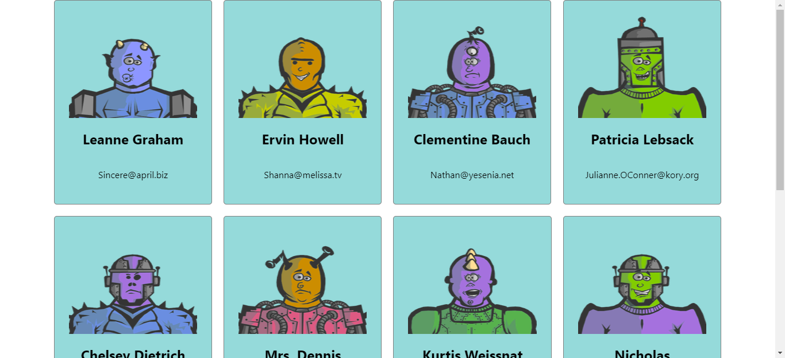
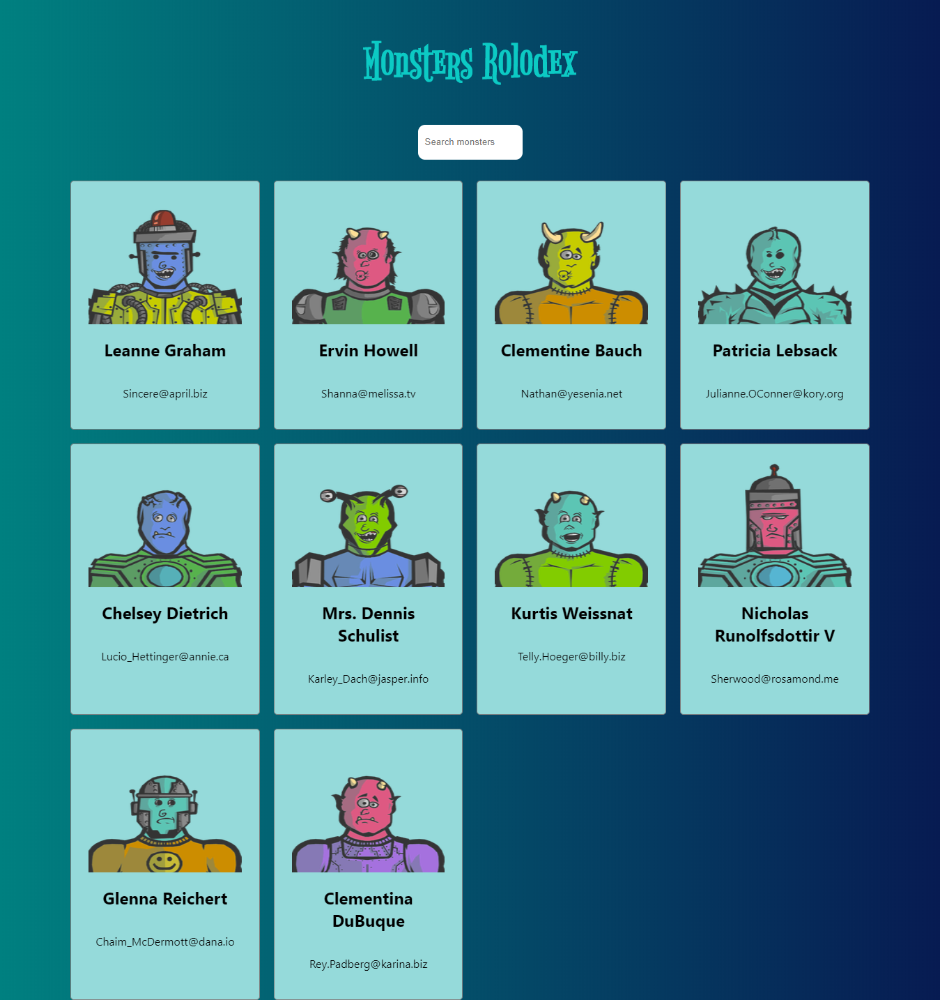
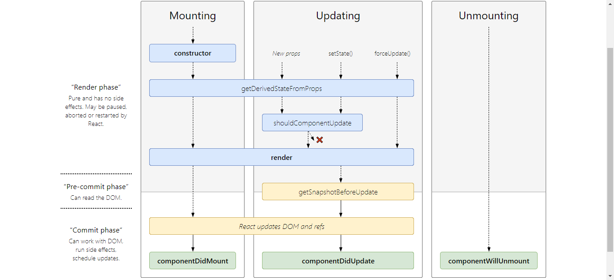

Become a Senior [React](https://reactjs.org/) Developer! Build a massive E-commerce app with [Redux](https://redux.js.org/), [Hooks](https://reactjs.org/docs/hooks-intro.html), [GraphQL](https://graphql.org/), [Context-API](https://reactjs.org/docs/context.html), [Stripe](https://stripe.com/), [Firebase](https://firebase.google.com/)

Created by [Andrei Neagoie](https://www.udemy.com/user/andrei-neagoie/), [Yihua Zhang](https://www.udemy.com/user/yihua-zhang-5/)

Twitter : [Andrei Neagoie](https://twitter.com/AndreiNeagoie)

Udemy Link - [Complete React Developer in 2019 (w/ Redux, Hooks, GraphQL)](https://www.udemy.com/complete-react-developer-zero-to-mastery)

🌟 _Get all the Sections from the Udemy Course_

```js
$$(".section--title--eCwjX").map(sections => sections.textContent);
```

> Images pasted here are captured using Chrome's Capture Screenshot Feature


## Section 1: Introduction


🌟 _Get titles for Section 1 & 2_

```js
$$(".curriculum-item-link--curriculum-item--KX9MD").map(
  title => title.textContent
);
```

### 1. Course Outline


### 2. Join Our Online Classroom

Join [Zero to Mastery Discord Channel](https://discord.gg/nVmbHYY)

[](https://discord.gg/nVmbHYY)

### 3. Exercise: Meet The Community

Introduce yourself in the Discord Community

## Section 2: React Key Concepts

### 4. React Concepts


### 5. The Birth of React.js

🌟 _Traditional HTML, CSS and JavaScript with less cross-browser support_

🌟 _Files are requested and served from the browser every time_


🌟 _JQuery and Backbone JS along with AJAX provided the cross-browser support and handling JS much easier_


🌟 _In `2010`, Google introduced SPA(Single Page Application) with AngularJS using concepts of MVC - Model View Controller and containers_

🌟 _As the size of the application grows, it becomes harder to manage the flow with many container._


🌟 _In `2013`, Facebook comes with React Framework to improving the drawbacks of AngularJS_


🌟 _Since then AngularJS evolved to Angular(Now Angular 8) and React with lots of new features._


### 6. Declarative vs Imperative

Imperative - Modify the DOM one by one based on the current app state using JavaScript


Declarative - This is where React is developed for, we just need say the state and how the page should look like. React will do everything for us which increases the performance of DOM manipulation.

### 7. Component Architecture


> Install [React Dev Tools](https://chrome.google.com/webstore/detail/react-developer-tools/fmkadmapgofadopljbjfkapdkoienihi?hl=en) from Chrome Web Store to debug the Original React Components.

### 8. One Way Data Flow


### 9. UI Library


- [React Desktop](https://reactdesktop.js.org/)
- [React Blessed - Terminal app](https://github.com/Yomguithereal/react-blessed)
- [React 360](https://facebook.github.io/react-360/)

### 10. How To Be A Great React Developer


## Section 3: React Basics


🌟 _Script used to get all the titles under this topic_

```js
[
  ...document.getElementsByClassName("curriculum-item-link--title--zI5QT")
].forEach(title => {
  console.log(title.textContent);
});
```

### 11. Section Overview

- Learn about installing [Node](https://nodejs.org/en/) directly
- Learn about installing [NVM-Node](https://github.com/nvm-sh/nvm) indirectly(I personally prefer this)
- Use [CodeSandbox](https://codesandbox.io/) or [StackBlitz](https://stackblitz.com/) to code online.
- Learn about [Create React App](https://reactjs.org/docs/create-a-new-react-app.html)

### 12. Environment Setup for Mac

- Install [VSCode](https://code.visualstudio.com/)
- Install [Yarn](https://yarnpkg.com/)
- Install [Node](https://nodejs.org/en/) directly
- Install [NVM-Node](https://github.com/nvm-sh/nvm) indirectly(I personally prefer this)

### 13. Environment Setup For Windows

- Install [GitBash](https://gitforwindows.org/)
- Install [VSCode](https://code.visualstudio.com/)
- Install [Node](https://nodejs.org/en/) directly
- Install [NVM-Node](https://github.com/nvm-sh/nvm) indirectly(I personally prefer this)
- Install [Yarn](https://yarnpkg.com/)

### 14. NPM vs YARN

🌟 _Install dependencies from package.json_

`npm install` == `yarn`

🌟 _Install a package and add to package.json_

`npm install package --save` == `yarn add package`

🌟 _Install a devDependency to package.json_

`npm install package --save-dev` == `yarn add package --dev`

🌟 _Remove a dependency from package.json_

`npm uninstall package --save` == `yarn remove package`

🌟 _Upgrade a package to its latest version_

`npm update --save` == `yarn upgrade`

🌟 _Install a package globally_

`npm install package -g` == `yarn global add package`

### 15. Yihua's VSCode font and settings

- I personally love [Fira Code](https://github.com/tonsky/FiraCode) and updated VS Code setting to use ligaments
- Install the below extension if needed,


### 16. Create React App

🌟 _[Basic app](https://zhangmyihua.github.io/monsters-rolodex/) that we are going to build_


- `npx create-react-app monsters-rolodex`
- `cd monsters-rolodex`
- `npm install`
- `npm start`
- Hit the browser `http://localhost:8080`
- Voila Starter Application is Up with Live Reload
- Uses Babel & WebPack in the background.

### 17. Create React App 2


`package.json`

```json
{
  "name": "monsters-rolodex",
  "version": "0.1.0",
  "private": true,
  "dependencies": {
    "react": "^16.8.6",
    "react-dom": "^16.8.6",
    "react-scripts": "3.0.1"
  },
  "scripts": {
    // start the development server
    "start": "react-scripts start",
    // build the project - production grade
    "build": "react-scripts build",
    // used of testing the react app
    "test": "react-scripts test",
    // eject the configurations that create react app did automatically
    "eject": "react-scripts eject"
    // only the configurations are ejected not the application
  },
  "eslintConfig": {
    "extends": "react-app"
  },
  "browserslist": {
    "production": [">0.2%", "not dead", "not op_mini all"],
    "development": [
      "last 1 chrome version",
      "last 1 firefox version",
      "last 1 safari version"
    ]
  }
}
```

🌟 _App start from index.html_

`public/index.html`

```html
<!DOCTYPE html>
<html lang="en">
  <head>
    <meta charset="utf-8" />
    <link rel="shortcut icon" href="%PUBLIC_URL%/favicon.ico" />
    <meta name="viewport" content="width=device-width, initial-scale=1" />
    <meta name="theme-color" content="#000000" />
    <!--
      manifest.json provides metadata used when your web app is installed on a
      user's mobile device or desktop. See https://developers.google.com/web/fundamentals/web-app-manifest/
    -->
    <link rel="manifest" href="%PUBLIC_URL%/manifest.json" />
    <!--
      Notice the use of %PUBLIC_URL% in the tags above.
      It will be replaced with the URL of the `public` folder during the build.
      Only files inside the `public` folder can be referenced from the HTML.

      Unlike "/favicon.ico" or "favicon.ico", "%PUBLIC_URL%/favicon.ico" will
      work correctly both with client-side routing and a non-root public URL.
      Learn how to configure a non-root public URL by running `npm run build`.
    -->
    <title>React App</title>
  </head>
  <body>
    <noscript>You need to enable JavaScript to run this app.</noscript>
    <div id="root"></div>
    <!--
      This HTML file is a template.
      If you open it directly in the browser, you will see an empty page.

      You can add webfonts, meta tags, or analytics to this file.
      The build step will place the bundled scripts into the <body> tag.

      To begin the development, run `npm start` or `yarn start`.
      To create a production bundle, use `npm run build` or `yarn build`.
    -->
  </body>
</html>
```

_public folder also contains `favicon.ico` and `manifest.json` for PWA_

_`index.html` is referenced by our React app at `src/index.js`_

`src/index.js`

```js
import React from "react";
import ReactDOM from "react-dom";
import "./index.css";
import App from "./App";
import * as serviceWorker from "./serviceWorker";

ReactDOM.render(<App />, document.getElementById("root"));

// If you want your app to work offline and load faster, you can change
// unregister() to register() below. Note this comes with some pitfalls.
// Learn more about service workers: https://bit.ly/CRA-PWA
serviceWorker.unregister();
```

_`ReactDOM` renders our `<App />` by replacing the element with id `root`_

🌟 _Global Styles and Service Workers are imported here_

`src/index.css`

```css
body {
  margin: 0;
  font-family: -apple-system, BlinkMacSystemFont, "Segoe UI", "Roboto",
    "Oxygen", "Ubuntu", "Cantarell", "Fira Sans", "Droid Sans",
    "Helvetica Neue", sans-serif;
  -webkit-font-smoothing: antialiased;
  -moz-osx-font-smoothing: grayscale;
}

code {
  font-family: source-code-pro, Menlo, Monaco, Consolas, "Courier New",
    monospace;
}
```

`src/App.js`

```js
import React from "react";
import logo from "./logo.svg";
import "./App.css";

function App() {
  return (
    <div className="App">
      <header className="App-header">
        
        <p>
          Edit <code>src/App.js</code> and save to reload.
        </p>
        <a
          className="App-link"
          href="https://reactjs.org"
          target="_blank"
          rel="noopener noreferrer"
        >
          Learn React
        </a>
      </header>
    </div>
  );
}

export default App;
```

🌟 _Root of our React Component_

🌟 _App.css and logo.svg are imported here_

`src/App.css`

```css
.App {
  text-align: center;
}

.App-logo {
  animation: App-logo-spin infinite 20s linear;
  height: 40vmin;
  pointer-events: none;
}

.App-header {
  background-color: #282c34;
  min-height: 100vh;
  display: flex;
  flex-direction: column;
  align-items: center;
  justify-content: center;
  font-size: calc(10px + 2vmin);
  color: white;
}

.App-link {
  color: #61dafb;
}

@keyframes App-logo-spin {
  from {
    transform: rotate(0deg);
  }
  to {
    transform: rotate(360deg);
  }
}
```

`src/App.test.js`

🌟 _It is used for testing_

```js
import React from "react";
import ReactDOM from "react-dom";
import App from "./App";

it("renders without crashing", () => {
  const div = document.createElement("div");
  ReactDOM.render(<App />, div);
  ReactDOM.unmountComponentAtNode(div);
});
```

🌟 _Extras_

`.gitignore`

```text
# See https://help.github.com/articles/ignoring-files/ for more about ignoring files.

# dependencies
/node_modules
/.pnp
.pnp.js

# testing
/coverage

# production
/build

# misc
.DS_Store
.env.local
.env.development.local
.env.test.local
.env.production.local

npm-debug.log*
yarn-debug.log*
yarn-error.log*
```

`node_modules` will be the home for our modules installed via npm.

`package-lock.json` will be used for checking the integrity of the packages installed.

### 18. React Project Setup


### 19. Don't Eject

`npm run eject`

Gives the Webpack and other configuration that are created under-hood when creating a new react app using `creat-react-app`

### 20. Class Components

`React.Component`

[React.Component Documentation](https://reactjs.org/docs/react-component.html)


`src/App.js`

```js{1,5-13,18-19}
import React, { Component } from "react";
import logo from "./logo.svg";
import "./App.css";

class App extends Component {
  constructor() {
    super();

    this.state = {
      string: "Navin"
    };
  }
  render() {
    return (
      <div className="App">
        <header className="App-header">
          
          <p>{this.state.string} is editing this App</p>
          <button onClick={() => this.setState({ string: "Navi" })}>
            Dont like Navin - Click Me
          </button>
        </header>
      </div>
    );
  }
}

export default App;
```


- Import `{Component}` from `react`
- Change the `App` function into a class extending `Component
- Utilize the `state` from Component by a `contructor` function with `super()`.
- Initialize a variable in the state using `this.state`
- Change the state using `this.setState()` when button clicked `onClick()`

### 21. Thinking In JSX

Learned about how state rerenders the components on an event trigger.

### 22. Dynamic Content

🌟 _Learned about displaying dynamic contents using map()_

`src/App.js`

```js
import React, { Component } from "react";
// import logo from "./logo.svg";
import "./App.css";

class App extends Component {
  constructor() {
    super();

    this.state = {
      mosters: [
        { name: "Frankenstein", id: 1 },
        { name: "Dracula", id: 2 },
        { name: "Zombie", id: 3 }
      ]
    };
  }
  render() {
    return (
      <div className="App">
        {this.state.mosters.map(moster => {
          return <h1 key={moster.id}>{moster.name}</h1>;
        })}
      </div>
    );
  }
}

export default App;
```


### 23. Optional: map() + key attribute

Will be explained in `Appendix 1: Key Developer Concepts`

### 24. Single Page Application


[What is JSON?](https://www.w3schools.com/whatis/whatis_json.asp)
[JSON Placeholder](https://jsonplaceholder.typicode.com/)

### 25. Fetching Content

🌟 _Learned about fetching JSON content from JSON Placeholder and update the state_

`src/App.js`

```js
import React, { Component } from "react";
// import logo from "./logo.svg";
import "./App.css";

class App extends Component {
  constructor() {
    super();

    this.state = {
      monsters: []
    };
  }

  componentDidMount() {
    fetch("https://jsonplaceholder.typicode.com/users")
      .then(res => res.json())
      .then(users => this.setState({ monsters: users }));
  }

  render() {
    return (
      <div className="App">
        {this.state.monsters.map(monster => {
          return <h1 key={monster.id}>{monster.name}</h1>;
        })}
      </div>
    );
  }
}

export default App;
```


### 26. Optional: Promises

Will be explained in `Appendix 1: Key Developer Concepts`

### 27. Architecture Our App

🌟 _Learned about how to file structure components and styles_

### 28. Card List Component


[A Complete Guide to Grid](https://css-tricks.com/snippets/css/complete-guide-grid/)

[Intro to Grid Layout](https://gridbyexample.com/learn/)

`src/App.js`

```js{4-6, 25-29}
import React, { Component } from "react";
import "./App.css";

// Components
import { CardList } from "./components/card-list/card-list.component";

class App extends Component {
  constructor() {
    super();

    this.state = {
      monsters: []
    };
  }

  componentDidMount() {
    fetch("https://jsonplaceholder.typicode.com/users")
      .then(res => res.json())
      .then(users => this.setState({ monsters: users }));
  }

  render() {
    return (
      <div className="App">
        <CardList>
          {this.state.monsters.map(monster => {
            return <h1 key={monster.id}>{monster.name}</h1>;
          })}
        </CardList>
      </div>
    );
  }
}

export default App;
```

`src/components/card-list/card-list.component.jsx`

```js
import React from "react";
import "./card-list.styles.css";

export const CardList = props => {
  return <div className="card-list">{props.children}</div>;
};
```

`src/components/card-list/card-list.styles.css`

```css
.card-list {
  width: 85vw;
  margin: 0 auto;
  display: grid;
  grid-template-columns: 1fr 1fr 1fr 1fr;
  grid-gap: 20px;
}
```

### 29. Card Component



`src/App.js`

```js{25}
import React, { Component } from "react";
import "./App.css";

// Components
import { CardList } from "./components/card-list/card-list.component";

class App extends Component {
  constructor() {
    super();

    this.state = {
      monsters: []
    };
  }

  componentDidMount() {
    fetch("https://jsonplaceholder.typicode.com/users")
      .then(res => res.json())
      .then(users => this.setState({ monsters: users }));
  }

  render() {
    return (
      <div className="App">
        <CardList monsters={this.state.monsters} />
      </div>
    );
  }
}

export default App;
```

`src/components/card-list/card-list.component.jsx`

```js{3,6-12}
import React from "react";
import "./card-list.styles.css";
import { Card } from "../card/card.component";

export const CardList = props => {
  return (
    <div className="card-list">
      {props.monsters.map(monster => (
        <Card key={monster.id} monster={monster} />
      ))}
    </div>
  );
};
```

`src/components/card/card.component.jsx`

```js
import React from "react";
import "./card.styles.css";

export const Card = props => (
  <div className="card-container">
    
    <h2>{props.monster.name}</h2>
    <p>{props.monster.email}</p>
  </div>
);
```

`src/components/card/card.styles.css`

```css
.card-container {
  display: flex;
  flex-direction: column;
  background-color: #95dada;
  border: 1px solid grey;
  border-radius: 5px;
  padding: 25px;
  cursor: pointer;
  transform: translateZ(0);
  transition: transform 0.25s ease-out;
}

.card-container:hover {
  transform: scale(1.05);
}
```

[Random Robo Image Generator](https://robohash.org/)

### 30. Exercise: Breaking Into Components


- Make the Component as small as possible.
- Re-usability
- Flexibility
- Each component does one login makes it easier to use in other place
- Easier Testing
- With better naming we can identify the functionality of each component.

### 31. State vs Props

- Learned to use [React Developer Tool](https://chrome.google.com/webstore/detail/react-developer-tools/fmkadmapgofadopljbjfkapdkoienihi?hl=en) for seeing components, states, props and keys.
- Learned about how state from one component affects other components when passed as props.
- If state changes, then all the child component will rerender.

### 32. SearchField State

Learned about [setState](https://reactjs.org/docs/react-component.html#setstate).

🌟 _Added Search Field to the App_

`src/App.js`

```js{12-13,26-30}
import React, { Component } from "react";
import "./App.css";

// Components
import { CardList } from "./components/card-list/card-list.component";

class App extends Component {
  constructor() {
    super();

    this.state = {
      monsters: [],
      searchField: ""
    };
  }

  componentDidMount() {
    fetch("https://jsonplaceholder.typicode.com/users")
      .then(res => res.json())
      .then(users => this.setState({ monsters: users }));
  }

  render() {
    return (
      <div className="App">
        <input
          type="search"
          placeholder="Search monsters"
          onChange={e => this.setState({ searchField: e.target.value })}
        />
        <CardList monsters={this.state.monsters} />
      </div>
    );
  }
}

export default App;
```

### 33. React Events

Learned about React Synthetic Events and how they intercept HTML events.

[Introduction to events](https://developer.mozilla.org/en-US/docs/Learn/JavaScript/Building_blocks/Events)

[HTML onchange event](https://www.w3schools.com/jsref/event_onchange.asp)

[React's Synthetic Events](https://reactjs.org/docs/events.html)

### 34. Filtering State


`src/App.js`

```js{24-28,36}
import React, { Component } from "react";
import "./App.css";

// Components
import { CardList } from "./components/card-list/card-list.component";

class App extends Component {
  constructor() {
    super();

    this.state = {
      monsters: [],
      searchField: ""
    };
  }

  componentDidMount() {
    fetch("https://jsonplaceholder.typicode.com/users")
      .then(res => res.json())
      .then(users => this.setState({ monsters: users }));
  }

  render() {
    const { monsters, searchField } = this.state;
    const filteredMonsters = monsters.filter(monster =>
      monster.name.toLowerCase().includes(searchField.toLowerCase())
    );

    return (
      <div className="App">
        <input
          type="search"
          placeholder="Search monsters"
          onChange={e => this.setState({ searchField: e.target.value })}
        />
        <CardList monsters={filteredMonsters} />
      </div>
    );
  }
}

export default App;
```

### 35. Optional: filter(), includes()

Will be explained in `Appendix 1: Key Developer Concepts`

### 36. Search Box Component


`src/App.js`

```js{6,32,34}
import React, { Component } from "react";
import "./App.css";

// Components
import { CardList } from "./components/card-list/card-list.component";
import { SearchBox } from "./components/search-box/search-box.component";

class App extends Component {
  constructor() {
    super();

    this.state = {
      monsters: [],
      searchField: ""
    };
  }

  componentDidMount() {
    fetch("https://jsonplaceholder.typicode.com/users")
      .then(res => res.json())
      .then(users => this.setState({ monsters: users }));
  }

  render() {
    const { monsters, searchField } = this.state;
    const filteredMonsters = monsters.filter(monster =>
      monster.name.toLowerCase().includes(searchField.toLowerCase())
    );

    return (
      <div className="App">
        <SearchBox
          placeholder="Search monsters"
          handleChange={e => this.setState({ searchField: e.target.value })}
        />
        <CardList monsters={filteredMonsters} />
      </div>
    );
  }
}

export default App;
```

`src/components/search-box/search-box.component.jsx`

```js
import React from "react";
import "./search-box.styles.css";

export const SearchBox = ({ placeholder, handleChange }) => (
  <input
    className="search"
    type="search"
    placeholder={placeholder}
    onChange={handleChange}
  />
);
```

`src/components/search-box/search-box.styles.css`

```css
.search {
  -webkit-appearance: none;
  border: none;
  outline: none;
  padding: 10px;
  width: 150px;
  line-height: 30px;
  margin-bottom: 30px;
}
```

### 37. Exercise: Where To Put State

🌟 _Learned on where to put the state because of the one way data flow_

### 38. Class Methods and ArrowFunctions

[Handling Events](https://reactjs.org/docs/handling-events.html)

🌟 _Learned about how `this` is bind to normal function and how JavaScript binds this to arrow function automatically to its context when the component gets created_

`src/App.js`

```js{18-21,38}
import React, { Component } from "react";
import "./App.css";

// Components
import { CardList } from "./components/card-list/card-list.component";
import { SearchBox } from "./components/search-box/search-box.component";

class App extends Component {
  constructor() {
    super();

    this.state = {
      monsters: [],
      searchField: ""
    };
  }

  handleChange = e => {
    this.setState({ searchField: e.target.value });
  };

  componentDidMount() {
    fetch("https://jsonplaceholder.typicode.com/users")
      .then(res => res.json())
      .then(users => this.setState({ monsters: users }));
  }

  render() {
    const { monsters, searchField } = this.state;
    const filteredMonsters = monsters.filter(monster =>
      monster.name.toLowerCase().includes(searchField.toLowerCase())
    );

    return (
      <div className="App">
        <SearchBox
          placeholder="Search monsters"
          handleChange={this.handleChange}
        />
        <CardList monsters={filteredMonsters} />
      </div>
    );
  }
}

export default App;
```

### 39. Exercise: Event Binding

🌟 _Learned about Event Binding and how this works through a simple exercise_

### 40. Quick Note: Binding in React

we learned about arrow functions and binding in React. A good rule of thumb is this: Use arrow functions on any class methods you define and aren't part
of React (i.e. render(), componentDidMount()).

If you want to learn more about this, [have a read here](https://reactjs.org/docs/handling-events.html)

### 41. Optional: Git + GitHub

Will be explained in `Appendix 1: Key Developer Concepts`

### 42. Optional: Connecting With SSH To Github

There are two ways to connect to a Github repository, through HTTPS and SSH. You can switch between the two options by clicking the switch https/ssh button after clicking clone. HTTPS does not require setup.


It is recommended by Github to clone using HTTPS according to their [official documentation here](https://help.github.com/en/articles/which-remote-url-should-i-use). However, if you do end up using SSH and have never set it up before, there are a couple steps you must take first!

Firstly, SSH is like a unique fingerprint you generate for your computer in your terminal, which you then let your github account know about so it knows that requests from this computer using SSH (cloning/ pushing/ pulling) are safe to do.

In order to generate an SSH, [please follow the instructions here](https://help.github.com/en/enterprise/2.15/user/articles/generating-a-new-ssh-key-and-adding-it-to-the-ssh-agent)

### 43. Deploying Our App



`package.json`

```json{5,7,17-18}
{
  "name": "monsters-rolodex",
  "version": "0.1.0",
  "private": true,
  "homepage": "http://navin-navi.github.io/monsters-rolodex",
  "dependencies": {
    "gh-pages": "^2.1.0",
    "react": "^16.8.6",
    "react-dom": "^16.8.6",
    "react-scripts": "3.0.1"
  },
  "scripts": {
    "start": "react-scripts start",
    "build": "react-scripts build",
    "test": "react-scripts test",
    "eject": "react-scripts eject",
    "predeploy": "npm run build",
    "deploy": "gh-pages -d build --git git"
  },
  "eslintConfig": {
    "extends": "react-app"
  },
  "browserslist": {
    "production": [">0.2%", "not dead", "not op_mini all"],
    "development": [
      "last 1 chrome version",
      "last 1 firefox version",
      "last 1 safari version"
    ]
  }
}
```

`public/index.html`

```html{13-16}
<!DOCTYPE html>
<html lang="en">
  <head>
    <meta charset="utf-8" />
    <link rel="shortcut icon" href="%PUBLIC_URL%/favicon.ico" />
    <meta name="viewport" content="width=device-width, initial-scale=1" />
    <meta name="theme-color" content="#000000" />
    <!--
      manifest.json provides metadata used when your web app is installed on a
      user's mobile device or desktop. See https://developers.google.com/web/fundamentals/web-app-manifest/
    -->
    <link rel="manifest" href="%PUBLIC_URL%/manifest.json" />
    <link
      href="https://fonts.googleapis.com/css?family=Bigelow+Rules&display=swap"
      rel="stylesheet"
    />
    <!--
      Notice the use of %PUBLIC_URL% in the tags above.
      It will be replaced with the URL of the `public` folder during the build.
      Only files inside the `public` folder can be referenced from the HTML.

      Unlike "/favicon.ico" or "favicon.ico", "%PUBLIC_URL%/favicon.ico" will
      work correctly both with client-side routing and a non-root public URL.
      Learn how to configure a non-root public URL by running `npm run build`.
    -->
    <title>React App</title>
  </head>
  <body>
    <noscript>You need to enable JavaScript to run this app.</noscript>
    <div id="root"></div>
    <!--
      This HTML file is a template.
      If you open it directly in the browser, you will see an empty page.

      You can add webfonts, meta tags, or analytics to this file.
      The build step will place the bundled scripts into the <body> tag.

      To begin the development, run `npm start` or `yarn start`.
      To create a production bundle, use `npm run build` or `yarn build`.
    -->
  </body>
</html>
```

`src/index.css`

```css{8-12}
body {
  margin: 0;
  font-family: -apple-system, BlinkMacSystemFont, "Segoe UI", "Roboto",
    "Oxygen", "Ubuntu", "Cantarell", "Fira Sans", "Droid Sans",
    "Helvetica Neue", sans-serif;
  -webkit-font-smoothing: antialiased;
  -moz-osx-font-smoothing: grayscale;
  background: linear-gradient(
    to left,
    rgba(7, 27, 82, 1) 0%,
    rgba(0, 128, 128, 1) 100%
  );
}

code {
  font-family: source-code-pro, Menlo, Monaco, Consolas, "Courier New",
    monospace;
}
```

`src/App.js`

```js{36}
import React, { Component } from "react";
import "./App.css";

// Components
import { CardList } from "./components/card-list/card-list.component";
import { SearchBox } from "./components/search-box/search-box.component";

class App extends Component {
  constructor() {
    super();

    this.state = {
      monsters: [],
      searchField: ""
    };
  }

  handleChange = e => {
    this.setState({ searchField: e.target.value });
  };

  componentDidMount() {
    fetch("https://jsonplaceholder.typicode.com/users")
      .then(res => res.json())
      .then(users => this.setState({ monsters: users }));
  }

  render() {
    const { monsters, searchField } = this.state;
    const filteredMonsters = monsters.filter(monster =>
      monster.name.toLowerCase().includes(searchField.toLowerCase())
    );

    return (
      <div className="App">
        <h1>Monsters Rolodex</h1>
        <SearchBox
          placeholder="Search monsters"
          handleChange={this.handleChange}
        />
        <CardList monsters={filteredMonsters} />
      </div>
    );
  }
}

export default App;
```

`src/App.css`

```css{4-9}
.App {
  text-align: center;
}

h1 {
  font-family: "Bigelow Rules";
  font-size: 72px;
  color: #0ccac4;
}
```

`src/components/search-box/search-box.styles.css`

```css{2,7,11-12, 15-17}
.search {
  font-size: 16px;
  -webkit-appearance: none;
  border: none;
  outline: none;
  padding: 10px;
  width: 200px;
  line-height: 30px;
  margin-bottom: 30px;
  border-radius: 10px;
  color: white;
  background-color: #4dd0e1;
}

.search::placeholder {
  color: rgba(255, 255, 255, 0.5);
}
```

`src/components/card/card.styles.css`

```css{2,3}
.card-container {
  /*display: flex;*/
  /*flex-direction: column;*/
  background-color: #95dada;
  border: 1px solid grey;
  border-radius: 5px;
  padding: 25px;
  cursor: pointer;
  transform: translateZ(0);
  transition: transform 0.25s ease-out;
}

.card-container:hover {
  transform: scale(1.05);
}
```

`src/components/card-list/card-list.styles.css`

```css{5, 9-25}
.card-list {
  width: 85vw;
  margin: 0 auto;
  display: grid;
  grid-template-columns: 1fr;
  grid-gap: 20px;
}

@media (min-width: 640px) {
  .card-list {
    grid-template-columns: 1fr 1fr 1fr;
  }
}

@media (min-width: 900px) {
  .card-list {
    grid-template-columns: 1fr 1fr 1fr;
  }
}

@media (min-width: 1160px) {
  .card-list {
    grid-template-columns: 1fr 1fr 1fr 1fr;
  }
}
```

- Deploying to GitHub
- Served through gh-pages
- Responsive to multiple screen sizes

[Monsters Rolodex](https://navin-navi.github.io/monsters-rolodex/)

### 44. React and ReactDOM

🌟 _Learned about plain React and ReactDOM in JavaScript using CDN packages_

🌟 _Learned what React Library does in the background with JSX syntax_

[React CDN Links](https://reactjs.org/docs/cdn-links.html)

```html
<!DOCTYPE html>
<html lang="en">
  <head>
    <meta charset="UTF-8" />
    <meta name="viewport" content="width=device-width, initial-scale=1.0" />
    <meta http-equiv="X-UA-Compatible" content="ie=edge" />
    <title>React Plain</title>
  </head>
  <body>
    <div id="root">React Not Rendered</div>
    <script
      crossorigin
      src="https://unpkg.com/react@16/umd/react.development.js"
    ></script>
    <script
      crossorigin
      src="https://unpkg.com/react-dom@16/umd/react-dom.development.js"
    ></script>
    <script>
      const Persons = props =>
        React.createElement("div", {}, [
          React.createElement("h2", {}, props.name),
          React.createElement("p", {}, props.occupation)
        ]);

      const App = () =>
        React.createElement("div", {}, [
          React.createElement(Persons, {
            name: "Navin",
            occupation: "Web Developer"
          }),
          React.createElement(Persons, {
            name: "Vasanth",
            occupation: "Mainframe Developer"
          }),
          React.createElement(Persons, {
            name: "Boopalan",
            occupation: "Python Developer"
          })
        ]);

      ReactDOM.render(
        React.createElement(App),
        document.getElementById("root")
      );
    </script>
  </body>
</html>
```

<https://codepen.io/navinnavi19/pen/GVGaJR>

### 45. Revisiting Virtual-DOM +Unidirectional Data Flow


🌟 _Learned the diff between Virtual DOM and DOM and how change in state changes only the affected DOM using Virtual DOM with Unidirectional Flow._

Used `Chrome Dev Tool->More Tools->Rendering->Paint Flashing` to see the affected part of the DOM for state changes.


### 46. Asynchronous setState

🌟 _Learned about how state changes asynchrously and how we can make it change in respective to prevState._

<https://codepen.io/navinnavi19/pen/KOeLxQ>

### 47. Introducing LifeCycle Methods

- 48.Mounting
- 49.Updating
- 50.Unmounting



<https://codepen.io/navinnavi19/pen/ymqYQd>

[React LifeCycle Interactive Diagram](http://projects.wojtekmaj.pl/react-lifecycle-methods-diagram/)

[LifeCycle Method Example Repo](https://github.com/ZhangMYihua/lifecycles-lesson)

### Quiz 1: When should we use a functional component vs a class com

> We want to create a new component in React that doesn't need any local state management or access to lifecycle methods in the component. What kind of component should we make?

_Functional components are the best type of component to render if you don't need access to state or LifeCycle methods! It has benefits of being easy to test, easier to read, and easier to write!_

### 51. Section Review

🌟 _Reviewed all the code done in this section_

## Section 4: Master Project: SettingUp E-commerce Project

🌟 _Run the below code to get all the sub headings of this section_

```js
$$(".curriculum-item-link--title--zI5QT").map(el => el.textContent);
```

### 52. The Long Road Ahead


### 53. Project Overview


### 54. GitHub + Project Repositories

### 55. Course Guideline + GitHub Links

🌟 _Instructions on how to clone and follow guide for the site_

[E-Commerce Lesson 1](https://github.com/ZhangMYihua/lesson-1)

### 56. Quick Note About GitHub

🌟 _Fork [Yihua Repo](https://github.com/ZhangMYihua/) and clone it to have our own repo_

### 57. E-commerce Homepage +SASS setup

`npx create-react-app crown-clothing`

`Removed unused codes`

`npm i -S node-sass`

[Node-SASS](https://www.npmjs.com/package/node-sass)

[View file changes in GitHub](https://github.com/navin-navi/crown-clothing-react/commit/35902d11137a2e80fe497d80872bdfe99489b979?diff=split)


### 58. Project Files + Modules

🌟 _Quick intro for the project files and modules that come preinstalled with `create-react-app`_

🌟 _Also learned about the troubleshooting steps when encountered an error_

### 59. Project Component Architecture

🌟 _Quick intro on folder structure and how to easily understand the components without getting lost_

### 60. CSS and SCSS files

🌟 _Note on both CSS and SCSS files will be included for use_

### 61. Homepage and Directory Components


[View file changes in GitHub](https://github.com/navin-navi/crown-clothing-react/commit/711f42d1e8e2a6b75f571efb130c8ad75662b171?diff=split)

### 62. Styling Menu Items


[View file changes in GitHub](https://github.com/navin-navi/crown-clothing-react/commit/e99fdec5907a7331fd8afa8103e1dff8d4edee23?diff=split)

[cubic-bezier timing function - MDN](https://developer.mozilla.org/en-US/docs/Web/CSS/timing-function)

## Section 5: Master Project: ReactRouter and Routing

🌟 _Run the below code to get all the sub headings of this section_

```js
$$(".curriculum-item-link--title--zI5QT").map(el => el.textContent);
```

### 63. Routing In React

🌟 _Quick intro to React Router on how it works on the browser_

### 64. Routing In Our Project

`npm install --save react-router-dom`

🌟 _Brief intro to React Router on how it works via `react-router-dom`_

[React Router DOM](https://www.npmjs.com/package/react-router-dom)

[React Router Documentation](https://reacttraining.com/react-router/web/guides/quick-start)

### 65. React Router DOM

🌟 _Deep dive into React Router on how it works on via `react-router-dom` using an example repo_

[React Router GitHub repo example](https://github.com/ZhangMYihua/react-router-demo)

```js{10, 20-22, 30, 38-42}
import React from "react";
import { Route, Link } from "react-router-dom";

import "./App.css";

const HomePage = props => {
  console.log(props);
  return (
    <div>
      <button onClick={() => props.history.push("/topics")}>Topics </button>
      <h1>HOME PAGE</h1>
    </div>
  );
};

const TopicsList = props => {
  return (
    <div>
      <h1>TOPIC LIST PAGE</h1>
      <Link to={`${props.match.url}/13`}>TO TOPIC 13</Link>
      <Link to={`${props.match.url}/17`}>TO TOPIC 17</Link>
      <Link to={`${props.match.url}/21`}>TO TOPIC 21</Link>
    </div>
  );
};

const TopicDetail = props => {
  return (
    <div>
      <h1>TOPIC DETAIL PAGE: {props.match.params.topicId}</h1>
    </div>
  );
};

function App() {
  return (
    <div>
      <Route exact path="/" component={HomePage} />
      <Route exact path="/blog/asdqw/topics" component={TopicsList} />
      <Route path="/blog/asdqw/topics/:topicId" component={TopicDetail} />
      <Route exact path="/blog/topics" component={TopicsList} />
      <Route path="/blog/topics/:topicId" component={TopicDetail} />
    </div>
  );
}

export default App;
```

### 66. withRouter()

```js
import React from "react";
import { withRouter } from "react-router-dom";

import "./menu-item.styles.scss";

const MenuItem = ({ title, imageUrl, size, linkUrl, history, match }) => (
  <div
    className={`${size} menu-item`}
    onClick={() => history.push(`${match.url}${linkUrl}`)}
  >
    <div
      style={{ backgroundImage: `url(${imageUrl})` }}
      className="background-image"
    />
    <div className="content">
      <h1 className="title">{title.toUpperCase()}</h1>
      <span className="subtitle">SHOP NOW</span>
    </div>
  </div>
);

export default withRouter(MenuItem);
```

[View file changes in GitHub](https://github.com/navin-navi/crown-clothing-react/commit/94c0cd723847f2ae0982a37902e77acfd689b890)

[Higher Order Components](https://reactjs.org/docs/higher-order-components.html)

## Section 6: Master Project: Forms + Components

🌟 _Run the below code to get all the sub headings of this section_

```js
$$(".curriculum-item-link--title--zI5QT").map(el => el.textContent);
```

### 67. Shopping Data

### 68. Shop Page

`Route: /shop`


[View file changes in GitHub](https://github.com/navin-navi/crown-clothing-react/commit/4c6c7d9efd280fcdc46ec0dc6509b38857511ebe?diff=split)

### 69. Collection Item

`Route: /shop`


[View file changes in GitHub](https://github.com/navin-navi/crown-clothing-react/commit/55fd08c42c1baca20a8e908f740d7edb3e27ffa4?diff=split)

### 70. Header Component

`Route: /`


[View file changes in GitHub](https://github.com/navin-navi/crown-clothing-react/commit/cdf882537ebbda6f4aed1d54044b1dcd42be0d89?diff=split)

### 71. Resources: Importing SVG In React

[React Component](https://facebook.github.io/create-react-app/docs/adding-images-fonts-and-files)

### 72. Introducing Forms In React

🌟 _Quick intro on how sign in and sign up component works and how state is managed in these components(ONLY LOCALLY)_

[HTML Form Introduction](https://developer.mozilla.org/en-US/docs/Learn/HTML/Forms/Your_first_HTML_form)

### 73. Sign In Component

`Route: /signin`


[View file changes in GitHub](https://github.com/navin-navi/crown-clothing-react/commit/d7d5fb36803cffb33b92b563b48c4ce49ff2d4ab?diff=split)

### 74. Form Input Component

`Route: /signin`


[View file changes in GitHub](https://github.com/navin-navi/crown-clothing-react/commit/638f73bb5546ab8ed6638fd53d4ec4b28e1a9b93?diff=split)

### 75. Custom Button Component

`Route: /signin`


[View file changes in GitHub](https://github.com/navin-navi/crown-clothing-react/commit/fa7c61aae7f02ce784bdcdf5fac977b8109b6267?diff=split)

## Section 7: Master Project: Firebase +User Authentication

🌟 _Run the below code to get all the sub headings of this section_

```js
$$(".curriculum-item-link--title--zI5QT").map(el => el.textContent);
```

### 76. Section Overview

🌟 _Quick intro on how Firebase is gonna be taught in this section_

### 77. Firebase Introduction


[Firebase](https://firebase.google.com/)

### 78. Adding a Project to Firebase

[Firebase NPM](https://www.npmjs.com/package/firebase)

- Added `npm i -S firebase` to the project
- Created a new firebase project "crown-clothing-db"
- Created a web app "crown-clothing-db"
- Spark plan for the web app is far more than enough

### 79. Note about GitHub

🌟 _**It is safe to enter the Firebase API in public**_

### 80. Google Sign In Authentication

`Route: /signin`


[View file changes in GitHub](https://github.com/navin-navi/crown-clothing-react/commit/369c729c83c2b2b8ea0afa6e5ff0eb3ab7f85c12?diff=split)

### 81. Cloning From This Point On

🌟 _**Nothing but a note for those who fork the original GitHub repo**_

### 82. Google Sign In Authentication 2

- Added state to look into the current user in `App.js`

[View file changes in GitHub](https://github.com/navin-navi/crown-clothing-react/commit/1a0c601d9cb8792bc102f36a85792cdd4983ebef?diff=split)

### 83. Optional: How to fix 403:restricted_client error

It's possible you may encounter a google Authorization error that says 403:restricted_client. If you do, here are the instructions to fix it!

There should be a Learn More link in the popup, clicking that should take you to the Google APIs console that has three tabs under the header named Credentials, OAuth Consent Screen, and Domain Verification. Go to the OAuth Consent Screen tab and update the Application Name to "crwn-clothing" or any other name you're comfortable with (i.e. the name of your project). Click on save at the bottom, then try logging into your verified Google account thereafter.

### 84. Google Sign In Authentication 3

`Route: /signin`


[View file changes in GitHub](https://github.com/navin-navi/crown-clothing-react/commit/f57219bd63c654a51ed9a7bc478b7814072430c3?diff=split)

[CSS Border Box](https://www.w3schools.com/cssref/css3_pr_box-sizing.asp)

### 85. Firebase Firestore

🌟 _**Quick intro on Firebase Firestore**_

Learned how to

- create Firebase database
- create collections and documents
- query for the collections and documents

### 86. Optional: Async Await

🌟 _**Explained in [Appendix 1: Key Developer Concepts](https://navin-navi.github.io/blog/complete-react-developer-in-2019/#310-async-await)**_

### 87. Storing User Data In Firebase


[View file changes in GitHub](https://github.com/navin-navi/crown-clothing-react/commit/10bb823e334935faef107eefa2b9322c8ee558a7?diff=split)


### 88. Storing User Data In Our App

`src/App.js`

```js{24-41}
import React from "react";
import { Switch, Route } from "react-router-dom";

import "./App.css";

import Header from "./components/header/header.component";
import HomePage from "./pages/homepage/homepage.component";
import SignInAndSignUpPage from "./pages/sign-in-and-sign-up/sign-in-and-sign-up.component";
import ShopPage from "./pages/shop/shop.component";

import { auth, createUserProfileDocument } from "./firebase/firebase.utils";

class App extends React.Component {
  constructor() {
    super();

    this.state = {
      currentUser: null
    };
  }

  unSubscribeFromAuth = null;

  componentDidMount() {
    this.unSubscribeFromAuth = auth.onAuthStateChanged(async userAuth => {
      if (userAuth) {
        const userRef = await createUserProfileDocument(userAuth);

        userRef.onSnapshot(snapShot => {
          this.setState({
            currentUser: {
              id: snapShot.id,
              ...snapShot.data()
            }
          });
        });
      } else {
        this.setState({ currentUser: userAuth });
      }
    });
  }

  componentWillUnmount() {
    this.unSubscribeFromAuth = null;
  }

  render() {
    return (
      <div>
        <Header currentUser={this.state.currentUser} />
        <Switch>
          <Route exact path="/" component={HomePage} />
          <Route exact path="/signin" component={SignInAndSignUpPage} />
          <Route path="/shop" component={ShopPage} />
        </Switch>
      </div>
    );
  }
}

export default App;
```

### 89. Sign Up Component

```js
import React from "react";

import "./sign-up.styles.scss";

import FormInput from "../form-input/form-input.components";
import CustomButton from "../custom-button/custom-button.components";

import { auth, createUserProfileDocument } from "../../firebase/firebase.utils";

class SignUp extends React.Component {
  constructor() {
    super();

    this.state = {
      displayName: "",
      email: "",
      password: "",
      confirmPassword: ""
    };
  }

  handleSubmit = async event => {
    event.preventDefault();

    const { displayName, email, password, confirmPassword } = this.state;

    if (password !== confirmPassword) {
      alert("Passwords do not match");
      return;
    }

    try {
      const { user } = await auth.createUserWithEmailAndPassword(
        email,
        password
      );
      await createUserProfileDocument(user, { displayName });

      this.setState({
        displayName: "",
        email: "",
        password: "",
        confirmPassword: ""
      });
    } catch (error) {
      console.log("Error in sign up", error.message);
    }
  };

  handelChange = event => {
    const { name, value } = event.target;

    this.setState({ [name]: value });
  };

  render() {
    const { displayName, email, password, confirmPassword } = this.state;

    return (
      <div className="sign-up">
        <h2 className="title">I do not have a account</h2>
        <span>Sign up with your email and password</span>
        <form className="sign-up" onSubmit={this.handleSubmit}>
          <FormInput
            type="text"
            name="displayName"
            value={displayName}
            onChange={this.handelChange}
            label="Display Name"
            required
          />
          <FormInput
            type="email"
            name="email"
            value={email}
            onChange={this.handelChange}
            label="Email"
            required
          />
          <FormInput
            type="password"
            name="password"
            value={password}
            onChange={this.handelChange}
            label="Password"
            required
          />
          <FormInput
            type="password"
            name="confirmPassword"
            value={confirmPassword}
            onChange={this.handelChange}
            label="Confirm Password"
            required
          />
          <CustomButton type="Submit">Sign Up</CustomButton>
        </form>
      </div>
    );
  }
}

export default SignUp;
```

```css
.sign-up {
  display: flex;
  flex-direction: column;
  width: 380px;

  .title {
    margin: 10px 0;
  }
}
```

### 90. Sign Up With Email and Password

`Route: /signin`


[View file changes in GitHub](https://github.com/navin-navi/crown-clothing-react/commit/000028a45573c5ff7025e70ed5fbdfd652ef4f55?diff=split)

### 91. Sign In With Email and Password

```js{8,20-30}
import React from "react";

import "./sign-in.styles.scss";

import FormInput from "../form-input/form-input.components";
import CustomButton from "../custom-button/custom-button.components";

import { auth, signInWithGoogle } from "../../firebase/firebase.utils";

class SignIn extends React.Component {
  constructor() {
    super();

    this.state = {
      email: "",
      password: ""
    };
  }

  handleSubmit = async e => {
    e.preventDefault();
    const { email, password } = this.state;

    try {
      await auth.signInWithEmailAndPassword(email, password);
      this.setState({ email: "", password: "" });
    } catch (error) {
      console.log("Error signing in", error.message);
    }
  };

  handleChange = e => {
    const { value, name } = e.target;

    this.setState({ [name]: value });
  };

  render() {
    const { email, password } = this.state;

    return (
      <div className="sign-in">
        <h2 className="title">I already have an account</h2>
        <span>Sign in with you email and password</span>

        <form onSubmit={this.handleSubmit}>
          <FormInput
            type="email"
            name="email"
            value={email}
            handleChange={this.handleChange}
            label="Email"
            required
          />
          <FormInput
            type="password"
            name="password"
            value={password}
            handleChange={this.handleChange}
            label="Password"
            required
          />
          <div className="buttons">
            <CustomButton type="submit">Sign In</CustomButton>
            <CustomButton onClick={signInWithGoogle} isGoogleSignIn>
              Sign in with Google
            </CustomButton>
          </div>
        </form>
      </div>
    );
  }
}

export default SignIn;
```

### Quiz 2: Firebase unsubscribe method

> Whenever we call the onAuthStateChanged() or onSnapshot() methods from our auth library or referenceObject, we get back a function that lets us unsubscribe from the listener we just instantiated. Which lifecycle method should we use to call that unsubscribe method in?

🌟 _**componentWillUnmount**_

🌟 _Calling the unsubscribe function when the component is about to unmount is the best way to make sure we don't get any memory leaks in our application related to listeners still being open even if the component that cares about the listener is no longer on the page._

### 92. Section Review

🌟 _Quick recap on this section coding_

## Section 8: Master Project: Redux 1

🌟 _Run the below code to get all the sub headings of this section_

```js
$$(".curriculum-item-link--title--zI5QT").map(el => el.textContent);
```

### 93. Section Overview


### 94. Redux Introduction


### 95. Redux Concepts


### 96. Redux In Our Application


### 97. Redux Actions and Reducers


### 98. Setting Up Redux 1


🌟 _Installed below three npm packages_

[Redux Logger](https://www.npmjs.com/package/redux-logger) || [Redux](https://www.npmjs.com/package/redux) || [React Redux](https://www.npmjs.com/package/react-redux)

[View file changes in GitHub](https://github.com/navin-navi/crown-clothing-react/commit/c5a8767b815e544abbfe3d7c3d54c84764f3d30b?diff=split)

### 99. Setting Up Redux 2

`src/index.js`

```js
import React from "react";
import ReactDOM from "react-dom";
import { BrowserRouter } from "react-router-dom";
import { Provider } from "react-redux";

import "./index.css";

import App from "./App";

import store from "./redux/store";

ReactDOM.render(
  <Provider store={store}>
    <BrowserRouter>
      <App />
    </BrowserRouter>
  </Provider>,
  document.getElementById("root")
);
```

`src/redux/store.js`

```js
import { createStore, applyMiddleware } from "redux";
import logger from "redux-logger";

import rootReducer from "./root-reducer";

const middlewares = [logger];

const store = createStore(rootReducer, applyMiddleware(...middlewares));

export default store;
```

`src/redux/user/user.action.js`

```js
export const setCurrentUser = user => ({
  type: "SET_CURRENT_USER",
  payload: user
});
```

### 100. connect() and mapStateToProps

### 101. mapDispatchToProps

### 102. User Redirect and User Action-type

### 103. Cart Component

### 104. Card Drop-down Component

### 105. Implementing Redux In Cart

### 106. Add To Cart Styling

### 107. Cart Item Reducer

### 108. Adding Multiple Items To Cart

### 109. Optional: find()

### 110. Cart Item Component

### 111. Optional: reduce()

### 112. Selectors in Redux

### 113. Optional: Memoization

### 114. Reselect Library

### 115. User Selectors

### 116. Checkout Page

### 117. Checkout Page 2

### 118. Extensible Code

### 119. Dispatch Action Shorthand

### 120. Checkout Item Component

### 121. Remove Items From Cart

### 122. Remove Items At Checkout

## Section 9: Master Project: SessionStorage + Persistence

## Section 10: Master Project: Redux 2

## Section 11: Master Project:Advanced Routing

## Section 12: Master Project: StateNormalization

## Section 13: Master Project: StripePayments Part 1

## Section 14: Master Project:Deploying To Production

## Section 15: Master Project: CSS in JS- styled-components

## Section 16: Master Project:Advanced Redux + Firebase

## Section 17: Master Project: HOCPatterns

## Section 18: Master Project: Asynchronous Redux

## Section 19: Master Project:Container Pattern

## Section 20: Master Project:Redux-Saga

## Section 21: Master Project: ReactHooks

## Section 22: Master Project: StripePayments Part 2 - Backend

## Section 23: Master Project: ContextAPI

## Section 24: Master Project: GraphQL+ Apollo

## Section 25: Master Project: MobileSupport

## Section 26: Master Project: ReactPerformance

## Section 27: React Interview Questions + Advice

## Section 28: Bonus: Progressive Web App

## Section 29: Bonus: Testing

## Section 30: Bonus: Webpack + Babel

## Section 31: Bonus: Build a GatsbyJSBlog

## Section 32: Appendix 1: Key Developer Concepts

🌟 _Got all Sub Heading by using the below Script_

`$$(".curriculum-item-link--title--zI5QT").map(text => text.textContent)`

### 304. map()

```js
const myArray = [1, 2, 3, 4];
myArray.map(el => el + 1);
// [2, 3, 4, 5]
myArray.map(() => "b");
// ["b", "b", "b", "b"]
```

### 305. Promises

[MDN-Promises](https://developer.mozilla.org/en-US/docs/Web/JavaScript/Reference/Global_Objects/Promise)

`Resolved Promise`

```js
const newPromise = new Promise((resolve, reject) => {
  if (true) {
    setTimeout(() => resolve("I resolved Successfully"), 1000);
  } else {
    reject("Error - Rejecting");
  }
});

newPromise.then(res => console.log(res)).catch(err => console.log(err));
// Promise {<pending>}
// I resolved Successfully
```

`Rejected Promise`

```js
const newPromise = new Promise((resolve, reject) => {
  if (false) {
    setTimeout(() => resolve("I resolved Successfully"), 1000);
  } else {
    reject("Error - Rejecting");
  }
});

newPromise.then(res => console.log(res)).catch(err => console.log(err));
// Error - Rejecting
```

### 306. filter()

```js
const myArray = [1, 2, 3, 4];
myArray.filter(el => true);
// [1, 2, 3, 4]
myArray.filter(el => false);
// []
myArray.filter(el => el > 2);
// [3, 4]
```

### 307. includes()

`includes(<value>, <index>)`

`Basic`

```js
const myArray = [1, 2, 3, 4, 5, 6, 7, 8, 9];
myArray.includes(5);
// true
myArray.includes(10);
// false
myArray.includes(5, 6);
// false
myArray.includes(5, 3);
// true
```

`Why this happens`

```js
const myArray = [{ id: 1 }, { id: 2 }, { id: 3 }];
myArray.includes({ id: 1 });
// false
const ob1 = { id: 1 };
const ob2 = { id: 2 };
const ob3 = { id: 3 };
const secArray = [ob1, ob2, ob3];
secArray.includes(ob1);
// true
```

> This behavior is because of the JavaScript's difference between Primitive Types and Object Types

- Primitive Types points to the memory of that primitive types.
- Object Types creates a new memory reference.

- Primitive Types are immutable because of the above reason.
- Object Types are mutable.

`Primitve Types`


`Object Types` - _**Objects** & **Arrays**_

### 308. CWD 2019: Git + GitHub

[Refer to Git 101 Post](https://navin-navi.github.io/blog/git-101/#getting-started)

### 309. CWD 2019: Git + GitHub 2

[Refer to Git 101 Post](https://navin-navi.github.io/blog/git-101/#listing-all-branches)

### 310. Async Await

`ES6`


`ES7`


### 311. find()

🌟 _Unlike filter(), find() only gives the first element when the condition matches_

```js
const myArray = [1, 2, 3, 4, 5, 6, 7, 8, 9];
myArray.find(el => el === 5);
// 5
```

### 312. reduce()

```js
const myArray = [1, 2, 3, 4, 5, 6, 7, 8, 9];
myArray.reduce((acc, currEl) => acc + currEl, 0);
// 45
```

### 313. Memoization

`caching repeatedly requested expressions`

```js
const cache = {};

const memoizedfunc = n => {
  if (n in cache) {
    console.log("Cached");
    return cache[n];
  } else {
    console.log("Not Cached");
    cache[n] = n + 80;
    return cache[n];
  }
};

console.log(memoizedfunc(5));
console.log(memoizedfunc(5));
console.log(memoizedfunc(5));
```

### 314. Currying with Closure

🌟 _Function that returns another function utilizing closure to get variables out of the scope and calling them one by one_

```js
const currying = a => b => c => a * b * c;

console.log(currying(5)(2)(10));
```

## Section 33: Bonus: Coupon Codes +Freebies

1. [The Complete Web Developer in 2019: Zero to Mastery](https://www.udemy.com/the-complete-web-developer-zero-to-mastery/?couponCode=EXISTINGSTUDENT138W)
2. [The Complete Junior to Senior Web Developer Roadmap](https://www.udemy.com/the-complete-junior-to-senior-web-developer-roadmap/?couponCode=PART22873)
3. [Advanced JavaScript Concepts](https://www.udemy.com/advanced-javascript-concepts/?couponCode=LEVELUPZTM)
4. [Master the Coding Interview: Data Structures + Algorithms](https://www.udemy.com/course/master-the-coding-interview-data-structures-algorithms/?couponCode=EXISTINGSTUDENT138W)


