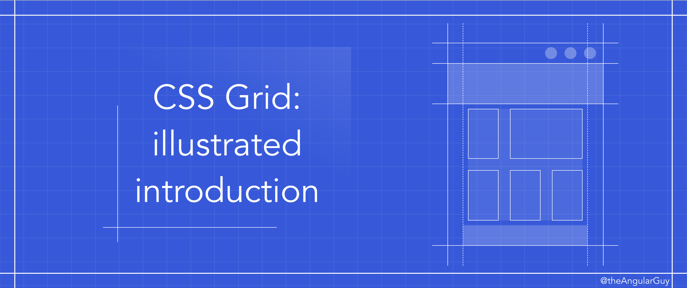
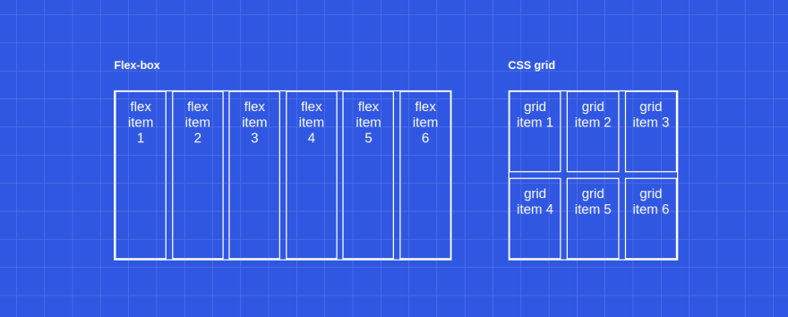
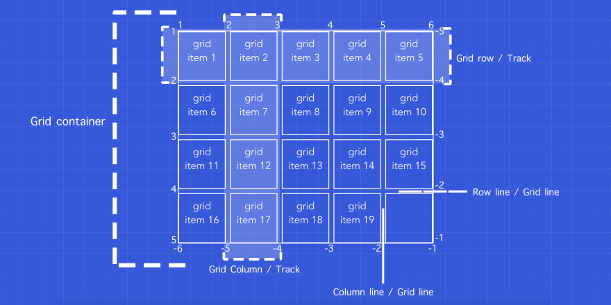
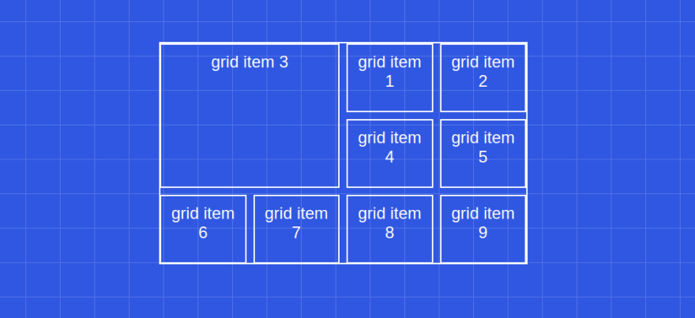
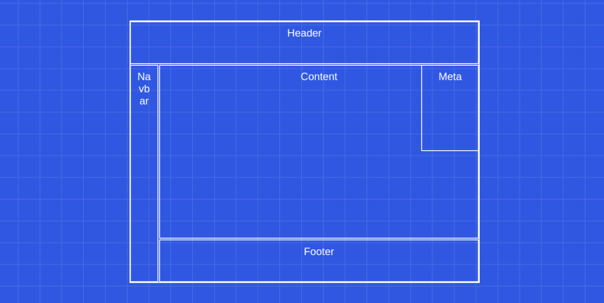
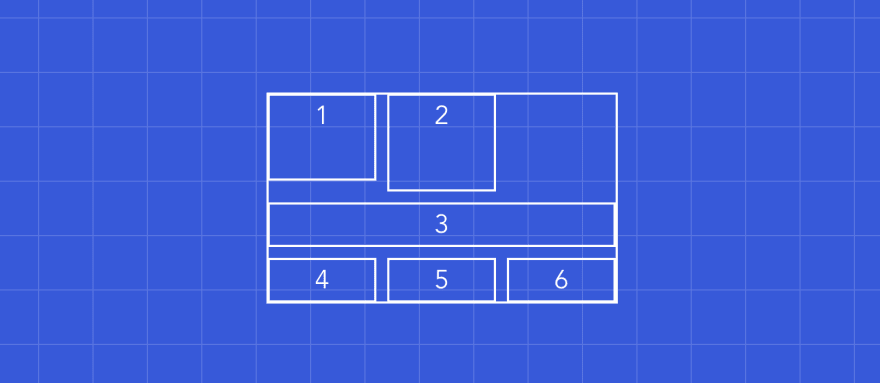
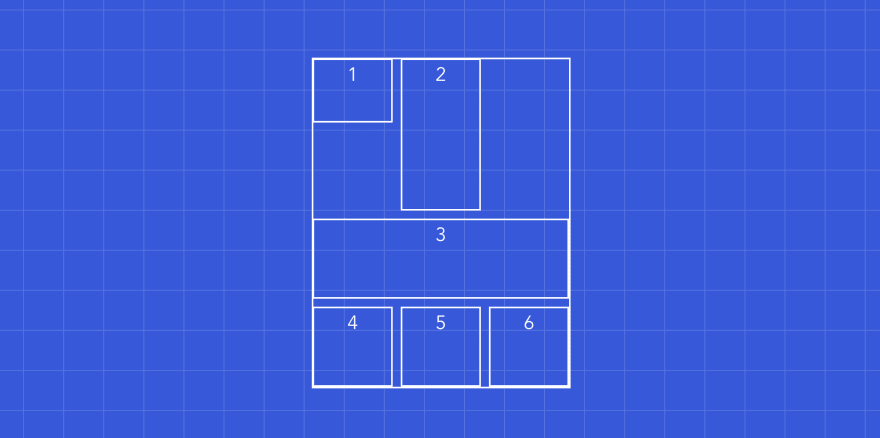
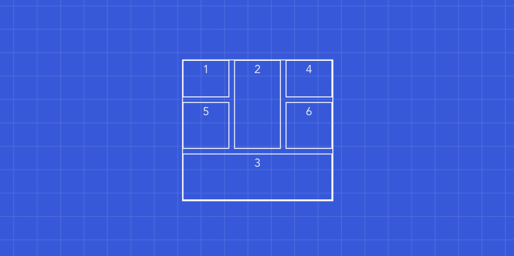

## 🚀 [CSS Grid: illustrated introduction](https://dev.to/mustapha/css-grid-illustrated-introduction-52l5)

👨‍💻 By [Mustapha](https://dev.to/mustapha)

🌟 Does `CSS grid` replace `flex-box`?

Well, CSS grid does not replace flex-box. They are two different tools for different purposes. Actually, they work very well together, we can have a flex display inside grid display and vice versa.

🌟 What are the differences between `CSS grid` and `flex-box`?

There are a lot of differences, but the main one is that `flex-box`is a `one-dimensional layout` system whereas `CSS grid` is a `two-dimensional layout` system.



🌟 Is CSS grid production-ready?

It depends. Do you need to support: IE, Opera mini, Blackberry browser, or Baidu mobile? If the answer is no, then yes it is production-ready, if the answer is yes then you might use it anyway for the browsers that support it (unprefixed: 91.61%) using the `@supports` CSS at-rule:

```js
@supports (display: grid) {
  div {
    display: grid;
  }
}
```

### 🎈Basics

Basically, a grid could be broken down to 2️⃣ elements:

1️⃣ the grid container
2️⃣ the grid items.



### 🎈 CSS Properties

https://codepen.io/navinnavi19/pen/GRKGypp

```html
<div class="grid-container">
  <div class="grid-item">grid item 1</div>
  <div class="grid-item">grid item 2</div>
  <div class="grid-item">grid item 3</div>
  <div class="grid-item">grid item 4</div>
  <div class="grid-item">grid item 5</div>
  <div class="grid-item">grid item 6</div>
  <div class="grid-item">grid item 7</div>
  <div class="grid-item">grid item 8</div>
  <div class="grid-item">grid item 9</div>
</div>
```

**Note:** `fr` is a fractional unit, so 1fr is for 1 part of the available space.

#### 🌟 Display

Display - `display: grid;`

#### 🌟 Rows & Columns

Rows - `grid-template-rows: 1fr auto 2fr;`
Columns - `grid-template-columns: 1fr 1fr 1fr 1fr;`
Both Rows and Columns
Row/Columss - `grid-template: 1fr auto 2fr / 1fr 1fr 1fr 1fr ;`

### 🌟 Repeat function

Repeat - `grid-template: 1fr auto 2fr / repeat(4, 1fr);`

### 🌟 Minmax function

MinMax - `grid-template: 1fr auto 2fr / repeat(4, minmax(100px, 1fr));`

### 🌟 Gaps

Row Gap - `row-gap: 5px;`
Column Gap - `column-gap: 10px;`

Define the row-gap then the column-gap

Gap = `gap: 5px 10px`

If the row-gap is the same as the column-gap, we can specify only one value.

### 🌟 The grid items

**LongHand**

|    Properties     |                                                                       Definitions                                                                       |
| :---------------: | :-----------------------------------------------------------------------------------------------------------------------------------------------------: |
|  grid-row-start   |    The grid-row-start CSS property specifies a grid item’s start position within the grid row by contributing a line, a span, or nothing (automatic)    |
|   grid-row-end    |      The grid-row-end CSS property specifies a grid item’s end position within the grid row by contributing a line, a span, or nothing (automatic)      |
| grid-column-start | The grid-column-start CSS property specifies a grid item’s start position within the grid column by contributing a line, a span, or nothing (automatic) |
|  grid-column-end  |   The grid-column-end CSS property specifies a grid item’s end position within the grid column by contributing a line, a span, or nothing (automatic)   |

**ShortHand**

| Properties  |                                                                           Definitions                                                                            |
| :---------: | :--------------------------------------------------------------------------------------------------------------------------------------------------------------: |
|  grid-row   |       The grid-row CSS property is a shorthand property for grid-row-start and grid-row-end specifying a grid item’s size and location within the grid row       |
| grid-column | The grid-column CSS property is a shorthand property for grid-column-start and grid-column-end specifying a grid item's size and location within the grid column |

### 🌟 Basic template spacing



```css
// Grid container
.grid-container {
  display: grid;
  gap: 10px;
  grid-template-columns: repeat(4, 1fr);
  grid-template-rows: repeat(3, 1fr);
}

// Grid item (third)
.grid-container .grid-item:nth-child(3) {
  grid-column-start: 1;
  grid-column-end: 3;
  grid-row-start: 1;
  grid-row-end: 3;
  // or
  grid-column: 1 / 3;
  grid-row: 1 / 3;
  // or
  grid-column: 1 / span 2;
  grid-row: 1 / span 2;
  // or
  grid-column: -5 / span 2; // because we have 4 columns
  grid-row: -4 / span 2; // because we have 3 rows
}
```

### 🌟 Advanced templating

https://codepen.io/navinnavi19/pen/VwZdyVa

```html
<div class="grid-container">
  <div class="grid-item header">Header</div>
  <div class="grid-item content">Content</div>
  <div class="grid-item navbar">Navbar</div>
  <div class="grid-item meta">Meta</div>
  <div class="grid-item footer">Footer</div>
</div>
```

```css
.grid-container {
  grid-template: repeat(6, 1fr) / repeat(12, 1fr); // rows then columns
}
.grid-container .header {
  grid-column: 1 / -1;
  grid-row: 1 / 2;
}
.grid-container .navbar {
  grid-column: 1 / 2;
  grid-row: 2 / -1;
}
.grid-container .content {
  grid-column: 2 / -1;
  grid-row: 2 / -2;
}
.grid-container .footer {
  grid-column: 2 / -1;
  grid-row: -2 / -1;
}
.grid-container .meta {
  grid-column: -3 / -1;
  grid-row: 2 / 4;
}
```



### 🌟 Named lines

```css
.grid-container {
  grid-template-rows: repeat(6, 1fr);
  grid-template-columns: 1fr 1fr [content-start navbar-end] repeat(10, 1fr);
}
```

```css
.grid-container .navbar {
  grid-column: 1 / navbar-end;
  grid-row: 2 / -1;
}
.grid-container .content {
  grid-column: content-start / -1;
  grid-row: 2 / -2;
}
.grid-container .footer {
  grid-column: content-start / -1;
  grid-row: -2 / -1;
}
```


### 🎈 Element template areas

```css
.grid-container {
  grid-template-areas:
    "h h h h h h h h h h h h"
    "n n c c c c c c c c c c"
    "n n c c c c c c c c c c"
    "n n c c c c c c c c c c"
    "n n c c c c c c c c c c"
    "n n f f f f f f f f f f";
}
.grid-container .navbar {
  grid-area: n;
}
.grid-container .content {
  grid-area: c;
}
.grid-container .footer {
  grid-area: f;
}
.grid-container .header {
  grid-area: h;
}
.grid-container .meta {
  grid-column: -3 / -1;
  grid-row: 2 / 4;
}
```

### 🎈 Implicit rows & grid flow

https://codepen.io/navinnavi19/pen/qBWKoJM

```css
<div class="grid-container">
  <div class="grid-item">1</div>
  <div class="grid-item">2</div>
  <div class="grid-item">3</div>
  <div class="grid-item">4</div>
  <div class="grid-item">5</div>
  <div class="grid-item">6</div>
</div>
<style>
.grid-container {
  grid-template-columns: repeat(3, minmax(100px, 1fr));
  grid-template-rows: 80px;
}
.grid-container .grid-item:nth-child(2) {
  grid-row: span 2;
}
.grid-container .grid-item:nth-child(3) {
  grid-column: span 3;
}
</style>
```



### 🎈 Implicit rows

```css
.grid-container {
  grid-template-columns: repeat(4, minmax(100px, 1fr));
  grid-template-rows: 80px;
  grid-auto-rows: 100px;
}
```



### 🎈 Grid flow

```css
.grid-container {
  grid-auto-flow: dense; // default is row
}
```


