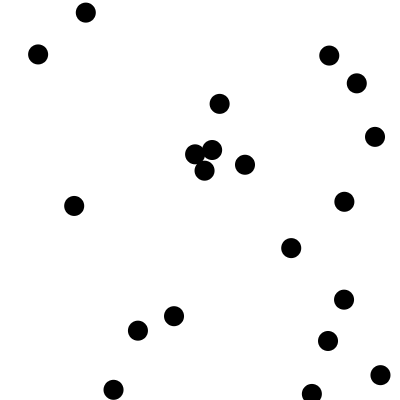
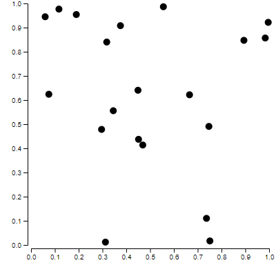
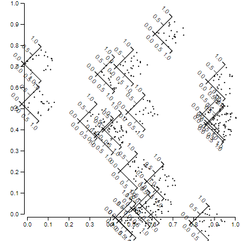

<iframe width="560" height="315" src="https://www.youtube.com/embed/Bdeu-BFisJU" frameborder="0" allow="accelerometer; autoplay; encrypted-media; gyroscope; picture-in-picture" allowfullscreen></iframe>

How can you create data visualization that works well in progressive web apps? On this episode, Swizec Teller (https://twitter.com/Swizec) joins to teach us how to use D3, React, and Gatsby to create SSR-friendly data visualizations for high performance dataviz.

- demo: https://react-gatsby-dataviz.netlify.com/
- repo: https://github.com/jlengstorf/react-dataviz

Links:

- https://d3js.org/
- https://github.com/Swizec/d3blackbox
- https://swizec.com/
- https://reactfordataviz.com

Twitter - [Jason Lengstorf](https://twitter.com/jlengstorf) & [Swizec Teller](https://twitter.com/Swizec)

Youtube Link - [Data Visualization in React Using Gatsby (with Swizec Teller) — Learn With Jason)](https://www.youtube.com/watch?v=Bdeu-BFisJU)

## Notes

New Gatsby site - `gatsby new . gatsbyjs/gatsby-starter-hello-world`

Run a development serve - `npm run develop`

Build the site to 'public' folder - `npm run build`

Serve the files from 'public folder' - `npm run serve`

`yarn add d3`

```js
import React from "react";
import * as D3 from "d3";

const getRandomData = () =>
  D3.range(20).map(() => ({ x: Math.random(), y: Math.random() }));

export default () => {
  const data = getRandomData();
  const xScale = D3.scaleLinear()
    .domain([0, 1])
    .range([0, 400]);
  const yScale = D3.scaleLinear()
    .domain([0, 1])
    .range([0, 400]);

  return (
    <svg width={400} height={400}>
      {data.map(d => (
        <circle cx={xScale(d.x)} cy={yScale(d.y)} id={d.x} r={10} />
      ))}
    </svg>
  );
};
```



`yarn add d3blackbox`

```js{3, 8-13, 32-33}
import React from "react";
import * as D3 from "d3";
import { useD3 } from "d3blackbox";

const getRandomData = () =>
  D3.range(20).map(() => ({ x: Math.random(), y: Math.random() }));

const Axis = ({ x, y, scale, axisType }) => {
  const fnName = axisType === "left" ? "axisLeft" : "axisBottom";
  const ref = useD3(el => D3.select(el).call(D3[fnName](scale)));

  return <g transform={`translate(${x},${y})`} ref={ref} />;
};

export default () => {
  const data = getRandomData();
  const width = 400;
  const height = 400;
  const xScale = D3.scaleLinear()
    .domain([0, 1])
    .range([45, width - 10]);
  const yScale = D3.scaleLinear()
    .domain([0, 1])
    .range([height - 45, 5]);

  return (
    <svg width={width} height={height}>
      {/* create a scatterplot of actual data */}
      {data.map(d => (
        <circle cx={xScale(d.x)} cy={yScale(d.y)} id={d.x} r={5} />
      ))}
      <Axis x={40} y={0} scale={yScale} axisType="left" />
      <Axis x={0} y={height - 40} scale={xScale} axisType="bottom" />
    </svg>
  );
};
```



```js{15-36}
import React from "react";
import * as D3 from "d3";
import { useD3 } from "d3blackbox";

const getRandomData = () =>
  D3.range(20).map(() => ({ x: Math.random(), y: Math.random() }));

const Axis = ({ x, y, scale, axisType, ticks = 10 }) => {
  const fnName = axisType === "left" ? "axisLeft" : "axisBottom";
  const ref = useD3(el => D3.select(el).call(D3[fnName](scale).ticks(ticks)));

  return <g transform={`translate(${x},${y})`} ref={ref} />;
};

const Datapoint = ({ cx, cy, r, index }) => {
  const data = getRandomData();
  const height = r;
  const width = r;
  const xScale = D3.scaleLinear()
    .domain([0, 1])
    .range([0, width]);
  const yScale = D3.scaleLinear()
    .domain([0, 1])
    .range([height, 0]);

  return (
    <g transform={`translate(${cx}, ${cy}) rotate(${degrees})`}>
      {/* create a scatterplot of actual data */}
      {data.map((d, index) => (
        <circle cx={xScale(d.x)} cy={yScale(d.y)} key={index} r={1} />
      ))}
      <Axis x={0} y={0} scale={yScale} axisType="left" ticks={2} />
      <Axis x={0} y={height} scale={xScale} axisType="bottom" ticks={2} />
    </g>
  );
};

export default () => {
  const data = getRandomData();
  const width = 400;
  const height = 400;
  const xScale = D3.scaleLinear()
    .domain([0, 1])
    .range([45, width - 10]);
  const yScale = D3.scaleLinear()
    .domain([0, 1])
    .range([height - 45, 5]);

  return (
    <svg width={width} height={height}>
      {/* create a scatterplot of actual data */}
      {data.map((d, index) => (
        <Datapoint
          cx={xScale(d.x)}
          cy={yScale(d.y)}
          key={index}
          r={40}
          index={index}
        />
      ))}
      <Axis x={40} y={0} scale={yScale} axisType="left" />
      <Axis x={0} y={height - 40} scale={xScale} axisType="bottom" />
    </svg>
  );
};
```



```js
...
const Datapoint = ({ cx, cy, r, index }) => {
  const [degrees, setDegrees] = useState(0)
  const data = getRandomData()
  const height = r
  const width = r
  const xScale = D3.scaleLinear()
    .domain([0, 1])
    .range([0, width])
  const yScale = D3.scaleLinear()
    .domain([0, 1])
    .range([height, 0])

  useEffect((cx, cy, index) => {
    D3.selection()
      .transition(`spinner-${cx}${cy}`)
      .tween("spinning", () => {
        const interpolate = D3.interpolate(0, 360)
        return t => setDegrees(Math.round(interpolate(t)))
      })
      .duration(1000)
      .ease(D3.easeBounceOut)
      .delay(500 * index)
  }, [])
...
```


