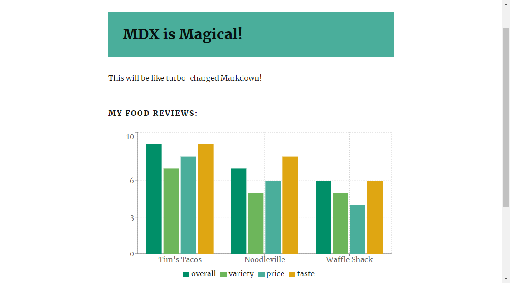

Blog - [Alligator](https://alligator.io/gatsbyjs/mdx-in-gatsby/)

Authors - [Daniel Stout](https://alligator.io/author/daniel-stout)

## Notes

To start with this tutorial it is recommended following below steps first

[Gatsby - Not Yo' Mama's Static Site Generator](https://alligator.io/react/gatsby-static-site-generator/) by [Conroy Whitney](https://alligator.io/author/conroy-whitney)

[Your First Steps with Gatsby v2](https://alligator.io/gatsbyjs/gatsby-first-steps/)

Ready with the initial configuration

New Gatsby site - `$ gatsby new . gatsbyjs/gatsby-starter-hello-world`

Run a development serve - `$ npm run develop`

Build the site to 'public' folder - `$ npm run build`

Serve the files from 'public folder' - `$ npm run serve`

Install [gatsby-plugin-mdx](https://www.gatsbyjs.org/packages/gatsby-plugin-mdx/) and it's peer dependencies

`$ npm i gatsby-plugin-mdx @mdx-js/mdx @mdx-js/react`

To make use of the local files - `$ npm i gatsby-source-filesystem`

`gatsby-config.js`

```js
module.exports = {
  //...siteMetadata, etc
  plugins: [
    {
      resolve: `gatsby-source-filesystem`,
      options: {
        name: `pages`,
        path: `${__dirname}/src/pages/`
      }
    },
    `gatsby-plugin-mdx`
    // ... other plugins
  ]
};
```

Import components like we do in react but after the frontmatter

```js
---
title: MDX is Magical!
path: /mdx-intro
date: 2019-08-25
---

import Layout from "../../components/layout.js"
import TitleBar from "../../components/TitleBar.js"
import PostSignature from "../../components/postSignature.mdx"

<Layout  location={props.location} title="Gatsby Starter Blog">
  <TitleBar
    size={"32px"}
    bkgdColor={"#4aae9b"}
    text={props.pageContext.frontmatter.title}
  />

This will be like turbo-charged Markdown!

<PostSignature />
</Layout>
```

Include a chart with the data in the MDX file

`npm i recharts -S`

```js
---
title: MDX is Magical!
path: /mdx-intro
date: 2019-08-25
---

import Layout from "../../components/layout.js"
import TitleBar from "../../components/TitleBar.js"
import PostSignature from "../../components/postSignature.mdx"
import BarChart from "../../components/BarChart"

export const myReviews = [
  {
    name: "Tim's Tacos",
    overall: 9,
    variety: 7,
    price: 8,
    taste: 9,
  },
  {
    name: "Noodleville",
    overall: 7,
    variety: 5,
    price: 6,
    taste: 8,
  },
  {
    name: "Waffle Shack",
    overall: 6,
    variety: 5,
    price: 4,
    taste: 6,
  },
]

<Layout  location={props.location} title="Gatsby Starter Blog">
  <TitleBar
    size={"32px"}
    bkgdColor={"#4aae9b"}
    text={props.pageContext.frontmatter.title}
  />

This will be like turbo-charged Markdown!

#### My Food Reviews:

<BarChart
  data={myReviews}
  bars={["overall", "variety", "price", "taste"]}
/>
<PostSignature />
</Layout>
```

## Reference:

- [Gatsby JS](https://www.gatsbyjs.org/)
- [Gatsby Plugins](https://www.gatsbyjs.org/docs/plugins/)
- [Gatsby Starters](https://next.gatsbyjs.org/docs/gatsby-starters/)
- [Gatsby Docs](https://www.gatsbyjs.org/docs/)
- [gatsby-plugin-mdx](https://www.gatsbyjs.org/packages/gatsby-plugin-mdx/)
- [Custom Remark Plugins collection](https://github.com/remarkjs/remark/blob/master/doc/plugins.md)
- [Custom Rehype Plugins](https://github.com/rehypejs/rehype/blob/master/doc/plugins.md)
- [MDX](https://mdxjs.com/)
- [Spectacle Repo](https://github.com/FormidableLabs/spectacle)
- [recharts](http://recharts.org/)
- [StaticGen](https://www.staticgen.com/)
- [Static Site Generators](https://staticsitegenerators.net/)
- [Google PRPL Pattern](https://developers.google.com/web/fundamentals/performance/prpl-pattern/)
- [Source Code Repo](https://github.com/navin-navi/gatsby-mdx-intro)
