Quickly recharge your minds with git commands here !!!!

## What is Git

- Git is version control system that means it stores and creates a timeline of all your changes done to the code.
- This allows you to return to your code when something gets messy or when needed to look at something that you did previously.

## What is GitHub

- GitHub is a cloud code hosting platform for version control and collaboration. It lets you and others work together on projects from anywhere. It's a go to place for most of the open source projects.

## How does it work

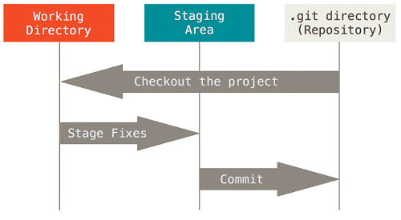

### Working Directory

- Area where of our files and directories and changes are living the time.

### Staging Area

- Files and directories that explicitly added to the staging area

### Git Repository

- Where our snapshots are stored

## Working with Git on Linux

### Installing Git

- Open a terminal window.
- Copy, paste and run thethe following commands and hit Return.

- `sudo apt-get update`
- `sudo apt-get upgrade`
- `sudo apt-get install git`

### Getting started

#### Create a new repository

`git init`

Inside a folder execute to make it as a working repository

`git status`

To know what is going on in the working directory, what are the changes and what has been staged

#### Adding files

`git add .`

To stage all the changes done in the current working directory like adding files and modifying the existing contents

`git add *file name*`

To stage the particular file \*file name\* in which the changes were done

#### Adding multiple files of a certain type

`git add *.any extension*`

To stage all the particular file types \*.any extension\* to which changes were done

#### Adding all files in directory (including hidden)

`git add -A`

To add all files and folders from the directory that you're in. This is a good command for adding everything in your project, all at one time

#### Removing Files that are staged

`git reset HEAD *file name*`

To unstage a particular file which is ready to be committed. will be seen as untracked file

#### Ignoring files

`touch .gitignore`

Add files and folders to ignore those from staging and committing. These files will not be tracked any more. Keeping the files to only local usage

#### Commit the staged files

`git commit -m *message*`

To commit the staged file or files to the git repository

#### Log view

`git log`

To get the log of all the commits done

### Git Branches

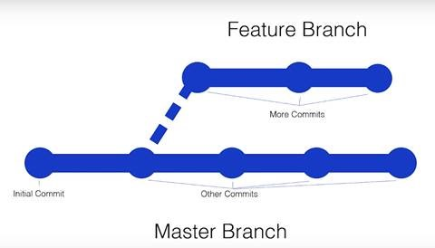

#### Listing all branches

`git branch`

To list all the branches in a repository

#### Adding a branch

`git checkout -b *branch-name*`

To create a new branch and will switch to it

#### Changing branches

`git checkout *branch-name*`

To switch to an existing branch

#### Merging a branch

`git merge *branch-name*`

Current branch will merge to an existing branch

#### Removing a branch

`git checkout -b *branch-name*`

To remove an existing branch

## Now comes the final part

### Link your Project to [github.com](images/https://github.com)

`git remote add origin *repository ssh link*`

Create a repository in GitHub(explained below) and get the SSH link to add to your local repository

`git remote -v`

To view the status of the repository connection

`git push -u origin master`

To push all the committed changes done to the working directory

`git pull`

To get all the latest commits from the GitHub repository

`git remote remove origin`

To remove the remote repositories from your local git

Thanks to [Ian Schoonover](images/https://www.youtube.com/channel/UCqo2YWBtmFSWhuUk4WEyfGg) for the guide.

## Working with Github

### Create a Repository

Repositories are used to store folders and files – anything about your project.

1. Go to [github.com](images/https://github.com)
2. In the upper right corner, next to your avatar , click and then select New repository.
3. Name your repository.
4. Write a short description.
5. Select Initialize this repository with a README.md
6. Click Create repository

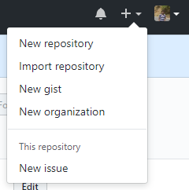

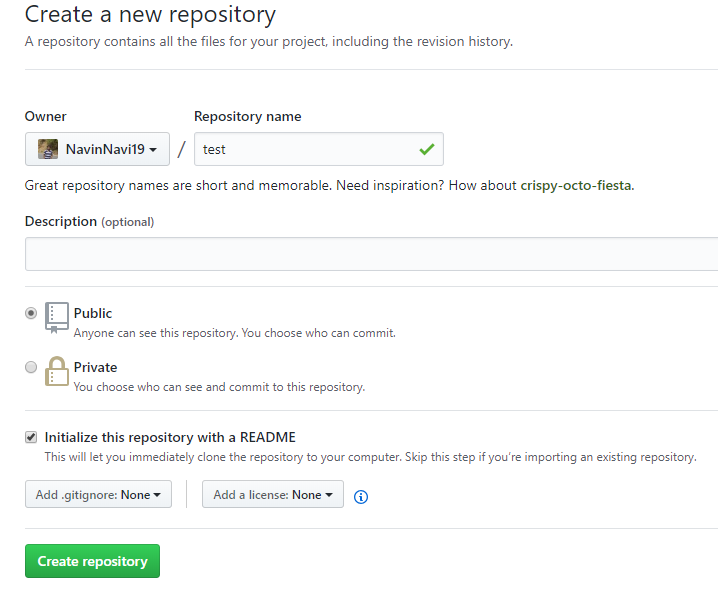

### Create a Branch

Create a new branch to make a copy of your repository in the master branch as working in new branch wont affect the master.

1. Go to your new repository.
2. Click the drop down at the top of the file list that says branch: master.
3. Type a branch name into the new branch text box.
4. Select the blue Create branch box or hit “Enter” on your keyboard.

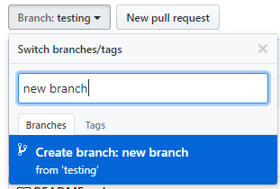

### Edit and commit changes

On GitHub, saved changes are called commits.

1. Click the pencil icon in the upper right corner of the file view to edit.
2. In the editor, write a bit about yourself.
3. Write a commit message that describes your changes in new branch.
4. Click Commit changes button.

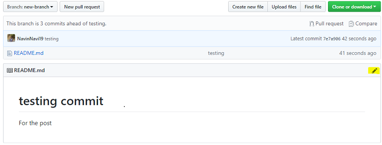

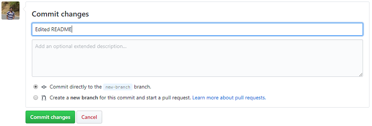

### Open a Pull Request

1. Click the Pull Request tab and click the green New pull request button.
2. Look over your changes in the diffs on the Compare page.
3. Click the big green Create Pull Request button.
4. Give your pull request a title and write a brief description of your changes.

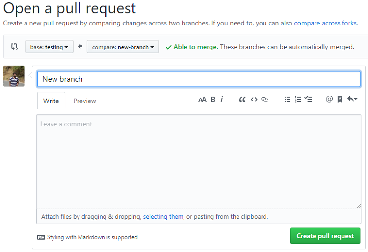

### Merge your Pull Request

1. Click the green Merge pull request button to merge the changes into master, after the code review and approval.
2. Click Confirm merge.
3. Now that your changes are pushed to master, go ahead and delete the branch. If you wish!!!

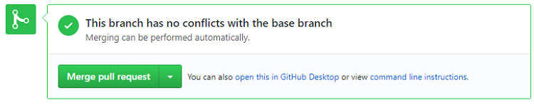

## Complete flow

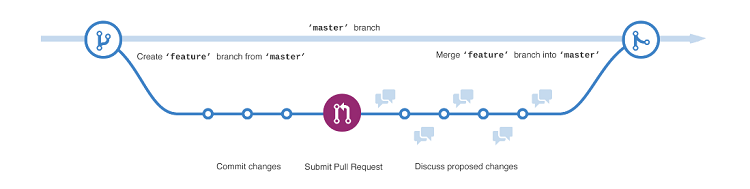

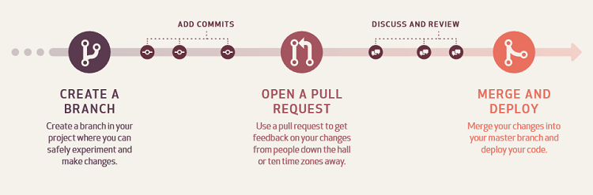

_Thanks to [GitHub Guides](images/https://guides.github.com/) for the article reference._

Finally, I hope this post was valuable for you so please, please share your feedback and suggestions to help me improve.
