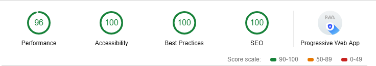

# [NavinNavi](https://navin-navi.github.io)

[](https://travis-ci.org/navin-navi/navin-navi.github.io)

[](https://github.com/prettier/prettier)

My personal portfolio & blog. Built with Gatsby.js.

Playful & colorful blog with Parallax effect

Developed upon [Gatsby Starter Portfolio: Cara](https://github.com/LekoArts/gatsby-starter-portfolio-cara)

**Checkout my site at [Navin-Navi](https://navin-navi.github.io)**

[](https://codesandbox.io/s/github/navin-navi/navin-navi.github.io/tree/dev/)

---

## 🖥 Tech Stack

- Developed using [Gatsby](https://www.gatsbyjs.org)
- Contents served from [Github](https://github.com) as Markdown files
- [TravisCI](https://travis-ci.org/) for CI and Build checks
- Hosted on [GithubPages](https://pages.github.com/)
- [Renovate](https://renovatebot.com) for auto dependency updates

## 📣 Features

**Google Lighthouse Audit Result**



- [React Spring](https://github.com/drcmda/react-spring) (Used for Parallax effect)
- [TailwindCSS](https://tailwindcss.com/) & [styled-components](https://www.styled-components.com/) for styling
  - Use the full power of TailwindCSS while generating small styles (as unused data gets deleted)
  - Uses `tailwind.macro` (Babel macro) to have hot-reloading of Tailwind styles
- SEO
  - Schema.org JSONLD
  - OpenGraph Tags
  - Twitter Tags
- [Typefaces](https://github.com/KyleAMathews/typefaces) for quicker font loading
- Offline Support
- WebApp Manifest Support
- Responsive images
  - The right image size for every screen size
  - Traced SVG Loading (Lazy-Loading)
  - WebP Support
- Blog with Markdown usign Markdown Remark
- Code syntax highlighting by Prismjs
- Google Analytics.
- Generate Sitemap XML.

Thanks to [@bradlc](https://github.com/bradlc)’s work on [babel-plugin-tailwind-components](https://github.com/bradlc/babel-plugin-tailwind-components), we can easily get the power of Tailwind without the stylesheet bloat by passing Tailwind classes into styled-components with **Babel macros** 🎉.

**Please note:** The parallax effect can be quite heavy for some older CPUs and the site uses some newer CSS features which will result in incompatibility with older browsers.

## 🚀 Quick start

Check your development environment! You'll need [Node.js](https://nodejs.org/en/), the [Gatsby CLI](https://www.gatsbyjs.org/docs/) and [node-gyp](https://github.com/nodejs/node-gyp#installation) installed. The official Gatsby website also lists two articles regarding this topic:

- [Gatsby on Windows](https://www.gatsbyjs.org/docs/gatsby-on-windows/)
- [Check your development environment](https://www.gatsbyjs.org/tutorial/part-zero/)

To copy and install this starter run this command (with "project-name" being the name of your folder you wish to install it in):

Use the Gatsby CLI to create a new site, specifying the blog starter.

```shell
gatsby new project-name https://github.com/LekoArts/gatsby-starter-portfolio-cara
cd project-name
npm run dev
```

Your site is now running at `http://0.0.0.0:8080`!

_Note: You'll also see a second link: _`http://0.0.0.0:8080/___graphql`_. This is a tool you can use to experiment with querying your data. Learn more about using this tool in the [Gatsby tutorial](https://www.gatsbyjs.org/tutorial/part-five/#introducing-graphiql)._

Edit `src/pages/index.js`, save your changes and the browser will update in real time!

### Adding new features/plugins

You can add other features by having a look at the official [plugins page](https://www.gatsbyjs.org/docs/plugins/).

### Building your site

```shell
npm run build
```

Copy the content of the `public` folder to your webhost or use a website like Netlify which automates that for you.

## 🎓 Configuration

You have multiple options to configure this project.

1. Use the `config/website.js` to configure data passed to the SEO component and other parts of the Gatsby site

2. Use the `tailwind.js` file to configure TailwindCSS. Their [documentation](https://tailwindcss.com/docs/configuration) explains it step-by-step.

3. Modify the files in the `src/styles` directory.

4. Modify the sections in the `src/views` directory. They contain the Dividers & SVG icons.

5. You can also place the icons somewhere else on the page, modify their animation and hide them on smaller screens:

```JSX
  <SVG icon="triangle" hideMobile width={48} stroke={colors.orange} left="10%" top="20%" />
  <SVG icon="hexa" width={48} stroke={colors.red} left="60%" top="70%" />
  <SVG icon="box" width={6} fill={colors['grey-darker']} left="60%" top="15%" />
```

- For `icon`, you have the options: `triangle, circle, arrowUp, upDown, box, hexa, cross`
- If you want the SVG to be hidden on mobile view, add `hideMobile` to the SVG component
- You can define the width via the TailwindCSS width [option](https://tailwindcss.com/docs/width)
- The colors get defined via the TailwindCSS color [option](https://tailwindcss.com/docs/colors)
  - Please note that you will either have to define the color in `stroke` **or** `fill` depending on the icon. For reference, have a look at the currently used SVGs
- The options `left` and `top` position the icon relatively to its parent container
- You can also wrap the SVGs with `<UpDown />` or `<UpDownWide />` to animate them

### Typography

Instead of relying on Google's CDN to host its fonts, this site self-hosts the fonts and therefore benefits from increased performance. The installed fonts can be found in `gatsby-browser.js`:

```JSX
import 'typeface-cantata-one';
import 'typeface-montserrat';
```

This starter uses [typefaces](https://github.com/KyleAMathews/typefaces) by Kyle Mathews. Have a look at the repository if you want to install & use other fonts.

You'll also need to configure your own **fonts** by installing or importing in `gatsby-browser.js`. You then can use the fonts by confirguring in `tailwind.config.js` or in `src/styles/globalStyle.css`.

## 💫 Thanks and Support

### [LekoArts](https://www.lekoarts.de)

If you want to quickly bootstrap a design/photography portfolio or use it as a foundation for your personal site, the starters in _gatsby-starter-portfolio_ are a perfect fit for you! The project's goal is to offer minimalistic and fast websites.

I hope thier like my starters and create something awesome! To see some of thier other works, you can visit [website](https://www.lekoarts.de) or support them on [Patreon](https://www.patreon.com/lekoarts) to get some neat rewards (4K images, project files, tutorial insights). Every pledge on Patreon helps them create more free starters!

Also, check out the other starters for _gatsby-starter-portfolio_:

- [gatsby-starter-portfolio-emma](https://github.com/LekoArts/gatsby-starter-portfolio-emma)
- [gatsby-starter-portfolio-emilia](https://github.com/LekoArts/gatsby-starter-portfolio-emilia)
- [gatsby-starter-portfolio-bella](https://github.com/LekoArts/gatsby-starter-portfolio-bella)
- [gatsby-starter-portfolio-jodie](https://github.com/LekoArts/gatsby-starter-portfolio-jodie)

Check out the [Gatsby Starter Portfolio Overview](https://gatsby-starter-portfolio.netlify.com/)!
