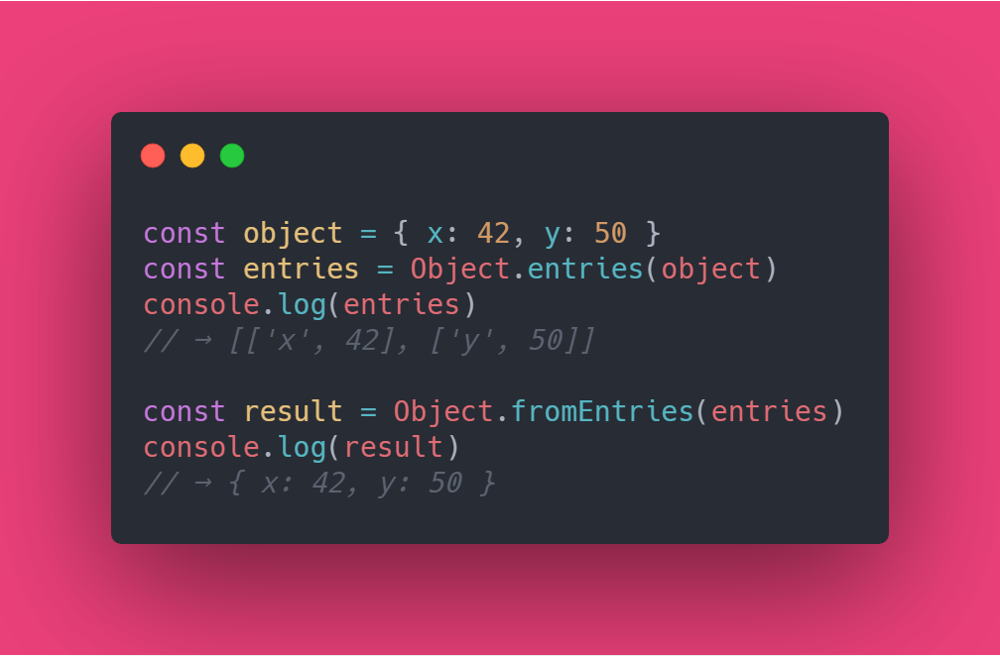

In this section, you are going to learn about the newest addition to the JavaScript(ES2019) `Object.fromEntries`. But before going any further, lets understand the `Object.entries` first

## Object.entries

```js
const object = { x: 42, y: 50 };
// "object" with two {"key":value} pair Objects

const entries = Object.entries(object);

console.log(entries);
// Logs:
// (2) [Array(2), Array(2)]
// 0: Array(2)
//     0: "x"
//     1: 42
//     length: 2
// 1: Array(2)
//     0: "y"
//     1: 50
//     length: 2
// length: 2

// → [["x", 42], ["y", 50]]
// → [["key", value], ["key", value]]
```

From the above code snippet, we can understand that `Object.entries` creates **an Array** from each key value pair of an Object.

```js
for (const [key, value] of entries) {
  console.log(`The value of ${key} is ${value}.`);
}
// Logs:
// The value of x is 42.
// The value of y is 50.
```

`Object.entries` works best in combination with `for..of..` to get values out of the created array.

But, we did not have any built-in JavaScript API to reconstruct the objects from an array. Until Now!!!

## Object.fromEntries

Inverse of `Object.entries`

```js
const object = { x: 42, y: 50 };
const entries = Object.entries(object);
// → [['x', 42], ['y', 50]]

const result = Object.fromEntries(entries);
console.log(result);
// → { x: 42, y: 50 }
```

Now, you can create an object from an Array of key value pairs easily.

**An example with explanation:**

```js
const object = { x: 42, y: 50, abc: 9001 };
const result = Object.fromEntries(
  Object.entries(object)
    .filter(([key, value]) => key.length === 1)
    .map(([key, value]) => [key, value * 2])
);
// → { x: 84, y: 100 }
```

1. Converted the object into an Array. `Object.entries(object)`
2. Used **Array.filter** to filter only the keys with length equal to 1. `filter(([ key, value ]) => key.length === 1))`

```js
console.log(Object.entries(object).filter(([key, value]) => key.length === 1));
// (2) [Array(2), Array(2)]
//      0: (2) ["x", 42]
//      1: (2) ["y", 50]
// length: 2
```

3. Used **Array.map** to map the key value pair returned from filter to double the value and return it to `Object.fromEntries()`

```js
console.log(
  Object.entries(object)
    .filter(([key, value]) => key.length === 1)
    .map(([key, value]) => [key, value * 2])
);

// (2) [Array(2), Array(2)]
//     0: (2) ["x", 84]
//     1: (2) ["y", 100]
// length: 2
```

4. `Object.fromEntries` reconstructed the object with the newly returned array. `{ x: 42, y: 50 }`

## Objects as Maps

We can get the most out of these API when using with `Map`s, which makes it easier to work with key value pairs.

```js
const object = { language: "JavaScript", coolness: 9001 };

// Convert the object into a map:
const map = new Map(Object.entries(object));

console.log(map);
// Map(2) {"language" => "JavaScript", "coolness" => 9001}
//     [[Entries]]: Array(2)
//         0: {"language" => "JavaScript"}
//         1: {"coolness" => 9001}

map.get("language");
// "Javascript"

map.set("coolness", 8000);
// Map(2) {"language" => "JavaScript", "coolness" => 8080}
```

```js
// Convert the map back into an object:
const objectCopy = Object.fromEntries(map);
// → { language: 'JavaScript', coolness: 8000 }
```

We can `get()` or `set()` new values to the keys more easily and convert them back to objects.

This gets useful when we work with JSON file to send and request from an external API.

**Note:** Does not work best if the keys are not unique

```js
const map = new Map([[{}, "a"], [{}, "b"]]);
Object.fromEntries(map);
// → { '[object Object]': 'b' }
// Note: the value 'a' is nowhere to be found, since both keys
// stringify to the same value of '[object Object]'.
```

### More Examples from [MDN](https://developer.mozilla.org/en-US/docs/Web/JavaScript/Reference/Global_Objects/Object/entries)

```js
const obj = { foo: "bar", baz: 42 };
console.log(Object.entries(obj)); // [ ['foo', 'bar'], ['baz', 42] ]

// array like object
const obj = { 0: "a", 1: "b", 2: "c" };
console.log(Object.entries(obj)); // [ ['0', 'a'], ['1', 'b'], ['2', 'c'] ]

// array like object with random key ordering
const anObj = { 100: "a", 2: "b", 7: "c" };
console.log(Object.entries(anObj)); // [ ['2', 'b'], ['7', 'c'], ['100', 'a'] ]

// getFoo is property which isn't enumerable
const myObj = Object.create(
  {},
  {
    getFoo: {
      value() {
        return this.foo;
      }
    }
  }
);
myObj.foo = "bar";
console.log(Object.entries(myObj)); // [ ['foo', 'bar'] ]

// non-object argument will be coerced to an object
console.log(Object.entries("foo")); // [ ['0', 'f'], ['1', 'o'], ['2', 'o'] ]

// returns an empty array for any primitive type, since primitives have no own properties
console.log(Object.entries(100)); // [ ]

// iterate through key-value gracefully
const obj = { a: 5, b: 7, c: 9 };
for (const [key, value] of Object.entries(obj)) {
  console.log(`${key} ${value}`); // "a 5", "b 7", "c 9"
}

// Or, using array extras
Object.entries(obj).forEach(([key, value]) => {
  console.log(`${key} ${value}`); // "a 5", "b 7", "c 9"
});

const arr = [{ name: "Alice", age: 40 }, { name: "Bob", age: 36 }];
Object.fromEntries(arr.map(({ name, age }) => [name, age]));
// {Alice: 40, Bob: 36}
```

### Polyfill for "Object.entries"

Below code shows how this function works,

```js
if (!Object.entries) {
  Object.entries = function(obj) {
    var ownProps = Object.keys(obj),
      i = ownProps.length,
      resArray = new Array(i); // preallocate the Array
    while (i--) resArray[i] = [ownProps[i], obj[ownProps[i]]];

    return resArray;
  };
}
```

### Polyfill for "Object.fromEntries"

Below inline code shows how this function works,

```js
obj = Array.from(map).reduce(
  (acc, [key, val]) => Object.assign(acc, { [key]: val }),
  {}
);
```

## References

- [V8 Dev](https://v8.dev/features/object-fromentries)
- [tc39 Proposal](https://github.com/tc39/proposal-object-from-entries)
- [MDN Object.fromEntries](https://developer.mozilla.org/en-US/docs/Web/JavaScript/Reference/Global_Objects/Object/fromEntries)
- [MDN Object.entries](https://developer.mozilla.org/en-US/docs/Web/JavaScript/Reference/Global_Objects/Object/entries)
