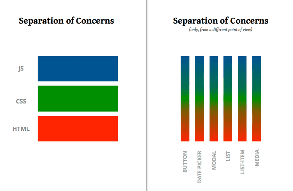

## IMAGINE WHAT YOU COULD BUILD 🏗

## IF YOU HAD TIME TO LEARN ALL OF REACT 👩‍🎓

Learn While You Poop! 💩

👉 No pressure learning at 2 minutes per day.

Start with the basics, become a React 16.3 master

How frustrated do you get when you're learning some tech and every resource you find is just wasting your time?

Either you're reading random blogs that make no sense. Or you're paying through the nose for expensive books and courses that you'll never finish anyway.

## HERE'S HOW IT USUALLY GOES 👇

🎲 you give up piecing together random blogs

📔 you buy a book

💸 get the video course upgrade too

🆕 you start reading

🎓 learn some basics

⚒ you build some stuff

💼 you get busy

🏙 life gets in your way

📽 and you forget all about your course

✈ 6 weeks fly by

👊 you get stuck

🎲 you search random blogs for a solution

Twitter - [Swizec Teller](https://twitter.com/Swizec)

Website - [Learn While You Poop](https://learnwhileyoupoop.com/)

Really loved the intro for the site!!!

## Notes

### MODULE 1: REACT ESSENTIALS

### Introduction

<iframe width="560" height="315" src="https://www.youtube.com/embed/JnMXuWy2t8A" frameborder="0" allow="accelerometer; autoplay; encrypted-media; gyroscope; picture-in-picture" allowfullscreen></iframe>



🌟 _**Old JavaScript**_

```js
// Togglable paragraph in old JavaScript
<div>
  <button id="showhide">Show paragraph</button>

  <p id="toggleMe">This is the paragraph that is only displayed on request.</p>
</div>

<script>
  function changeDisplayState(id) {
      var d = document.getElementById('showhide'),
          e = document.getElementById(id);
      if (e.style.display === 'none' || e.style.display === '') {
          e.style.display = 'block';
          d.innerHTML = 'Hide paragraph';
      } else {
          e.style.display = 'none';
          d.innerHTML = 'Show paragraph';
      }
  }
  document.getElementById('showhide').addEventListener('click', function (e) {
      e.preventDefault();
      changeDisplayState('toggleMe');
  });
</script>
```

🌟 _**JQuery**_

```js
// Togglable paragraph in jQuery
<div>
  <button id="showhide">Show paragraph</button>

  <p id="toggleMe">This is the paragraph that is only displayed on request.</p>
</div>

<script>
  $("#showhide").on("click", function (e) {
    e.preventDefault();

    if ($("#toggleMe").is(":visible")) {
      $(this).html("Show paragraph");
      $("#toggleMe").hide();
    }else{
      $(this).html("Hide paragraph");
      $("#toggleMe").show();
    }
  })
</script>
```

🌟 _**React**_

```js
// Togglable paragraph in React
class Toggled extends React.Component {
  state = { show: true }

  onToggle = () => this.setState({
    show: !this.state.show
  })

  render() {
    const { show } = this.state;

    return (
      <div>
        <button onClick={this.onToggle}>
          {show ? "Hide paragraph" : "Show paragraph}
        </button>
        {show && <p>This is the paragraph that is only displayed on request.</p>}
      </div>
  )
  }
}
```

### WHY ARE COMPONENTS SO GREAT 🤔

🌟 _**You can think of components as LEGO blocks for your app.**_

Just keep in mind that components give you 👇

- composability, building blocks you can assemble into anything
- encapsulation, components have clear APIs so you never have to worry about internals
- reusability, build it once, use it everywhere

<!-- 🌟 _****_ -->
