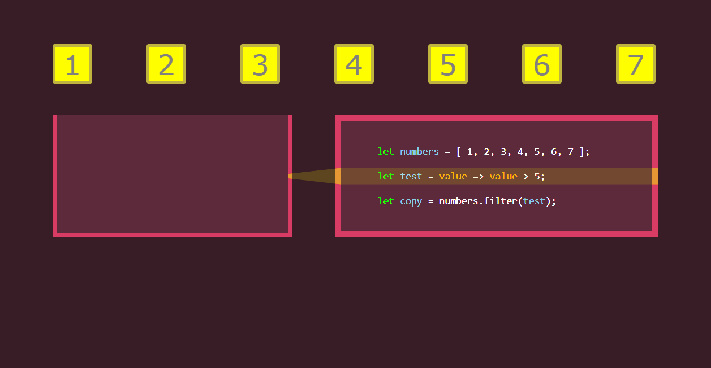
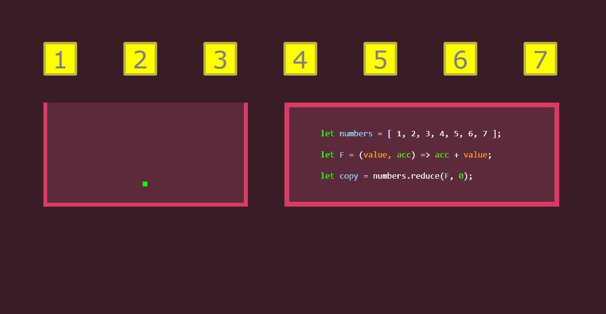

[Map, Filter and Reduce – Animated](https://medium.com/@js_tut/map-filter-and-reduce-animated-7fe391a35a47) by [Javascript Teacher](https://medium.com/@js_tut)

Javascript Teacher : [Twitter](https://twitter.com/js_tut) || [Instagram](https://www.instagram.com/javascriptteacher/) || [FB](https://www.facebook.com/javascriptteacher/)

## Notes

### Map

> Array.map – map all values to an expression.

- Expression value + 1 is applied to every item in the original array.
- .map() returns a modified copy of the array leaving original untouched.
- Result: [2,3,4,5,6,7,8] (a copy of the original array is created.)

### Filter

> Array.filter – keep all that match a condition.

**NOTE:** there is a small mistake in the animation. It should return [6,7], not [6,7,8].

- function value > 5 is applied to every item in the original array.
- .filter() returns a modified copy of the array – the original is still available!
- Result: [6,7,8] (only values that passed the condition.)

### Reduce

> Array.reduce – reduce all items to a single value.

- Reducer function F takes value and accumulator.
- In this example .reduce(v, a) returns the sum of all values.
- Result: 28 (the sum of all numbers in the original array)
