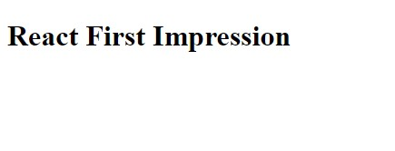

# Let's Dive In!

**React Starter Application** Built in [CodePen](https://codepen.io/navinnavi19/full/gJzQJO).

**Notes:**

- Change Preprocessor to Babel.
- Add **React** (knows components) and **ReactDOM** (knows to render the components) library.

Uses `JSX` for HTML code in React DOM.

Install `Node JS.`

NPM install `npm install -g create-react-app`.

`create-react-app jsx --use-npm` to use npm inside the new app.

This installs all the necessary packages for the React App.

Includes `Babel` for newer JS sytax.

Yarn Pkg Manager will be used by default.
`--use-npm` to bypass Yarn Pakage Manager.

Start the application using `npm start` to open the project in `local:http://localhost:8080/`.

Deleted all the files in the `src` folder in the new app.

Creates `index.js` IMP Application starts from this file.

Imported the most needed libraries as a starter.

```js
import React from "react";
import ReactDOM from "react-dom";
```

Created a Basic React Component to display "Hi There" using **JSX**.

```jsx
const App = () => {
  return <div>Hi There</div>;
};
```

Now took that Basic Component and displayed it using `ReactDOM`.

```jsx
ReactDOM.render(<App />, document.querySelector("#root"));
```

### Section Completed

**Final Code**

```jsx{1-2,6}
// import React and React Dom Libraries
import React from "react";
import ReactDOM from "react-dom";

// create a React Component
const App = () => {
  return (
    <div>
      <h1>React First Impression</h1>
    </div>
  );
};

// Take the React Component and show it on the screen
ReactDOM.render(<App />, document.querySelector("#root"));
```

```jsx
class FlavorForm extends React.Component { // highlight-line
  constructor(props) {
    super(props);
    this.state = {value: 'coconut'};

    this.handleChange = this.handleChange.bind(this);
    this.handleSubmit = this.handleSubmit.bind(this);
  }

  handleChange(event) {
    // highlight-next-line
    this.setState({value: event.target.value});
  }

  // highlight-start
  handleSubmit(event) {
    alert('Your favorite flavor is: ' + this.state.value);
    event.preventDefault();
  }
  // highlight-end

  render() {
    return (
      { /* highlight-range{1,4-9,12} */ }
      <form onSubmit={this.handleSubmit}>
        <label>
          Pick your favorite flavor:
          <select value={this.state.value} onChange={this.handleChange}>
            <option value="grapefruit">Grapefruit</option>
            <option value="lime">Lime</option>
            <option value="coconut">Coconut</option>
            <option value="mango">Mango</option>
          </select>
        </label>
        <input type="submit" value="Submit" />
      </form>
    );
  }
}
```

**Final Image**


