## Design

### Day 18: January 03, 2020 - Friday

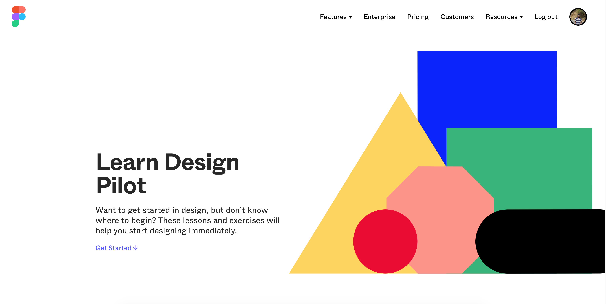

**BRIEF DESCRIPTION:**

- After so many days set up 2 hours in my daily schedule to learn and improve my skill on Design aswell.
- Started of with [Figma](https://www.figma.com/) with its own [Learn Design course](https://www.figma.com/resources/learn-design/) tools.

**REFERENCES:**

- [Figma](https://www.figma.com/)
- [Learn Design course](https://www.figma.com/resources/learn-design/)

---

## Javascript Info Cont.

### Day 17: January 02, 2020 - Thursday

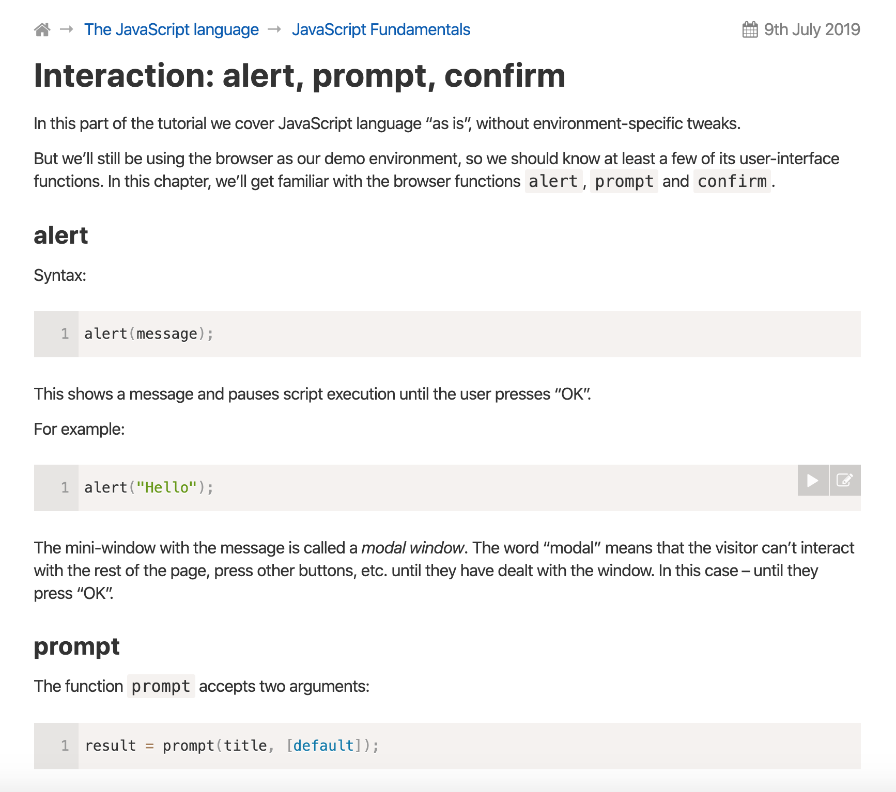

**BRIEF DESCRIPTION:**

- Continue reading [Javascript Info](https://javascript.info/) in the free time.
- Side by side practised in the Dev Tools on how JS works.

**REFERENCES:**

- [Javascript Info](https://javascript.info/).

---

## Javascript Info & CSS Visual Dictionary Grammar

### Day 16: January 01, 2020 - Wednesday 🍾 💖

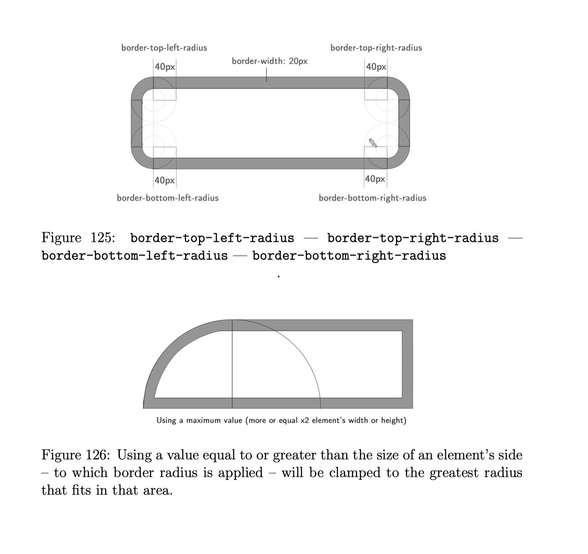

**BRIEF DESCRIPTION:**

- Started learning JS from scratch from [Javascript Info](https://javascript.info/) to fill the gap in Vanilla JS.
- Much needed one.
- Also finished half of [CSS  Visual Dictionary](http://www.javascriptteacher.com/free-book.html) by [Javascript Teacher](https://twitter.com/js_tut).
- Started this CSS Book earlier in 2019 but never finished it, but this time I am going to complete it.

**REFERENCES:**

- [Javascript Info](https://javascript.info/)
- [CSS  Visual Dictionary](http://www.javascriptteacher.com/free-book.html)
- [Javascript Teacher](https://twitter.com/js_tut)

---

## CSS Animation ✨

### Day 15: December 31, 2019 - Tuesday

**BRIEF DESCRIPTION:**

- Spent some time experimenting with CSS Animation on [Codepen](https://codepen.io/navinnavi19).

**REFERENCES:**

- [Navin Navi Codepen](https://codepen.io/navinnavi19)

---

## Gistpad 💟

### Day 14: December 30, 2019 - Monday

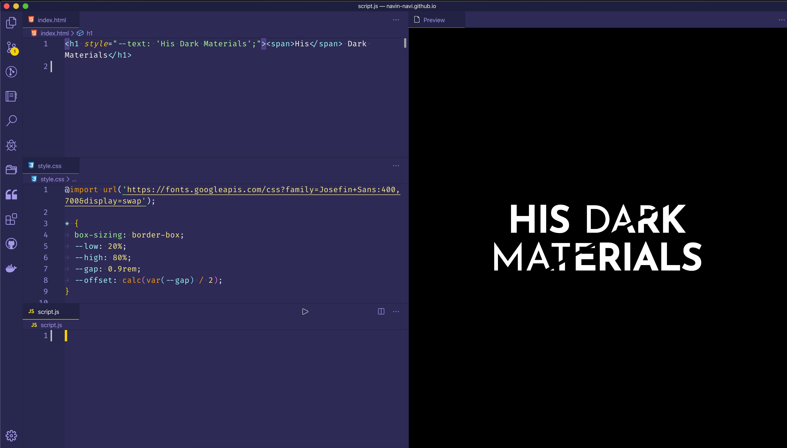

**BRIEF DESCRIPTION:**

- Used [Gistpad](https://github.com/vsls-contrib/gistpad) as a playground in [VSCode](https://code.visualstudio.com/) to clone some Codepen projects for learning.
- [Jonathan Carter](https://twitter.com/LostInTangent) has done an amazing job integrating this in [VSCode](https://code.visualstudio.com/).
- Then watched [Kevin Powell](https://www.youtube.com/channel/UCJZv4d5rbIKd4QHMPkcABCw) Youtube three part series on Pseudo Elements - learned some cool Tricks.
- Read the blog post on [CSS IRL](https://css-irl.info/) about [CSS Custom Properties](https://css-irl.info/7-uses-for-css-custom-properties/)
- Then cloned [this](https://codepen.io/michellebarker/pen/yLLGVMQ) codepen to try out how custom properties can be used.
- Got some inspiration from [Dark Code](https://www.youtube.com/channel/UCD3KVjbb7aq2OiOffuungzw/videos) on [text masking with textures](https://www.youtube.com/watch?v=5PVHJ_dG8T8) and cloned it.

**REFERENCES:**

- [Gistpad](https://github.com/vsls-contrib/gistpad)
- [Jonathan Carter](https://twitter.com/LostInTangent)
- [His Dark Materials TV series logo with CSS](https://codepen.io/michellebarker/pen/yLLGVMQ)
- [Kevin Powell](https://www.youtube.com/channel/UCJZv4d5rbIKd4QHMPkcABCw)
- [CSS IRL](https://css-irl.info/)
- [CSS Custom Properties](https://css-irl.info/7-uses-for-css-custom-properties/)
- [Dark Code](https://www.youtube.com/channel/UCD3KVjbb7aq2OiOffuungzw/videos)
- [Text masking with textures](https://www.youtube.com/watch?v=5PVHJ_dG8T8)
- [VSCode](https://code.visualstudio.com/)

---

## Youtube Videos and Bookmarks Organized

### Day 13: December 29, 2019 - Sunday

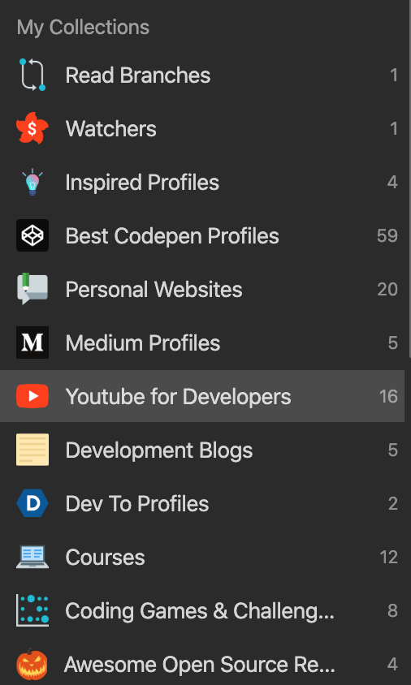

**BRIEF DESCRIPTION:**

- Continued with the Youtube Videos of [Mozilla Developer YT](https://www.youtube.com/channel/UCh5UlGiu9d6LegIeUCW4N1w/videos).
- Learned about Grid and Advanced Font editor in [Firefox Developer Edition](https://www.mozilla.org/en-US/firefox/71.0a2/firstrun/).
- Organized some of the Bookmarks in [Raindrop](https://raindrop.io/) from Chrome.

**REFERENCES:**

- [Mozilla Developer YT](https://www.youtube.com/channel/UCh5UlGiu9d6LegIeUCW4N1w/videos)
- [Firefox Developer Edition](https://www.mozilla.org/en-US/firefox/71.0a2/firstrun/)
- [Raindrop](https://raindrop.io/)

---

## Vue Instance

### Day 12: December 28, 2019 - Saturday

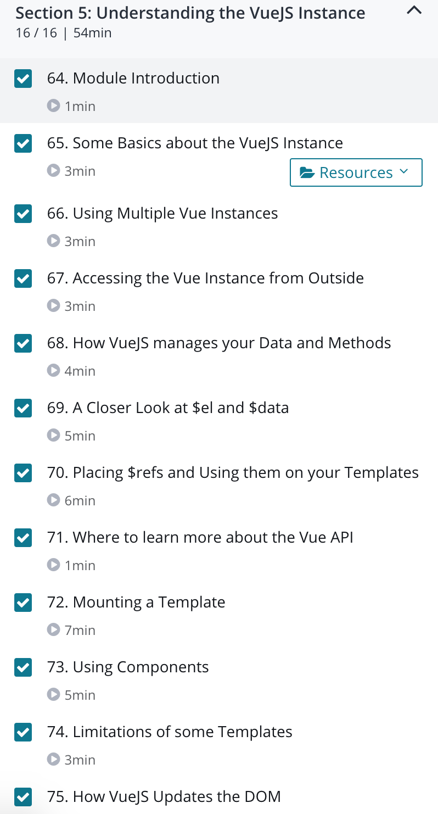

**BRIEF DESCRIPTION:**

- Completed Section 5 - Understanding the VueJS Instance in [Vue JS](http://vuejs.org/) - [course](https://www.udemy.com/course/vuejs-2-the-complete-guide/) by [Maximilian](https://twitter.com/maxedapps)

**REFERENCES:**

- [Vue JS](http://vuejs.org/)
- [Vue JS 2 - The Complete Guide (incl. Vue Router & Vuex)](https://www.udemy.com/course/vuejs-2-the-complete-guide/)
- [Maximilian](https://twitter.com/maxedapps)
- [Course Notes](https://github.com/navin-navi/getting-started-with-vue-js-maximilian-course)

---

## Monster Slaying Project

### Day 11: December 27, 2019 - Friday

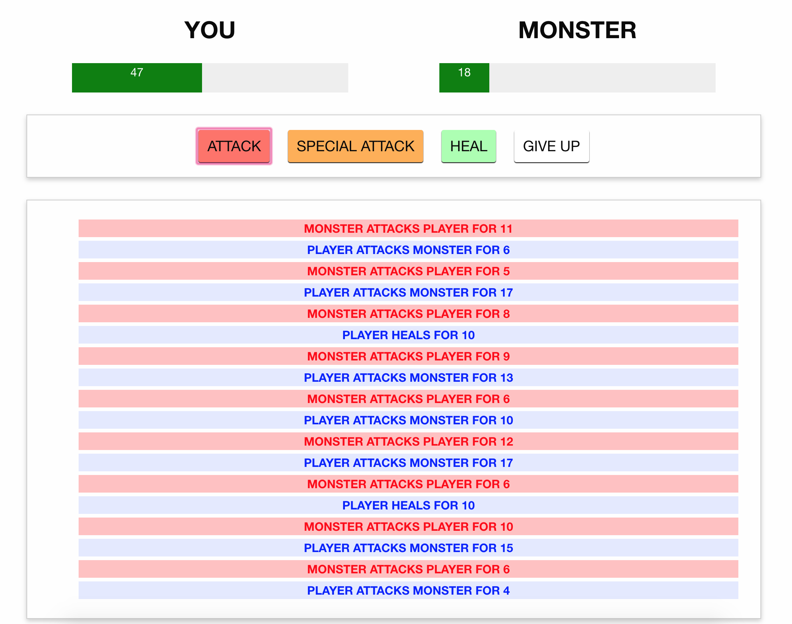

**BRIEF DESCRIPTION:**

- Completed Section 4 - Monster Slaying Project in [Vue JS](http://vuejs.org/) - [course](https://www.udemy.com/course/vuejs-2-the-complete-guide/) by [Maximilian](https://twitter.com/maxedapps)

**REFERENCES:**

- [Vue JS](http://vuejs.org/)
- [Vue JS 2 - The Complete Guide (incl. Vue Router & Vuex)](https://www.udemy.com/course/vuejs-2-the-complete-guide/)
- [Maximilian](https://twitter.com/maxedapps)
- [Course Notes](https://github.com/navin-navi/getting-started-with-vue-js-maximilian-course)

---

## Conditionals and Rendering Lists

### Day 10: December 26, 2019 - Thursday

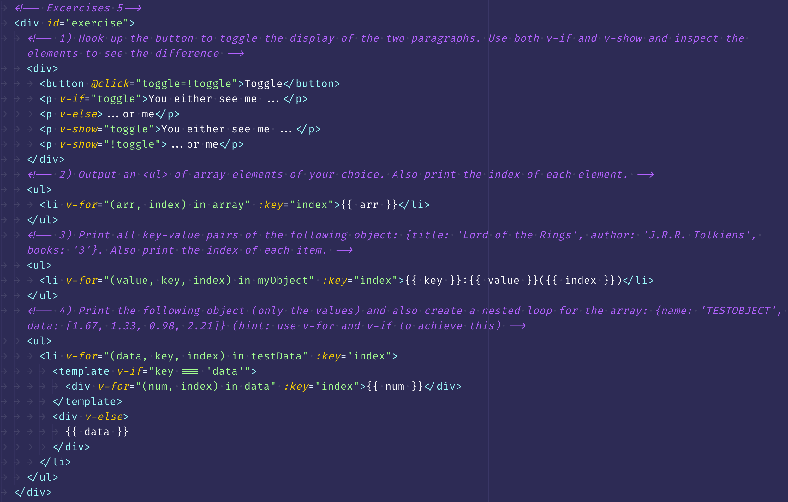

**BRIEF DESCRIPTION:**

- Completed Section 3 Using Conditionals and Rendering Lists in [Vue JS](http://vuejs.org/) - [course](https://www.udemy.com/course/vuejs-2-the-complete-guide/) by [Maximilian](https://twitter.com/maxedapps)

**REFERENCES:**

- [Vue JS](http://vuejs.org/)
- [Vue JS 2 - The Complete Guide (incl. Vue Router & Vuex)](https://www.udemy.com/course/vuejs-2-the-complete-guide/)
- [Maximilian](https://twitter.com/maxedapps)
- [Course Notes](https://github.com/navin-navi/getting-started-with-vue-js-maximilian-course)

---

## Statecharts & StateMachines

### Day 9: December 25, 2019 - Wednesday

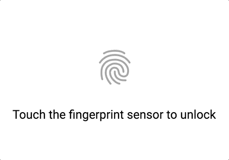

**BRIEF DESCRIPTION:**

- Started of with [Whatsapp Fingerprint Unlock](https://codepen.io/prathameshkoshti/pen/eYYjJxp) codepen to make a replica.
- Learned how it works and recoded them to know how exactly it works.
- Improved the JS code to have two states like lock and unlock to fix the bug in animation from the previous implements.
- Learned about SVG's stroke-dashArray and stroke-dashOffset.
- [MDN](https://developer.mozilla.org/en-US/) becomes the go to place directly from VSCode.
- Spent the evening watching videos about State Machines by [David K Piano](https://twitter.com/DavidKPiano) and others explaining [Xstate](https://github.com/davidkpiano/xstate).
- Read some intro on [Statecharts](https://statecharts.github.io/).
- Got an overview of how the state machines work.
- Better way to code without too many booleans in the code.

**REFERENCES:**

- [Whatsapp Fingerprint Unlock](https://codepen.io/prathameshkoshti/pen/eYYjJxp)
- [MDN](https://developer.mozilla.org/en-US/)
- [David K Piano](https://twitter.com/DavidKPiano)
- [Xstate](https://github.com/davidkpiano/xstate)
- [Statecharts](https://statecharts.github.io/)
- [Introduction to XState](https://www.youtube.com/watch?v=73Ch_EL4YVc)
- [Let’s learn state machines with David K. Piano! — Learn With Jason](https://www.youtube.com/watch?v=czi24DqUfSA)

---

## Shed some light on CSS Clip-path

### Day 8: December 24, 2019 - Tuesday

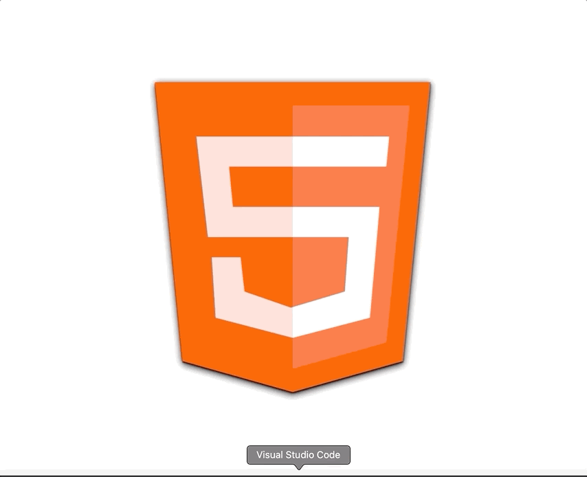

**BRIEF DESCRIPTION:**

- Started again with one of the [CurleyWebDev](https://www.facebook.com/curleywebdev/) codepen on [Pure CSS HTML 5 Shape Animation](https://codepen.io/curley/pen/eYYqzrK).
- Created a replica of the above codepen and [Rubber stamp effect](https://codepen.io/555/pen/pdwvBP) for learning about mask-image.
- During this I learned about clip-path and mask-image and different ways of using them.
- [MDN](https://developer.mozilla.org/en-US/) helped me a lot in learning.

**REFERENCES:**

- [CurleyWebDev](https://www.facebook.com/curleywebdev/)
- [Pure CSS HTML 5 Shape Animation](https://codepen.io/curley/pen/eYYqzrK)
- [Rubber stamp effect](https://codepen.io/555/pen/pdwvBP)
- [MDN](https://developer.mozilla.org/en-US/)

---

## Mozilla Developer Edition DevTools

### Day 7: December 23, 2019 - Monday

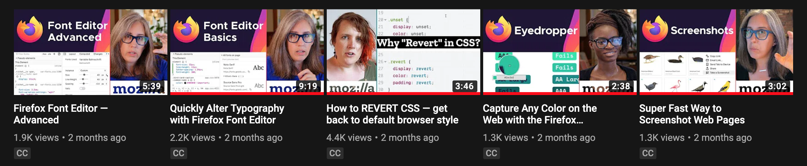

**BRIEF DESCRIPTION:**

- Continued watching the [Mozilla Developer](https://www.youtube.com/channel/UCh5UlGiu9d6LegIeUCW4N1w/videos) youtube videos.
- Learned about the inbuilt screenshot feature, Font Editor & Color Picker.
- Also, just to explore the [Edge Chromium](https://www.microsoftedgeinsider.com/en-us/), I installed the Dev Edition and tested out for sometime.
- First impression, seems more like Chrome with some improvements.
- Interface is good, icons are bright but will give it a try for some days.

**REFERENCES:**

- [Mozilla Developer YT](https://www.youtube.com/channel/UCh5UlGiu9d6LegIeUCW4N1w/videos)
- [Firefox Developer Edition](https://www.mozilla.org/en-US/firefox/71.0a2/firstrun/)
- [Popular Pen of 2019](https://codepen.io/2019/popular/pens)
- [Edge Chromium](https://www.microsoftedgeinsider.com/en-us/)

---

## Mozilla Developers YT

### Day 6: December 22, 2019 - Sunday

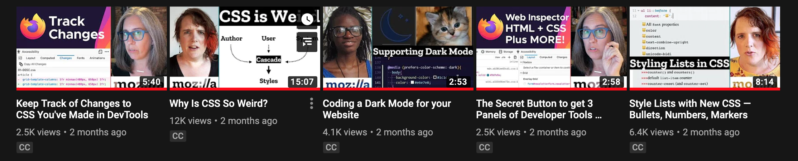

**BRIEF DESCRIPTION:**

- Started watching the [Mozilla Developer](https://www.youtube.com/channel/UCh5UlGiu9d6LegIeUCW4N1w/videos) youtube videos.
- Learned several new terms in CSS and much more about devTools.
- Further explored the Dev tools of [Firefox Developer Edition](https://www.mozilla.org/en-US/firefox/71.0a2/firstrun/)
- Spent most of my time going through the [Popular Pen of 2019](https://codepen.io/2019/popular/pens)

**REFERENCES:**

- [Mozilla Developer YT](https://www.youtube.com/channel/UCh5UlGiu9d6LegIeUCW4N1w/videos)
- [Firefox Developer Edition](https://www.mozilla.org/en-US/firefox/71.0a2/firstrun/)
- [Popular Pen of 2019](https://codepen.io/2019/popular/pens)

---

## CURLEYWEBDEV CSS Animation

### Day 5: December 21, 2019 - Saturday

**BRIEF DESCRIPTION:**

- Completed Section 2 in [Vue JS](http://vuejs.org/) - [course](https://www.udemy.com/course/vuejs-2-the-complete-guide/) by [Maximilian](https://twitter.com/maxedapps)
- Learning to do Pure CSS Animation in the side.
- I have always insipired from [CurleyWebDev](https://www.facebook.com/curleywebdev/)'s FB group, so starting with his creations in [Codepen](https://codepen.io/curley).
- Replicated two of his creations - [Sleeping Smiley](https://codepen.io/curley/pen/JgamNv) & [Love Smiley](https://codepen.io/curley/pen/WNepqQb).
- For a day, switched to [Firefox Developer Edition](https://www.mozilla.org/en-US/firefox/71.0a2/firstrun/) for seeing the animation values within the dev tools and loved it.
- Hope we can get something similer to [Chrome](https://www.google.com/chrome/) as well.
- Firefox shows unused CSS, changed CSS and lets you copy them.
- Visually see the Grid, Flex and animation, lot more to it. Need to explore more on this.

**REFERENCES:**

- [Vue JS](http://vuejs.org/)
- [Vue JS 2 - The Complete Guide (incl. Vue Router & Vuex)](https://www.udemy.com/course/vuejs-2-the-complete-guide/)
- [Maximilian](https://twitter.com/maxedapps)
- [CurleyWebDev](https://www.facebook.com/curleywebdev/)
- [CurleyWebDev Codepen](https://codepen.io/curley)
- [Sleeping Smiley Animation](https://codepen.io/curley/pen/JgamNv)
- [Love Smiley Animation](https://codepen.io/curley/pen/WNepqQb)
- [Firefox Developer Edition](https://www.mozilla.org/en-US/firefox/71.0a2/firstrun/)
- [Chrome](https://www.google.com/chrome/)
- [Course Notes](https://github.com/navin-navi/getting-started-with-vue-js-maximilian-course)

---

## VS Code Tasks

### Day 4: December 20, 2019 - Friday

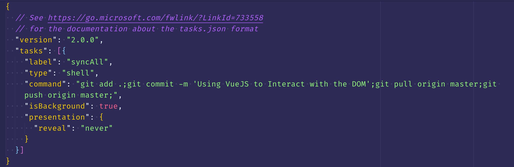

**BRIEF DESCRIPTION:**

- Completed Section 1 in [Vue JS](http://vuejs.org/) - [course](https://www.udemy.com/course/vuejs-2-the-complete-guide/) by [Maximilian](https://twitter.com/maxedapps)
- Spent most of my time trying to figure out how [tasks](https://code.visualstudio.com/Docs/editor/tasks) work in [VSCode](https://code.visualstudio.com/) and learned them.
- Created a macro with keybindings to save, add, commit, pull and push the changes to the github via tasks in background.
- This is super awesome with to possibilities I can do much more.

**REFERENCES:**

- [Vue JS](http://vuejs.org/)
- [Vue JS 2 - The Complete Guide (incl. Vue Router & Vuex)](https://www.udemy.com/course/vuejs-2-the-complete-guide/)
- [Maximilian](https://twitter.com/maxedapps)
- [VSCode](https://code.visualstudio.com/)
- [Tasks in VSCode](https://code.visualstudio.com/Docs/editor/tasks)
- [Course Notes](https://github.com/navin-navi/getting-started-with-vue-js-maximilian-course)

---

## Vue JS 2 - The Complete Guide (incl. Vue Router & Vuex)

### Day 3: December 19, 2019 - Thursday

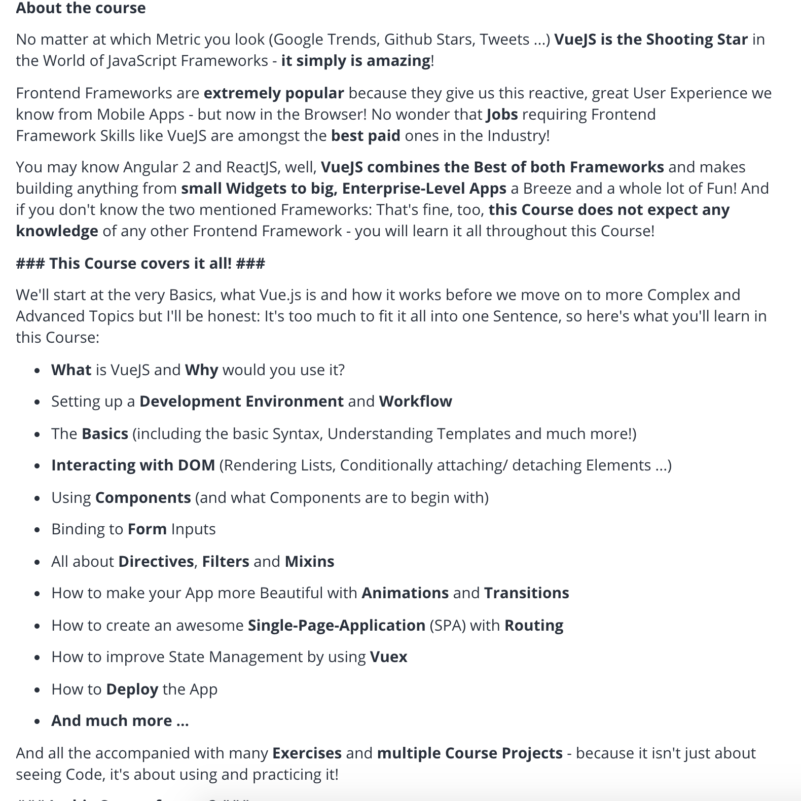

**BRIEF DESCRIPTION:**

- Started the [Vue JS](http://vuejs.org/) - [course](https://www.udemy.com/course/vuejs-2-the-complete-guide/) by [Maximilian](https://twitter.com/maxedapps)
- Not much of learning today since took some time to decide on which & best course to start.
- Also visited some of the Dev Discord servers which has a lot of unread messages.
- Got interested in Google's Quantum Supremacy and watching how they build it and how powerful it is.

**REFERENCES:**

- [Vue JS](http://vuejs.org/)
- [Vue JS 2 - The Complete Guide (incl. Vue Router & Vuex)](https://www.udemy.com/course/vuejs-2-the-complete-guide/)
- [Maximilian](https://twitter.com/maxedapps)

---

## MOARRR Extensions - VSCode

### Day 2: December 18, 2019 - Wednesday

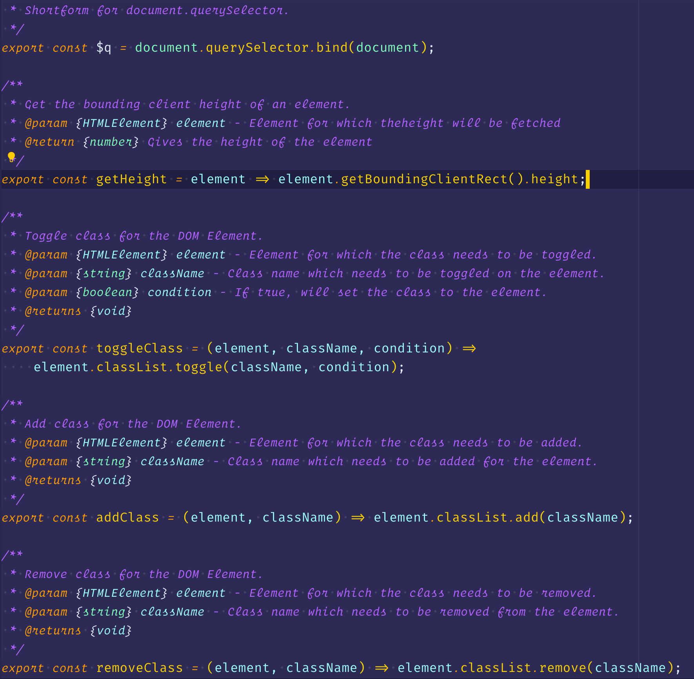

**BRIEF DESCRIPTION:**

- Completed 💯 VSCode Pro.
- Best in this segment, I can see myself using the keyboard shortcuts all the time.
- Also started thinking why not use snippets instead of typing out all these syntaxes again & again.
- Learned about [JSDoc](https://jsdoc.app/index.html) for better understanding of the code I wrote.
- Using [Emoji log](https://github.com/ahmadawais/Emoji-Log) on my repo with [Alfred](https://www.alfredapp.com/) Snippet Expansion
- Awesome 🌟 videos I saw today
  - Again from [Fireship](https://www.youtube.com/channel/UCsBjURrPoezykLs9EqgamOA) but this is some nice comparision of the current trend and the prediction - [The Future of Javascript](https://www.youtube.com/watch?v=f0DrPLKf6Ro&list=TLPQMTgxMjIwMTnWgbO-O42Lug&index=2)

**REFERENCES:**

- [VSCode.pro](https://vscode.pro/)
- [JSDoc](https://jsdoc.app/index.html)
- [Emoji log](https://github.com/ahmadawais/Emoji-Log)
- [Alfred](https://www.alfredapp.com/)
- [Fireship](https://www.youtube.com/channel/UCsBjURrPoezykLs9EqgamOA)
- [The Future of Javascript](https://www.youtube.com/watch?v=f0DrPLKf6Ro&list=TLPQMTgxMjIwMTnWgbO-O42Lug&index=2)
- [Shades of Purple](https://github.com/ahmadawais/shades-of-purple-vscode)
- [VSCode Tips & Tricks](https://github.com/ahmadawais/VSCode-Tips-Tricks)

---

## PHP setup in VSCode

### Day 1: December 17, 2019 - Tuesday

**BRIEF DESCRIPTION:**

- Completed 💯 `Module 8` in VSCode Pro.
- Learned a lot about setting up the Editor for a PHP/Wordpress project.
- Quite long 😫 but finally [ended](https://madewithlove.be/using-prettier-in-php/) up customizing [php cs fixer](https://github.com/FriendsOfPHP/PHP-CS-Fixer) & [prettier php plugin](https://github.com/prettier/plugin-php) to work together. 💪
- Followed the course to learn about wordpress site lauching & debugging.
- Wrote a couple of new global snippets in VSCode for documenting.
- Awesome 🌟 videos I saw today
  - [Fireship](https://www.youtube.com/channel/UCsBjURrPoezykLs9EqgamOA) about [Cloud Computing](https://www.youtube.com/watch?v=1pBuwKwaHp0&list=TLPQMTcxMjIwMTmYvwjQLjm2oQ&index=4)
  - [AR Core Depth API](https://www.youtube.com/watch?v=VOVhCTb-1io)
- [AhmadAwais](https://twitter.com/MrAhmadAwais) replied to my review for [Shades of Purple](https://github.com/ahmadawais/shades-of-purple-vscode) with `SuperCaliFragilisticExpialidocious! 🎉` 🤔
- No idea what that is, so googled it to see a [SuperCaliFragilisticExpialidocious video from Mary Poppins](https://www.youtube.com/watch?v=1Pu1adxqUAg) 😆😆

**REFERENCES:**

- [VSCode.pro](https://vscode.pro/)
- [PHP-CS-Fixer](https://github.com/FriendsOfPHP/PHP-CS-Fixer)
- [Prettier PHP Plugin](https://github.com/prettier/plugin-php)
- [Fireship](https://www.youtube.com/channel/UCsBjURrPoezykLs9EqgamOA)
- [Cloud Computing - Fireship](https://www.youtube.com/watch?v=1pBuwKwaHp0&list=TLPQMTcxMjIwMTmYvwjQLjm2oQ&index=4)
- [SuperCaliFragilisticExpialidocious video from Mary Poppins](https://www.youtube.com/watch?v=1Pu1adxqUAg)
- [Shades of Purple](https://github.com/ahmadawais/shades-of-purple-vscode)
- [VSCode Tips & Tricks](https://github.com/ahmadawais/VSCode-Tips-Tricks)

## [Go to Round 2](/blog/round-2-100-days-of-code/)
