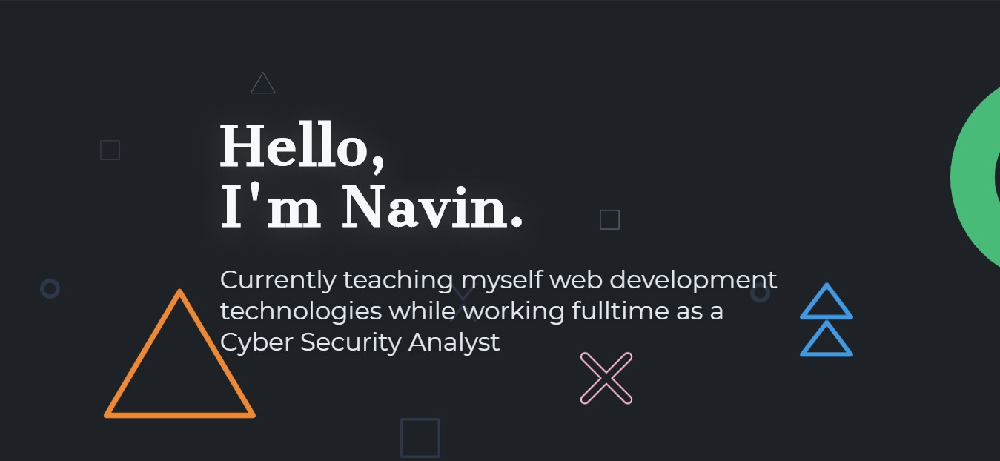

# 1. Welcome to my Blog

## Day 1: June 19, 2019 - Wednesday

**Project:** Polished my [Blog](https://navin-navi.github.io/)

**Live Demo:** [Edit in Code Sandbox](https://codesandbox.io/s/navin-navigithubio-egxzq?fontsize=14)

**Progress:** Completed developing my blog.

**Brief Description:**

After one week of tireless work learning Gatsby from scratch to understanding how React works, I was able to finally deliver my work with full satisfaction. It was not easy, doing a full time job and learning after that but my real motivation was from the coding communities who manages everything and still code an hour daily.

Among those my real motivation comes from [James Priest](https://twitter.com/james_priest1) seeing him posting his work daily without fail.

With this I am going to start over my #100DaysOfCode Rounds with just counting the Day. But in the end these are just the number. Learning daily is the thing.

**Links:**

- [GitHub Repository](https://github.com/navin-navi/navin-navi.github.io)
- [Original Inspiration Repo Link from LekoArts](https://github.com/LekoArts/gatsby-starter-portfolio-cara)

---
