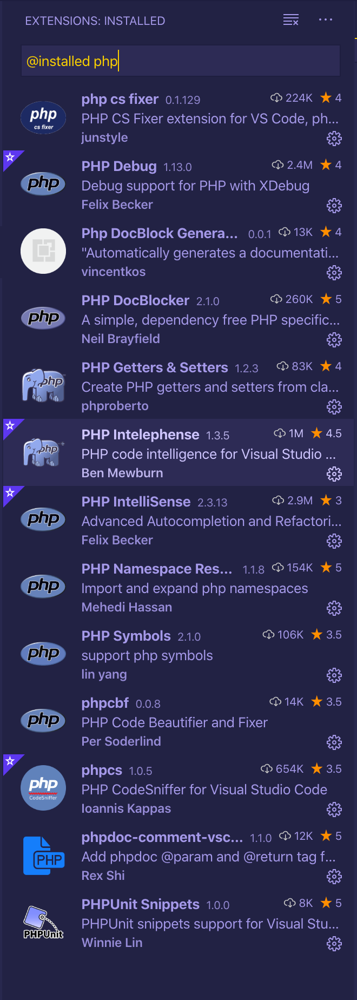

## PHP setup in VSCode

### Day 1: December 17, 2019 - Tuesday

**BRIEF DESCRIPTION:**

- Completed 💯 `Module 8` in VSCode Pro.
- Learned a lot about setting up the Editor for a PHP/Wordpress project.
- Quite long 😫 but finally [ended](https://madewithlove.be/using-prettier-in-php/) up customizing [php cs fixer](https://github.com/FriendsOfPHP/PHP-CS-Fixer) & [prettier php plugin](https://github.com/prettier/plugin-php) to work together. 💪
- Followed the course to learn about wordpress site lauching & debugging.
- Wrote a couple of new global snippets in VSCode for documenting.
- Awesome 🌟 videos i saw today
  - [Fireship](https://www.youtube.com/channel/UCsBjURrPoezykLs9EqgamOA) about [Cloud Computing](https://www.youtube.com/watch?v=1pBuwKwaHp0&list=TLPQMTcxMjIwMTmYvwjQLjm2oQ&index=4)
  - [AR Core Depth API](https://www.youtube.com/watch?v=VOVhCTb-1io)
- [AhmadAwais](https://twitter.com/MrAhmadAwais) replied to my review for [Shades of Purple](https://github.com/ahmadawais/shades-of-purple-vscode) with `SuperCaliFragilisticExpialidocious! 🎉` 🤔
- No idea what that is, so googled it to see a [SuperCaliFragilisticExpialidocious video from Mary Poppins](https://www.youtube.com/watch?v=1Pu1adxqUAg) 😆😆

**REFERENCES:**

- [VSCode.pro](https://vscode.pro/)
- [PHP-CS-Fixer](https://github.com/FriendsOfPHP/PHP-CS-Fixer)
- [Prettier PHP Plugin](https://github.com/prettier/plugin-php)
- [Fireship](https://www.youtube.com/channel/UCsBjURrPoezykLs9EqgamOA)
- [Cloud Computing - Fireship](https://www.youtube.com/watch?v=1pBuwKwaHp0&list=TLPQMTcxMjIwMTmYvwjQLjm2oQ&index=4)
- [SuperCaliFragilisticExpialidocious video from Mary Poppins](https://www.youtube.com/watch?v=1Pu1adxqUAg)
- [Shades of Purple](https://github.com/ahmadawais/shades-of-purple-vscode)
- [VSCode Tips & Tricks](https://github.com/ahmadawais/VSCode-Tips-Tricks)

## [Go to Round 2](/blog/round-2-100-days-of-code/)
