## 46.Complete React Developer in 2019

### Day 46: August 09, 2019 - Friday

**Project:** Completed Section 4 and Appendix

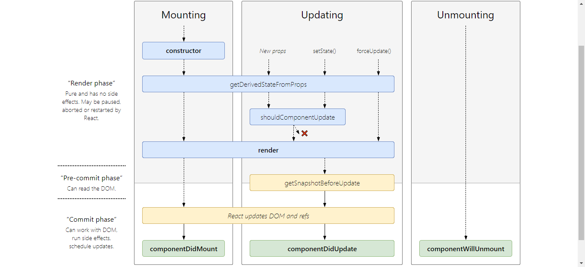

**Live:** [React DOM and Lifecycle events](http://35.154.61.191:8080/blog/complete-react-developer-in-2019/#44-react-and-reactdom)

**Brief Description:**

Learned about a couple of new things,

- [React and ReactDOM](https://navin-navi.github.io/blog/complete-react-developer-in-2019/#44-react-and-reactdom)
- [Revisiting Virtual-DOM +Unidirectional Data Flow](https://navin-navi.github.io/blog/complete-react-developer-in-2019/#45-revisiting-virtual-dom-unidirectional-data-flow)
- [Asynchronous setState](https://navin-navi.github.io/blog/complete-react-developer-in-2019/#46-asynchronous-setstate)
- [Introducing LifeCycle Methods](https://navin-navi.github.io/blog/complete-react-developer-in-2019/#47-introducing-lifecycle-methods)
- [Appendix 1: Key Developer Concepts](https://navin-navi.github.io/blog/complete-react-developer-in-2019/#section-32-appendix-1-key-developer-concepts)
- [Update my Git101 Post](https://navin-navi.github.io/blog/git-101/#getting-started)

---

## 45.Complete React Developer in 2019

### Day 45: August 08, 2019 - Thursday

**Project:** Yet to complete Section 3

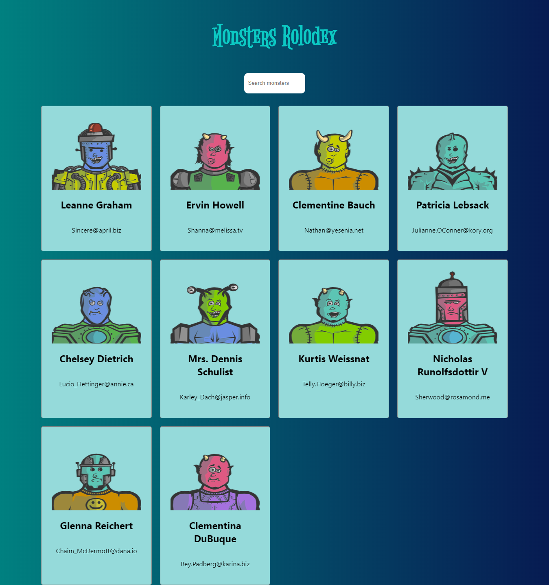

**Repo:** [Monster Rolodex](https://github.com/navin-navi/monsters-rolodex)
**Live:** [Monster Rolodex](https://navin-navi.github.io/monsters-rolodex/)

**Brief Description:**

Learned about a couple of new things,

- [Added SearchField Component](https://navin-navi.github.io/blog/complete-react-developer-in-2019/#32-searchfield-state)
- [React Events](https://navin-navi.github.io/blog/complete-react-developer-in-2019/#33-react-events)
- [Added Filter Login to the Search Component](https://navin-navi.github.io/blog/complete-react-developer-in-2019/#34-filtering-state)
- [Event Binding](https://navin-navi.github.io/blog/complete-react-developer-in-2019/#38-class-methods-and-arrowfunctions)
- [Responsive App deployed to GH Pages](https://navin-navi.github.io/blog/complete-react-developer-in-2019/#43-deploying-our-app)

---

## 44.Complete React Developer in 2019

### Day 44: August 07, 2019 - Wednesday

**Project:** Yet to complete Section 3

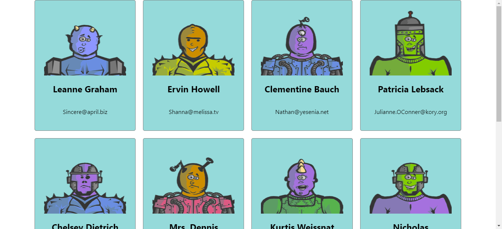

**Live Post:** [Monster Rolodex In Works](https://navin-navi.github.io/blog/complete-react-developer-in-2019/#29-card-component)

**Brief Description:**

Learned about a couple of new things,

- [Created Card List Component](https://navin-navi.github.io/blog/complete-react-developer-in-2019/#28-card-list-component)
- [Created Card Component](https://navin-navi.github.io/blog/complete-react-developer-in-2019/#29-card-component)
- [Learned on why we are breaking everything into components](https://navin-navi.github.io/blog/complete-react-developer-in-2019/#30-exercise-breaking-into-components)
- [Deep dive into State vs Props](https://navin-navi.github.io/blog/complete-react-developer-in-2019/#31-state-vs-props)

---

## 43. React Assignment

### Day 43: August 06, 2019 - Tuesday

**Project:** Build a React App with GitHub API - Redux Version

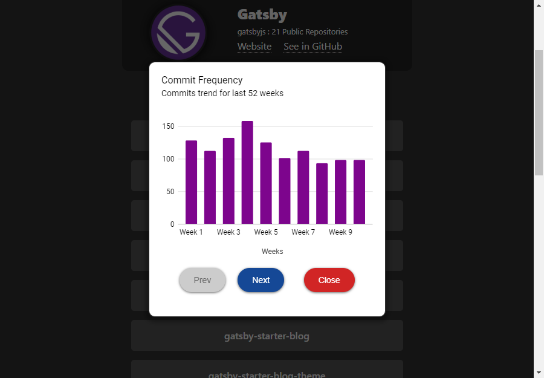

**Brief Description:**

- Basic React App built using Redux.
- Shows the weekly commits count.
- Planned to improve the app after completing the React Course.

**Links:**

- [Source Code](https://github.com/navin-navi/redux-github-commits-history-chart)
- [Live Application](https://navin-navi.github.io/redux-github-commits-history-chart/)
- [CodeSandbox](https://codesandbox.io/s/github/navin-navi/redux-github-commits-history-chart)

---

## 42. React Assignment

### Day 42: August 05, 2019 - Monday

**Project:** Build a React App with GitHub API - Hooks Version

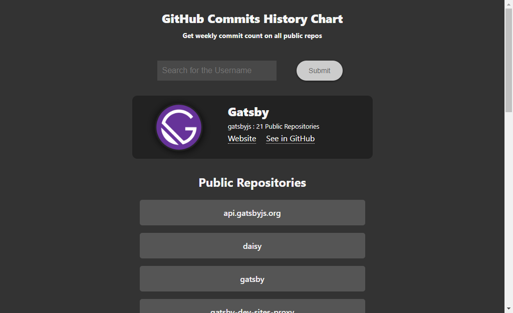

**Brief Description:**

- Basic React App built using hooks.
- Shows the weekly commits count.
- Planned to improve the app after completing the React Course.

**Links:**

- [Source Code](https://github.com/navin-navi/github-commits-history-chart)
- [Live Application](https://navin-navi.github.io/github-commits-history-chart/)
- [CodeSandbox](https://codesandbox.io/s/github/navin-navi/github-commits-history-chart/)

---

## 41.Watch Later

### Day 41: August 04, 2019 - Sunday

**Project:** See watch later videos one by one

**Brief Description:**

- [Gatsby Themes](https://www.youtube.com/watch?v=wX84vXBpMR8)
- [Gatsby Intro by Kyle Mathews](https://www.youtube.com/watch?v=U6SWCTrPtn8)
- [When should you use Gatsby](https://www.youtube.com/watch?v=VoscwJ6MGsU)
- [Gatsby with GraphQL and Apollo](https://www.youtube.com/watch?v=wNUg1jpj9T0)
- [GraphQL V1 First Look](https://www.youtube.com/watch?v=CSemYFzHAtU)

---

## 40.Watch Later

### Day 40: August 03, 2019 - Saturday

**Project:** See one by one watch later videos

**Brief Description:**

- Today I thought to look into the new prespective of Procrastination called Watch Later and do something about it.
- [Why I won't work a developer job anymore | #grindreel #entrepreneurship](https://www.youtube.com/watch?v=MbUvTbD9q4A&list=WL&index=56)
- [REST vs. GraphQL](https://www.youtube.com/watch?v=UnHGlHXglJQ)
- [GraphQL vs REST - What is GraphQL and Why You Should Choose It](https://www.youtube.com/watch?v=6H7-3_Wgwu4)
- [GraphQL: The Documentary](https://www.youtube.com/watch?v=783ccP__No8)
- [Introducing Gatsby Themes](https://www.youtube.com/watch?v=wX84vXBpMR8)

---

## 39.Interview Preparation

### Day 39: August 02, 2019 - Friday

**Project:** Interview Preparation

**Brief Description:**

- Today I concentrated to refresh my javascript skills.
- Mostly learned about React, Angular & Javascript.
- Not much of a coding.

---

## 38.Complete React Developer in 2019

### Day 38: August 01, 2019 - Thursday

**Project:** Course Started

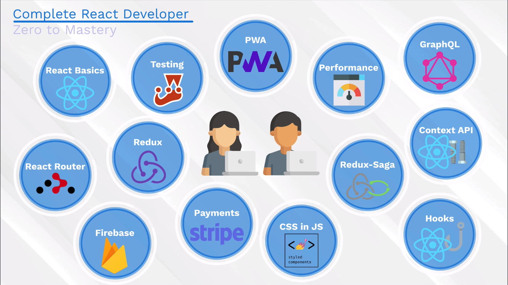

**Live Post:** [React Basics](https://navin-navi.github.io/blog/complete-react-developer-in-2019/)

**Brief Description:**

Learned about a couple of new things,

- [React Introduction](https://navin-navi.github.io/blog/complete-react-developer-in-2019/#section-1-introduction)
- [React KeyComponents](https://navin-navi.github.io/blog/complete-react-developer-in-2019/#section-2-react-key-concepts)
- [React Basics](https://navin-navi.github.io/blog/complete-react-developer-in-2019/#section-3-react-basics)

---

## 37.JavaScript Basics - Ultimate Courses

### Day 37: July 30, 2019 - Wednesday

**Project:** Course Completed

**Live Post:** [String, Objects and Arrays](https://navin-navi.github.io/blog/ultimate-courses-javascript-basics/#conditional-logic)

**Brief Description:**

Learned about a couple of new things,

- [Conditional Logic](https://navin-navi.github.io/blog/ultimate-courses-javascript-basics/#conditional-logic)
- [Numbers In-Depth](https://navin-navi.github.io/blog/ultimate-courses-javascript-basics/#numbers-in-depth)
- [Strings In-Depth](https://navin-navi.github.io/blog/ultimate-courses-javascript-basics/#boolean-in-depth)
- [Boolean In-Depth](https://navin-navi.github.io/blog/ultimate-courses-javascript-basics/#boolean-in-depth)
- [Functions In-Depth](https://navin-navi.github.io/blog/ultimate-courses-javascript-basics/#functions-in-depth)
- [Objects In-Depth](https://navin-navi.github.io/blog/ultimate-courses-javascript-basics/#objects-in-depth)
- [Arrays In-Depth](https://navin-navi.github.io/blog/ultimate-courses-javascript-basics/#arrays-in-depth)

---

## 36.JavaScript Basics - Ultimate Courses

### Day 36: July 30, 2019 - Tuesday

**Project:** JavaScript variables and truthy and falsy values

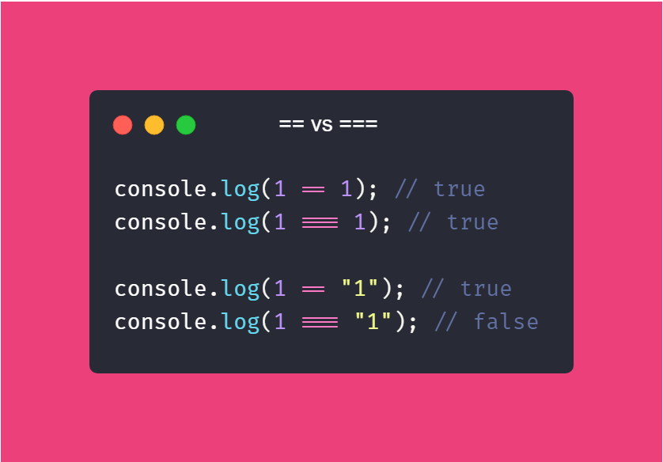

**Live Post:** [Javascript Variables](https://navin-navi.github.io/blog/ultimate-courses-javascript-basics/#understanding-var-and-hoisting)

**Brief Description:**

- Understanding `var` and Hoisting
- Block scoping and `let`
- Variables with `const`
- Conditional Logic - `Truthy and Falsy Values`

---

## 35.JavaScript Basics - Ultimate Courses

### Day 35: July 29, 2019 - Monday

**Project:** JavaScript History and Starter Application Walkthrough

**Live Post:** https://navin-navi.github.io/blog/ultimate-courses-javascript-basics/

**Brief Description:**

- After months of project and assignments, I am back to full fledged learning.
- Started of with the most recommeded course I encountered in Twitter.
- The saying is true, I completed two modules and I am already in love with the quality and presentation of the contents.
- Today I learned about the Introduction to Javascript.
- Cloned the starter application and learned about every file in them.

---

## 34.Fitness Studio Project

### Day 34: July 28, 2019 - Sunday

**Project:** Final touches to the Project

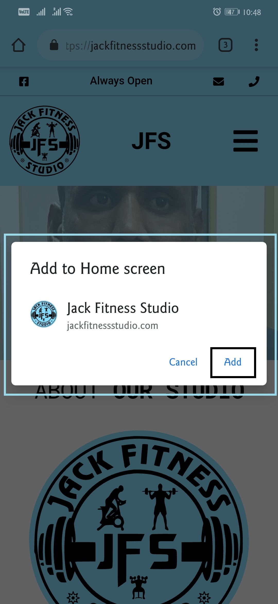

**Live Demo:** https://jackfitnessstudio.com

**Brief Description:**

- Started the day with excitation about my completion of first client project.
- Done some final small changes to the site based on the reviews.
- Had to explain some features of the site and some emails explaining some everything.

---

## 33.Fitness Studio Project

### Day 33: July 27, 2019 - Saturday

**Project:** Final touches to the Project

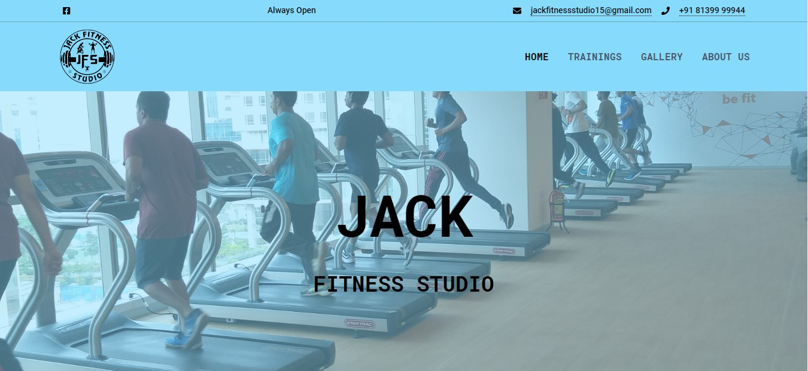

**Live Demo:** https://jackfitnessstudio.com

**Brief Description:**

- Worked on the Video Gallery and 404 Page.
- Not Experienced in building the Video Component, so built with a available package.
- Completed the MVP and the product ready for the launch.
- Lot more code refractoring and performance improvements are needed.

---

## 32.Fitness Studio Project

### Day 32: July 26, 2019 - Friday

**Project:** Build components to the Projects

**Brief Description:**

- Worked on the Testimial and Hero Component.
- Learned about some React NPM Components and thier functionalities.
- Used React Slick Component and React Lazy Hero Component.

---

## 31.Fitness Studio Project

### Day 31: July 25, 2019 - Thursday

**Project:** Build components to the Projects

**Brief Description:**

- Worked on the About Component.
- Forked and installed new Code-Server Beta Application.
- Learned more about VSCode settings.json

---

## 30.Fitness Studio Project

### Day 30: July 24, 2019 - Wednesday

**Project:** Build components to the Projects

**Brief Description:**

- Worked on the Contact Component.
- Took some to test Thea IDE in installing locally and testing it's features.
- Also installed a bunch of new VS Code Extensions to IDE.

---

## 29.Fitness Studio Project

### Day 29: July 23, 2019 - Tuesday

**Project:** Build components to the Projects

**Brief Description:**

- Worked on the Trainings Offered Component.
- Carefully selected Icons for the component from Flaticon.
- Icons are all of same Fill type.

---

## 28.Fitness Studio Project

### Day 28: July 20, 2019 - Saturday

**Project:** Build components to the Projects

**Brief Description:**

- Worked on the Service Offered Component.
- Learned more about Flexbox.

---

## 27.Fitness Studio Project

### Day 27: July 19, 2019 - Friday

**Project:** Build components to the Projects

**Brief Description:**

- Worked on the SideNav for Mobile Devices.
- Learned about passing the state between child and parent.
- Took some time but I learned something new.

---

## 26.Fitness Studio Project

### Day 26: July 18, 2019 - Thursday

**Project:** Upgrade to Gatsby and Improve the Site

**Brief Description:**

- Worked on the Top Bar and the Navbar
- Navbar is almost done, but working on the hamburger menu with side nav for Mobile device
- Prefer to develop Desktop first and mobile next component wise.

---

## 25.Understand Styled Components and Tailwind CSS

### Day 25: July 17, 2019 - Wednesday

**Project:** Understand Styled Components and Tailwind CSS

**Brief Description:**

- Today was completely on using Tailwind with Styled Components.
- Read the documentation of both in their sites.
- Tried out some code snippets to understand them better.

---

## 24.Understand Reboot, reset & remedy CSS

### Day 24: July 16, 2019 - Tuesday

**Project:** Understand Reboot, reset & remedy CSS

**Brief Description:**

- Learned about Twitter bootstrap's Reboot CSS.
- Understood what reset and remedy css is doing.
- Took a peek on normalize css & Tailwind base css.
- Decided to use reboot css for my project as a starter css.

---

## 23.Understand ESLint

### Day 23: July 15, 2019 - Monday

**Project:** Understand ESLint

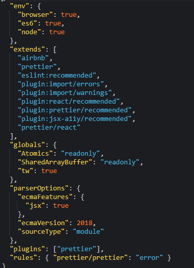

**Brief Description:**

- Took some break from projects to understand the eslint basics.
- Initialized Eslint in VsCode and chose Airbnb Code style.
- Integrated with Prettier and used Recommended rules.
- Understood each and every plugins used in eslint through their docs.
- Integrated Prettier/React plugins and used React recommended lints.
- Understood the difference between extends and plugins.

---

## 22.Angular Express Issue Tracker Project

### Day 22: July 14, 2019 - Sunday

**Project:** Finish Angular Express Project

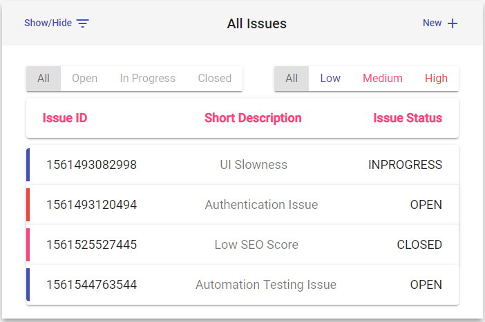

**Progress:** Completed Angular Express Project

**Live Demo:** https://angular-express-issue-tracker.herokuapp.com/

**Brief Description:**

- Integrated both the Angular and Express App into One App
- Deployed in Heroku

**Links:**

- [GitHub Repository](https://github.com/navin-navi/angular-express-issue-tracker)

---

## 21.Express Issue Tracker Project

### Day 21: July 13, 2019 - Saturday

**Project:** Finish Express Project

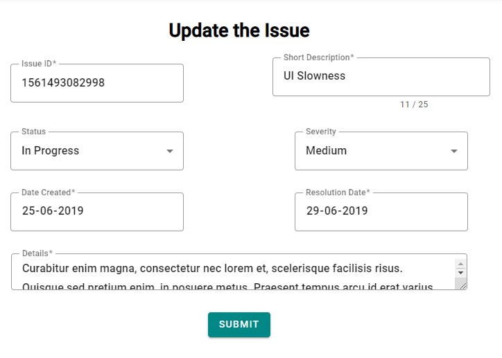

**Progress:** Completed Express Project

**Live Demo:** https://express-issue-tracker.herokuapp.com/

**Brief Description:**

- Finished designing the New and Update Page.
- Performed CRUD Operations.
- Fully functioning application deployed in Heroku.

**Links:**

- [GitHub Repository](https://github.com/navin-navi/express-issue-tracker)

---

## 20.Node JS Issue Tracker Project

### Day 20: July 12, 2019 - Friday

**Project:** Finish Node JS Project

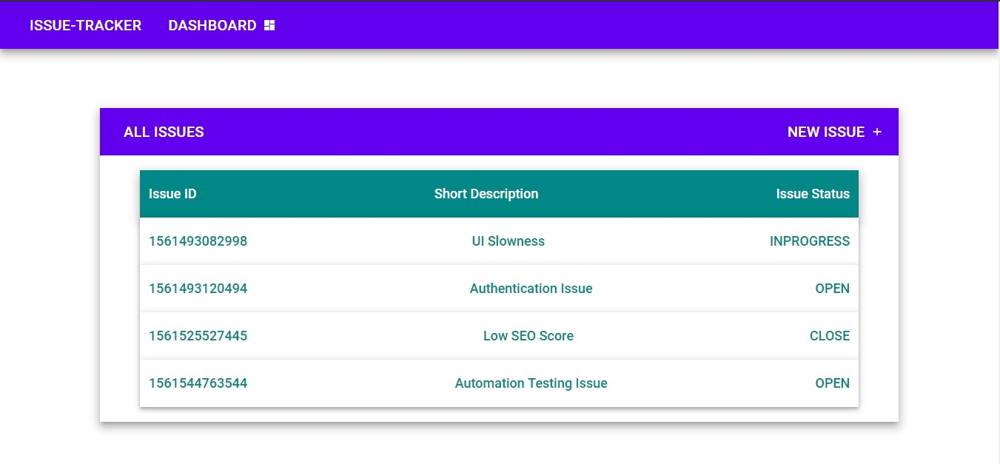

**Progress:** Half Completed Node JS Project

**Brief Description:**

- Rebuild the Angular Issue Tracker with Node JS.
- Used MDC Material Design Components for the UI.

---

## 19.Node JS Assignments

### Day 19: July 11, 2019 - Thursday

**Project:** Finish 3 Node JS Assignments

**Progress:** Finished all 3 Node JS Assignments

**Brief Description:**

- Built an Express router to get the result params from the url.
- Built an Express router to accept json input and display them in table on request.
- Built an Express router that sends the json file on request.

---

## 18.About Page

### Day 18: July 10, 2019 - Wednesday

**Project:** Build About Page

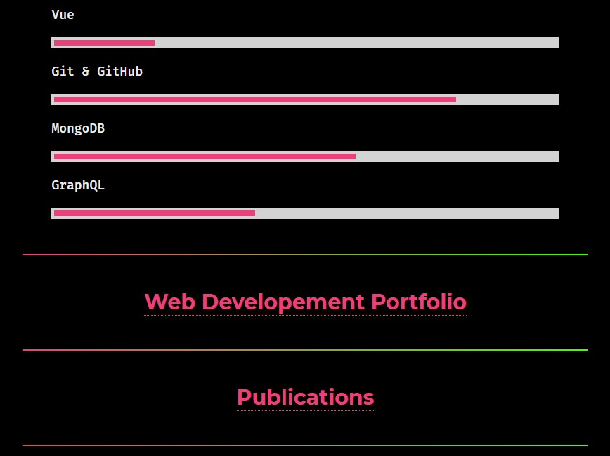

**Live Demo:** https://navin-navi.github.io/about

**Progress:** Completed about Page for my blog

**Brief Description:**

- Finished writing contents for my about page.
- Built company and Linkedin Profile.

**Links:**

- [About Page](https://navin-navi.github.io/about)

---

## 17.About Page

### Day 17: July 09, 2019 - Tuesday

**Project:** Build About Page

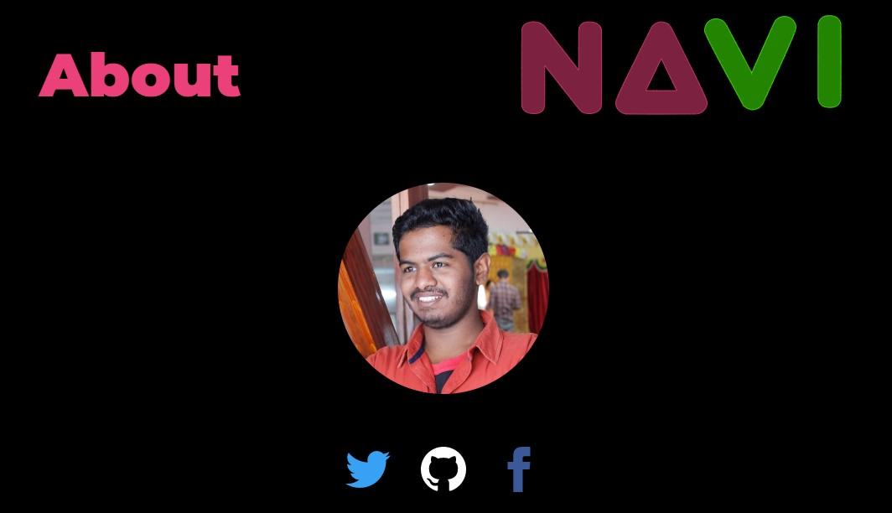

**Live Demo:** https://navin-navi.github.io/about

**Progress:** Half completed about Page for my blog

**Brief Description:**

- Designed my about page.
- Started building the site and it's now half completed with Intro and Skills completed.
- Wasted most of my time in trying out new designs and in deciding on which to proceed.

**Links:**

- [About Page](https://navin-navi.github.io/about)

---

## 16.Projects Page

### Day 16: July 08, 2019 - Monday

**Project:** Build Projects Page

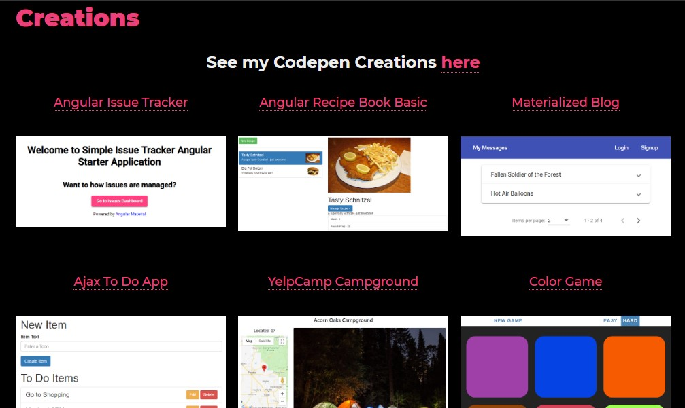

**Live Demo:** https://navin-navi.github.io/projects

**Progress:** Finished building Projects Page for my blog

**Brief Description:**

- Added Images to every projects.
- Images are rendered by Gatsby Images - Traced SVG and lazy loading.
- Added Codepen Creations Page with all the Codepen project Iframes.

**Links:**

- [Projects Page](https://navin-navi.github.io/projects)
- [Codepen Creations](https://navin-navi.github.io/blog/codepen-creations/)

---

## 15.Issue Tracker Application

### Day 15: July 05, 2019 - Friday

**Project:** Angular Issue Tracker

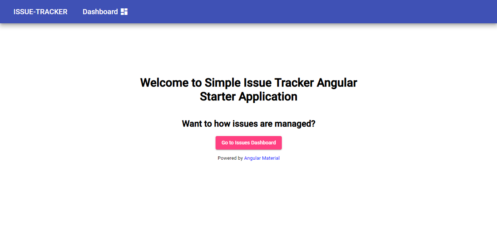

**Live Demo:** https://navin-navi.github.io/angular-issue-tracker/

**Progress:** Published the application in GHpages with CI

**Brief Description:**

- Worked on bringing my Issue Tracker Application Live.
- Fixed some bugs while making them live.
- Travis CI for Auto Deployment on successful build.

**Links:**

- [Issue Tracker Live](https://navin-navi.github.io/angular-issue-tracker/)
- [GitHub Repository](https://github.com/navin-navi/angular-issue-tracker)

---

## 14.Organize Old Projects

### Day 14: July 04, 2019 - Thursday

**Project:** Organize my Old Projects

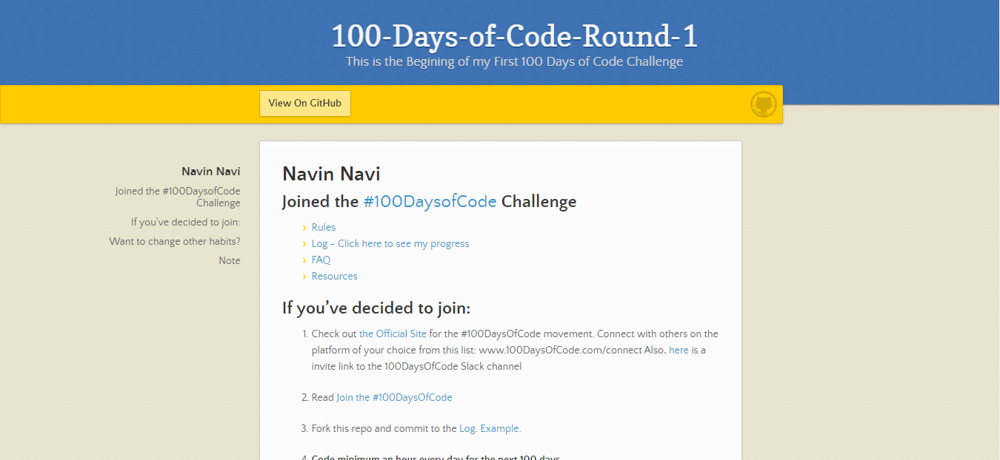

**Live Demo:** https://navin-navi.github.io/100-Days-of-Code-Round-1/

**Progress:** Made an JSON API endpoint to power a project

**Brief Description:**

- Worked on creating own JSON Server to power an app.
- Made my Round 1 in #100DaysOfCode into a Jekyll site.

**Links:**

- [Live](https://navin-navi.github.io/100-Days-of-Code-Round-1/)
- [GitHub Repository](https://github.com/navin-navi/100-Days-of-Code-Round-1)

---

## 13.Organize Old Projects

### Day 13: July 03, 2019 - Wednesday

**Project:** Organize my Old Projects

**Live Demo:** https://materialized-blog.herokuapp.com/

**Progress:** Finally the site is made public

**Brief Description:**

- Worked on one project, split the code into front and backend
- Deployed in Heroku
- Mongo DB atlas connected
- Relearned how the project work and fixed some bugs.

**Links:**

- [Live Demo WIP](https://materialized-blog.herokuapp.com/)
- [GitHub Repository](https://github.com/navin-navi/material-blog-backend)

---

## 12.Organize Old Projects

### Day 12: July 02, 2019 - Tuesday

**Project:** Organize my Old Projects

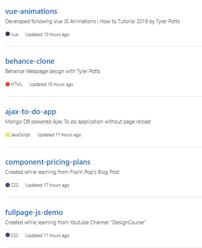

**Live Demo:** https://navin-navi.github.io/

**Progress:** Made Progress and today's target was achieved

**Brief Description:**

- Worked on organizing some of my old experiments and improving them giving them a URL.
- Had to recall Mongo DB and Mongoose Works.
- Really amazed to see these projects getting organized that were sitting.

**Links:**

- [Live Demo WIP](https://navin-navi.github.io/projects)
- [GitHub Repository](https://github.com/navin-navi/navin-navi.github.io)

---

## 11.Organize Old Projects

### Day 11: July 01, 2019 - Monday

**Project:** Organize my Old Projects

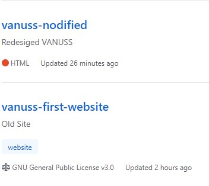

**Live Demo:** https://navin-navi.github.io/

**Progress:** Made Progress and today's target was achieved

**Brief Description:**

- Worked on organizing some of my old experiments and improving them giving them a URL.
- Updated the dependencies and renovated them for auto dependency update.
- Understood ESlint and Prettier Integration.
- Airbnb styled as default.

**Links:**

- [Live Demo WIP](https://navin-navi.github.io/projects)
- [GitHub Repository](https://github.com/navin-navi/navin-navi.github.io)

---

## 10.Organize Old Projects

### Day 10: June 30, 2019 - Sunday

**Project:** Organize my Old Projects

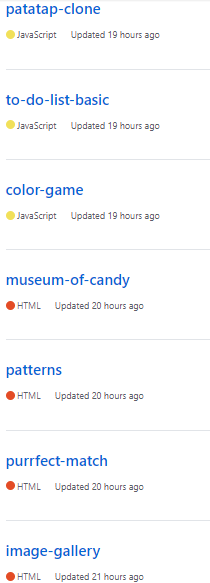

**Live Demo:** https://navin-navi.github.io/

**Progress:** Made Progress and today's target was achieved

**Brief Description:**

- Worked on organizing some of my old experiments and improving them giving them a URL

**Links:**

- [Live Demo WIP](https://navin-navi.github.io/projects)
- [GitHub Repository](https://github.com/navin-navi/navin-navi.github.io)

---

## 9.Blog Improvements

### Day 9: June 29, 2019 - Saturday

**Project:** Improve my blog layout and code quality

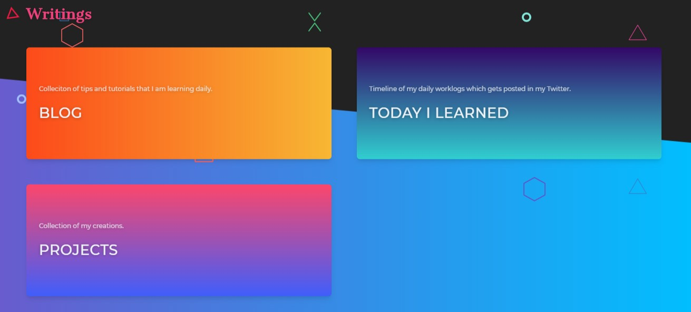

**Live Demo:** https://navin-navi.github.io/

**Progress:** Made Progress and today's target was achieved

**Brief Description:**

- Experimented with FB and Twitter SDK to add the Share Button.
- Fixed the layout and refracted the code for the Share Component.
- Added Projects Section and Created a Layout Component.
- Now Layout Component Will be the default for all the pages.
- Took some time for planning the design but finally fixed with the common layout.

**Links:**

- [Live Demo](https://navin-navi.github.io/blog)
- [GitHub Repository](https://github.com/navin-navi/navin-navi.github.io)

---

## 8.Blog Improvements

### Day 8: June 28, 2019 - Friday

**Project:** Improve my blog layout and code quality

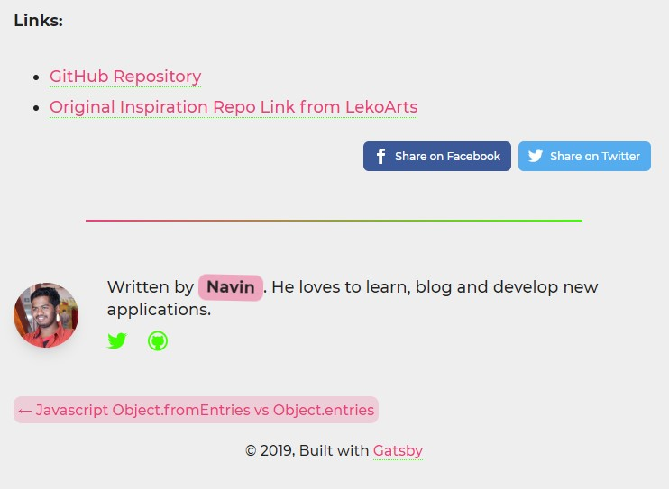

**Live Demo:** https://navin-navi.github.io/

**Progress:** Made Progress and today's target was achieved

**Brief Description:**

- **Highlight** - Added Dark & Light Theme Switch.
- Fixed all the css to control the theme switch bugs.
- Made Dark Theme as Default on Page Load.
- **Highlight** - Added Social Share Icons - FaceBook and Twitter.
- Still a lot of work and code optimization needs to be done.
- Removed Lodash as there is no use for it in the Project.

**Links:**

- [Live Demo](https://navin-navi.github.io/blog)
- [GitHub Repository](https://github.com/navin-navi/navin-navi.github.io)

---

## 7. Blog Improvements

### Day 7: June 27, 2019 - Thursday

**Project:** Improve my blog layout and code quality

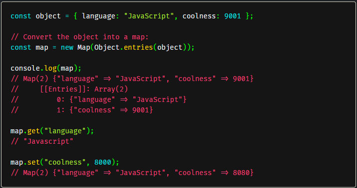

**Live Demo:** https://navin-navi.github.io/

**Progress:** Made Progress and today's target was achieved

**Brief Description:**

- Changed Syntax Highlighting from Fira Mono to Fira Code
- Updated [README](https://github.com/navin-navi/navin-navi.github.io/blob/dev/README.md) with tons of details.
- Added heartbeat animation to Footer love SVG using tailwind.
- Added Markdown Images - Medium like Zoom on click.
- Smooth Scroll for all post header anchor link.
- Mobile code display and multiple optimization and code refractoring done.

**Links:**

- [Live Demo](https://navin-navi.github.io/blog)
- [GitHub Repository](https://github.com/navin-navi/navin-navi.github.io)

---

## 6. Angular Issue Tracker Project

### Day 6: June 26, 2019 - Wednesday

**Project:** Complete Angular Issue Tracker Project

**Live Demo:** Will soon give this one a seperate repo and make it live

**Progress:** Completed Angular Issue Tracker Project

**Brief Description:**

- Implemented snackBar Notificaiton, filters and customizations to the Issue Tracker Project.
- Submitted the Project for review.
- Implemented Pagination to this blog.
- Imported old blogs from the html to this site as markdown.
- Some UI improvements to the blog.
- Planned to implement Dark and Light Mode and Fira Code font for Code Syntax HighLighting.

**Links:**

- [GitHub Repository](https://github.com/navin-navi/Angular-Collection.git)

---

## 5. Angular Issue Tracker Project

### Day 5: June 25, 2019 - Tuesday

**Project:** Complete Angular Issue Tracker Project

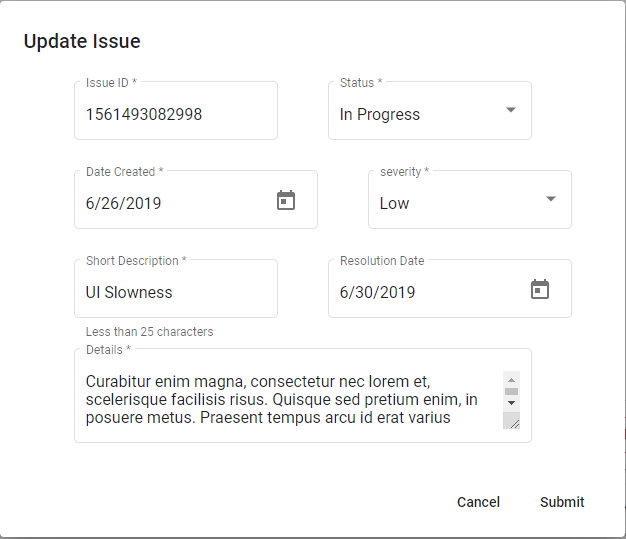

**Live Demo:** Will make it available once complete

**Progress:** Nearly Complete the Project

**Brief Description:**

- Designed UI for Create and Update Component.
- Implemented and tested CRUD operation using JSON Server.
- Need to implement filters and customization along with chip notification for every action.

**Links:**

- [GitHub Repository](https://github.com/navin-navi/Angular-Collection.git)

---

## 4. Angular Issue Tracker Project

### Day 4: June 24, 2019 - Monday

**Project:** Complete Angular Issue Tracker Project

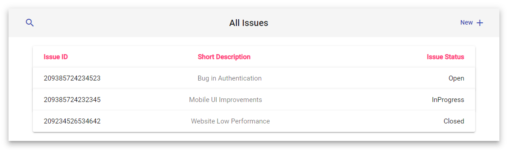

**Live Demo:** Will make it available once complete

**Progress:** Half way through the Project

**Brief Description:**

- Designed UI and used model data to fetch from database.
- Planned on how to implement CRUD Operation and the UI for the respective actions.

**Links:**

- [GitHub Repository](https://github.com/navin-navi/Angular-Collection.git)

---

## 3. First Javascript Article

### Day 3: June 21, 2019 - Friday

**Project:** Learn new Javascript API and Write article about it

**Article Live @:** [this LINK](https://navin-navi.github.io/blog/javascript-Object.fromEntries-vs-Object.entries/)

**Progress:** Wrote and published it in my site today

**Brief Description:**

Today I spent most of the time learning and researching about Javascript Object.entries and Object.fromEntries to write an article about those.

Then I planned for the Issue Tracker Angular Application that I need to build as part of the Full Stack Course. Nearing the End date.

**Links:**

- Live - [Javascript Object.fromEntries vs Object.entries](https://navin-navi.github.io/blog/javascript-Object.fromEntries-vs-Object.entries/)

---

## 2. Angular HTTP Assignment

### Day 2: June 20, 2019 - Thursday

**Project:** FullStack Program Angular Assignment

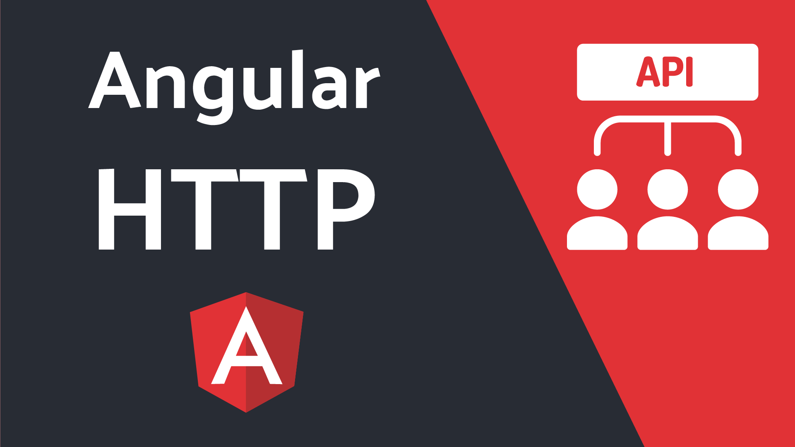

**Live Demo:** No Demo

**Progress:** Completed 3rd Angular assignment

**Brief Description:**

This assignment is completely focused on Angular HTTP feature, where

1. I need to GET the Products data from the server which is in json format and show the output.
2. Need to submit the new product through form and update the data through POST request. Also need to display the newly added product.

**Links:**

- [Referenced Official Documentation](https://angular.io/guide/http)

---

## 1. Welcome to my Blog

### Day 1: June 19, 2019 - Wednesday

**Project:** Polished my [Blog](https://navin-navi.github.io/)

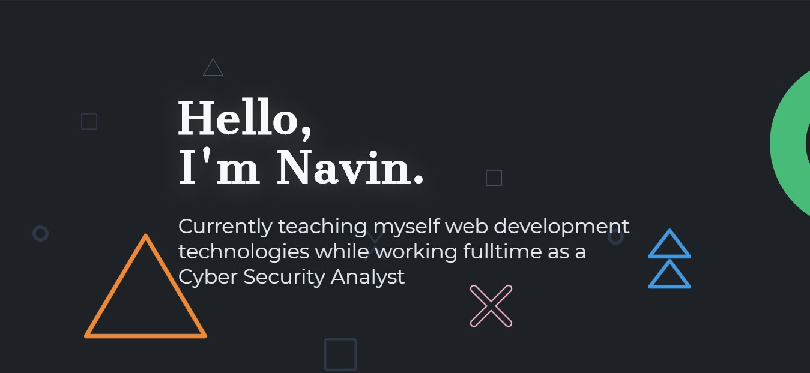

**Live Demo:** [Edit in Code Sandbox](https://codesandbox.io/s/navin-navigithubio-egxzq?fontsize=14)

**Progress:** Completed developing my blog.

**Brief Description:**

After one week of tireless work learning Gatsby from scratch to understanding how React works, I was able to finally deliver my work with full satisfaction. It was not easy, doing a full time job and learning after that but my real motivation was from the coding communities who manages everything and still code an hour daily.

Among those my real motivation comes from [James Priest](https://twitter.com/james_priest1) seeing him posting his work daily without fail.

With this I am going to start over my #100DaysOfCode Rounds with just counting the Day. But in the end these are just the number. Learning daily is the thing.

**Links:**

- [GitHub Repository](https://github.com/navin-navi/navin-navi.github.io)
- [Original Inspiration Repo Link from LekoArts](https://github.com/LekoArts/gatsby-starter-portfolio-cara)
