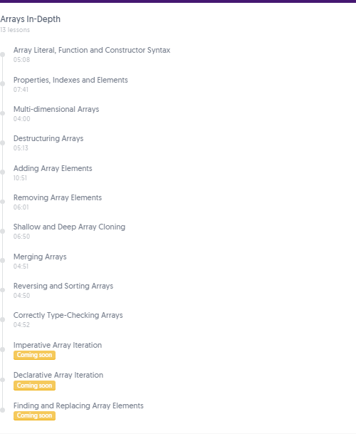

## Course Notes


One of the most recommended courses in Twitter crafted by Todd Motto with [Ultimate Courses](https://ultimatecourses.com/course/javascript-basics)

## The Missing Introduction to JavaScript


### The Missing Introduction to JavaScript


`Course Intro`


`Overview of what JavaScript is!! and its features`


`Interpreted vs Compiled Language Differences`


- Interpreted Language - No need to be compiled for the execution. Execute directly at Run time.
- Compiled Language - Need a compiler which compiles during the build time.

`Multi-Paradigm Language`


- JavaScript supports multiple styles and designs of writing the code.

`History of JavaScript`


- JavaScript conforms to ECMAScript(ES) Standards.
- Browser vendors should comply to this to reduce the cross-browser bugs.
- Now ECMA Script is being updated yearly.
- Not all browsers supports all the latest ES Features.

`Browser Support`


- Babel compiles our latest JavaScript code into a code that will be supported by all the browsers including older versions.
- Basically it complies ES2015 and Beyond code into ES5 which is supported by all the browsers.

`JavaScript in Front-End vs Back-End`


`Front End - V8 Engine by Google`


- Browser has something called Document Object Model(DOM).
- JavaScript can interact with DOM Environment to manipulate it.
- One need to learn JavaScript Language along with DOM to fully understand the concept.


`Back End - Node JS`


- Node JS has V8 Engine but does not have DOM.
- It has something called Server Side Environment which it can interact with!

### Modern JavaScript


`Tooling and Automating JavaScript Development Environtments`


### External Resources


[Node JS](https://nodejs.org/en) | [NPM](https://www.npmjs.com) | [Babel](https://babeljs.io) | [Web-Pack](https://webpack.js.org) | [ESLint](https://eslint.org) | [MDN Firefox](https://developer.mozilla.org/en-US) | [ECMA International](https://www.ecma-international.org/)

## Variables, Declarations and Assignment


### Project Setup

`Tools`


[VS Code](https://code.visualstudio.com/download) | [Google Chrome](https://www.google.co.uk/chrome/) | [Node.js](https://nodejs.org/en/download/)

`Project Links`


[Starter Project Source](https://github.com/ultimatecourses/javascript-basics)

`Setup Instructions`

Join Ultimate Courses - [Slack Channel](https://slack.ultimatecourses.com/)


### Project Walk-through and Install

**Project Walk-through**

- Clone the starter application from source code - GitHub [link](https://github.com/ultimatecourses/javascript-basics).

- `git clone https://github.com/ultimatecourses/javascript-basics`


- Change the current directory to "javascript-basics".
- `cd javascript-basics`
- Now lets start with the `index.html` - base of our project.

`Path: ./index.html`

```html
<!DOCTYPE html>
<html>
  <head>
    <title>Ultimate Courses</title>
  </head>
  <body>
    <header class="header">
      <div class="logo">
        <div class="logo-ultimate"></div>
        <p class="logo-name">Ultimate Courses<span>&trade;</span></p>
      </div>
    </header>
    <div id="app"></div>
  </body>
</html>
```

- We will be seeing the source code here and console window from Chrome's Dev-Tools to debug our application.

`Path: ./src/index.js`

```js
import "../assets/css/style.css";

const app = document.getElementById("app");
app.innerHTML = "<h1>JavaScript Basics</h1>";
```

1. Imported the css file into this java script file
2. We are now accessing the HTML's DOM Element `<div id="app"></div>` using `document.getElementById('app')`.
3. Setting it's `innerHTML` as `<h1>JavaScript Basics</h1>`.

- `assests` folder has all the required files for styling(CSS), font and images


- `.babelrc` has the recommended basic configuration required by the Babel.

`Path: ./.babelrc`

```json
{
  "presets": ["@babel/preset-env"]
}
```

- `.eslint.json` is a powerful tool to help us with the Code Quality.
- Display's errors in case of a bad quality of code written as red squiggly.

`Path: ./.eslint.json`

```json
{
  "env": {
    "browser": true,
    "es6": true
  },
  "extends": "eslint:recommended",
  "globals": {
    "Atomics": "readonly",
    "SharedArrayBuffer": "readonly"
  },
  "parserOptions": {
    "ecmaVersion": 2018,
    "sourceType": "module"
  },
  "rules": {
    "no-console": "off"
  }
}
```

`Path: ./webpack.config.babel.js`

```js
import path from "path";
import HtmlWebpackPlugin from "html-webpack-plugin";

export default {
  entry: path.join(__dirname, "src/index.js"),
  output: {
    path: path.join(__dirname, "dist"),
    filename: "[name].bundle.js"
  },
  module: {
    rules: [
      {
        test: /\.js/,
        exclude: /(node_modules)/,
        use: ["babel-loader", "eslint-loader"]
      },
      {
        test: /\.css$/,
        use: ["style-loader", "css-loader"]
      },
      {
        test: /\.(png|svg|jpg|gif)$/,
        use: ["file-loader"]
      },
      {
        test: /\.(woff|woff2|eot|ttf|otf)$/,
        use: ["file-loader"]
      }
    ]
  },
  plugins: [
    new HtmlWebpackPlugin({
      template: path.join(__dirname, "index.html"),
      favicon: "assets/img/favicon.png"
    })
  ],
  stats: "minimal",
  devtool: "source-map",
  mode: "development",
  devServer: {
    open: false,
    contentBase: "./dist",
    inline: true,
    port: 8080,
    host: "0.0.0.0"
  }
};
```

- Let's breakdown the web-pack file.
- Basic setup `entry` path for giving our entry js file and `output` path to give out the compiled code.
- Then rule with couple of loaders in bottom to top order telling how web-pack should compile our application.
- `HtmlWebpackPlugin` to include our `index.html` file as the template and `favicon` path to be generated and added to the final compiled `index.html`
- `devServer` to configure our development server.
- `mode` can be set to development/production.

`Path: ./package.json`

```js
{
  "name": "javascript-basics",
  "version": "1.0.0",
  "description": "Starter Repo for JavaScript Basics",
  "main": "index.js",
  "repository": {
    "type": "git",
    "url": "git://github.com/ultimatecourses/javascript-basics.git"
  },
  // Scripts that can be run using `npm`
  "scripts": {
    "test": "echo \"Error: no test specified\" && exit 1",
    "watch": "webpack --watch", // `npm run watch`
    "start": "webpack-dev-server", // `npm start`
    "build": "webpack" // `npm run build`
  },
  "author": "Ultimate Courses",
  "license": "MIT",
  // Dev Dependencies that your project relies on!!!
  "devDependencies": {
    "@babel/core": "^7.4.3", // '^'-> Satisfies Latest Version
    "@babel/preset-env": "7.4.3", // Fixed Version
    "@babel/register": "^7.4.0",
    "babel-loader": "^8.0.5",
    "css-loader": "^2.1.1",
    "eslint": "^5.16.0",
    "eslint-loader": "^2.1.2",
    "eslint-plugin-import": "^2.17.1",
    "file-loader": "^3.0.1",
    "html-webpack-plugin": "^3.2.0",
    "style-loader": "^0.23.1",
    "webpack": "^4.30.0",
    "webpack-cli": "^3.3.0",
    "webpack-dev-server": "^3.3.1"
  }
}
```

**Install**

- Dependencies are the packages that are available in NPM registry.
- Install them using `npm install`.
- Creates a `package-lock.json` which should be committed to the version control and `node_modules` which has all the files requires by our dependencies.
- This is useful to check the integrity of these packages.
- Run `npm start` to start the application by the command `webpack-dev-server`.
- This command runs the code belongs to its dependency.
- Spins up the application in `http://0.0.0.0:8080/`.
- Build the project with `npm build`. `dist` folder contains all compiled code is generated.

**Extras**

`Path: ./gitignore`

```git
node_modules
dist/*
```

- Remove the `.git` folder and `git init` to make your own git container and commit the files.
- Our `node_modules` and `dist` directory will be excluded from git watch.


Next we will see more about the project.

### Hello `<script>` World

- Lets learn about the `<script>` tag.
- It is an HTML element which holds our javascript code.
- It has two attributes `src` and `type` and `<noscript>` tag.
- `src` - path to your JavaScript file.
- `type` - `text/javascript` which means that this script is a JavaScript

```html
<script>
  console.log("Hello World!!");
</script>
```

- Output can viewed in Chrome's Dev-Tools at Console Window.
- `script` tags can be placed in `head` tag or in the end of `body` tag.
- `noscript` - to inform the user about the disabled JavaScript.

```html
<noscript>Your Javascript is disabled!!</noscript>
```

- Above code will be executed only when the browsers does not have the JavaScript Enabled.

> **Note:**
> JavaScript can be disabled manually in the browser by going to the devTools->Preference->Debugger-> Click the checkbox `Disable JavaScript`


### Understanding `var` and Hoisting

- Learned about the `var` reserved keywords.
- Declarations
- Initialization
- `undefined` - More clearance on this
- Hoisting - whatever or wherever a variable is declared, JavaScript will take and declare them at the top of the file.

```js
// Declaration
var a;
console.log(a); // `undefined`
// Initialization
a = 2;
console.log(a); // 2
```

### Block scoping and `let`

- Scoped - Within the nearest block.
- Will not be hoisted.
- Only available within the respective block.
- Can declare variables of same name in the same file within different block.

```js
// `let` declared and initialized
console.log(a); // ReferenceError: Cannot access 'a' before initialization
let a = 5;
console.log(a); // 5
```

### Variables with `const`

- Scoped
- Not bind-able to another value again
- Immutable - the variable itself
- Mutable - Objects of that variable

```js
const a = 10;
console.log(a); // 10
a = 11; // Assignment to constant variable.
```

## Conditional Logic


### Truthy and Falsy Values

`Intro`

```js
console.log(1 == 1); // true
console.log(1 === 1); // true

console.log(1 == "1"); // true
console.log(1 === "1"); // false
```

`Truthy`

```js
console.log(!!true)
console.log(Boolean(true)
console.log(!!{})
console.log(!![])
console.log(!!new Date())
console.log(!!"0")
console.log(!!42)
console.log(!!-42)
console.log(!!43.3)
console.log(!!-43.3)
```

`Falsy`

```js
console.log(!!false)
console.log(Boolean(false)
console.log(!!0)
console.log(!!"")
console.log(!!null)
console.log(!!undefined)
console.log(!!NaN)
```

### If, Else If and Else Statements

```js
const condition = true;

if (condition) {
  console.log('Yes'); // Yes
} else {
  console.log('No');
}

// OR

if (condition) console.log('Yes'); // Yes
else console.log('No');

// More realistic example
const number = 99;
let result; // undefined

if (number === 1) {
  result = 'One';
} else if (number === 99) {
  result = 'Ninety-Nine'; 
} else if (number === 1000) {
  result = 'One Thousand';
} else {
  result = 'No Match';
}

console.log(result); // Ninety-Nine
```

Ternary Operator

```js
const number = 1;
const result = 'The Number is: ' + (number === 1 ? 'One' : 'No Match');

console.log(result); // The Number is: One

// Nested Ternary Expressions
const anotherNumber = 99;
const anotherResult =
  anotherNumber === 1
    ? 'One'
    : anotherNumber === 99
    ? 'Ninety-Nine'
    : anotherNumber === 1000
    ? 'One Thousand'
    : 'No Match';

console.log(anotherResult); Ninety-Nine
```

Switch Statements

```js
const number = 1;
let result;

switch (number) {
  case 1: {
    const text = 'One';
    result = text;
    break;
  }
  case 99: {
    const text = 'Ninety-Nine';
    result = text;
    break;
  }
  case 1000:
    result = 'One Thousand';
    break;
  default:
    result = 'No Match';
}

console.log(result); // One
```

## Numbers In-Depth


### Number Literal, Function and Constructor Syntax

```js
// literal
const literalNumber = 99;
console.log(literalNumber); // 99

// function syntax
// perform a type-conversion in a non-constructor context
console.log(Number(55)); // 55
console.log(Number('33')); // 33
console.log(Number('44px')); // NaN

// constructor syntax, creates a wrapper Object
// avoid using it
console.log(new Number('44px')); // Number {NaN}
```

### Integers and Floating Points

```js
console.log(0.1 + 0.2); // 0.30000000000000004

const price = 9.33;
const quantity = 3;
console.log(price * quantity); // 27.990000000000002

const anotherPrice = 9.33 * 100;
const anotherQuantity = 3;
console.log((anotherPrice * anotherQuantity) / 100); // 27.99
```

### Parsing Strings to Numbers

```js
console.log(parseInt('55px', 10)); // 55
console.log(parseFloat('55.9999px') * 10); // 559.999

console.log(Number('55e10')); // 550000000000
console.log(Number('55.9999')); // 55.9999
console.log(9 + +'99.5555'); // 108.5555
```

### Understanding Not-a-Number

```js
const result = Number('55px'); 

// isNaN "NaN"
console.log(isNaN(result)); // true
console.log(isNaN('I am a String!')); // true

console.log(Number.NaN); // NaN
console.log(Number.isNaN(Number.NaN)); // true
console.log(Number.isNaN(result)); // true
console.log(Number.isNaN('I am another String!')); // false

console.log(Number.isInteger(66)); // true
```

### Numbers and Immutability

```js
const immutableNumber = 99;
// Just the immutablenumber is copied - Not referenced
let referencedNumber = immutableNumber; 
referencedNumber = 44;
console.log(immutableNumber); // 99
console.log(referencedNumber); // 44
```

### Correctly Type-Checking Numbers

```js
console.log(typeof 99.66); // Number
console.log(99 instanceof Number); // false
console.log(Number('99') instanceof Number); // false
console.log(new Number('99') instanceof Number); // true
// Most useful way of TypeChecking
console.log(Object.prototype.toString.call(99).slice(8, -1) === 'Number'); // true
```

### Exploring Number Methods

```js
console.log(Number.prototype); // Number Object
console.log(parseFloat((99.12345678).toFixed(4))); // 99.1234
console.log((99.12345678).toPrecision(5)); // "99.123"
console.log(new Number(99).valueOf()); // 99
```

## Strings In-Depth


### String Literal, Function and Constructor Syntax

```js
console.log('Pizza "Hello!"'); // Pizza "Hello!"

const pizza = 'Pepperoni';
console.log('Pizza is: ' + pizza + '!'); // Pizza is: Pepperoni!

/* Pizza is: 
 * Pepperoni!
 */
console.log(`
Pizza is: 
${pizza}!
`);

console.log(String(55 + 11), 55 + '11'); // 66 5511
console.log(String({ name: 'Pepperoni' })); // [object Object]
console.log(String([1, 2, 3, 4])); // 1,2,3,4

console.log(new String(55)); //  String {"55"}
```

### String Properties and Indexes

```js
console.log(new String(5599)); // String {"5599"}
console.log('Pepperoni'.length); // 9

const pizza = 'P e p p e r o n i';
console.log(pizza[0], pizza[pizza.length - 1], pizza.length); // P i 17
```

### Strings and Immutability

```js
const immutableString = 'I shall not change!';
const uppercaseString = immutableString.toUpperCase();

console.log(immutableString, uppercaseString); // I shall not change! I SHALL NOT CHANGE!
```

### Correctly Type-Checking Strings

```js
console.log(typeof 'Pepperoni'); // string
console.log('Pepperoni' instanceof String); // false
console.log(new String('Pepperoni') instanceof String); // true
console.log(String('Pepperoni') instanceof String); // false
console.log(Object.prototype.toString.call('Pepperoni')); // [object string]
```

### Exploring String Methods

```js
console.log(String.prototype); // String Object

console.log('Pepperoni'.indexOf('P')); // 0
console.log('Pepperoni'.includes('P')); // true

console.log('Pepperoni'.replace('oni', 'fire')); // Pepperfire
console.log('Pepperoni'.replace(/oni$/, 'fire')); // Pepperfire

console.log('Pepperoni'.slice(2, -3)); // pper

console.log('Pepperoni~Plain'.split('~')[1]); // Plain
console.log('Pepperoni~Plain'.split(/~/)[1]); // Plain

console.log('Pepperoni~Plain'.split('~')[1]); // (15) ["P", "e", "p", "p", "e", "r", "o", "n", "i", "~", "P", "l", "a", "i", "n"]

console.log('  4444 5555 6666 7777  '.trim()); // 4444 5555 6666 7777
console.log('  4444 5555 6666 7777  '.replace(/\s/g, "")); // 444455556666 7777
```

## Boolean In-Depth


### Boolean Literal, Function and Constructor Syntax

```js
console.log(true, false); // true false

const arg = 'X';
console.log(Boolean(arg)); // true
console.log(!!arg); // true
console.log(Boolean([])); // true
console.log(Boolean({})); // true

console.log(new Boolean(arg)); // true
```

### Correctly Type-Checking Boolean

```js
console.log(typeof false); // boolean
console.log(true instanceof Boolean); // false
console.log(new Boolean('X') instanceof Boolean); //  true
console.log(Object.prototype.toString.call(true)); // [object Boolean]
```

## Functions In-Depth


### Function Declarations and Expressions

```js
// hoisting
console.log(makeCar); // makeCar()
console.log(makeCarExpression); // undefined
console.log(makeCarArrow); // undefined
console.log(makeCarArrowShorthand); // undefined

// 1: Function Declaration
function makeCar() {
  console.log('Making car...');
}
makeCar(); // Making car...

// 2: Function Expression (anonymous or named)
const makeCarExpression = function myFunction() {};

console.log(makeCarExpression.name); // makeCarExpression

// 3: Arrow Function
const makeCarArrow = () => {
  console.log('Making car inside Arrow...');
};

makeCarArrow(); // Making car inside Arrow...

const makeCarArrowShorthand = () => console.log('Short');

makeCarArrowShorthand(); // Short
```

### Function Parameters and Defaults

```js
// name = parameter
function makeCar(name = 'Porsche') {
  // name = name || 'Porsche';

  // if (!name) {
  //   name = 'Porsche';
  // }
  console.log(`Making car: ${name.toUpperCase()}`);
}

// strings = arguments
makeCar('Porsche'); // Making car: PORSCHE
makeCar('Ferrari'); // Making car: FERRARI
makeCar(); // Making car: PORSCHE
```

### Rest Parameters and Arguments

```js
function makeCarPrice() {
  console.log(arguments, Array.isArray(arguments)); // Arguments(5) || false
  const total = Array.from(arguments).reduce((prev, next) => {
    return prev + next;
  });
  console.log(`Total: ${total}USD`); // Total: 275USD
}

makeCarPrice(11, 44, 55, 99, 66);

function makeCarPriceRest(...params) {
  console.log(Array.isArray(params)); // true
  const total = params.reduce((prev, next) => prev + next);
  console.log(`Total: ${total}USD`); // Total: 319USD
}

makeCarPriceRest(99, 88, 77, 11, 44);
```

### Function Return Values

```js
function makeCarPrice(...params) {
  const total = params.reduce((prev, next) => prev + next);
  return total;
}

const makeCarPriceArrow = (...params) =>
  params.reduce((prev, next) => prev + next);

console.log(`Total: ${makeCarPrice(11, 22, 33, 44, 55, 66)}`); // Total: 231
console.log(`Total: ${makeCarPriceArrow(99, 77, 44)}`); // Total: 220
```

### Function Closures and Scope

```js
function makeCarPartID(id) {
  const theId = `CAR_PART_${id}`;
  return function(name) {
    return `${theId}_${name.toUpperCase()}`;
  };
}

const carPartId = makeCarPartID('x8YdsZ12');
console.log(carPartId('Left Door')); // CAR_PART_x8YdsZ12_LEFT DOOR
console.log(carPartId('Right Door')); // CAR_PART_x8YdsZ12_RIGHT DOOR
console.log(carPartId('Windscreen')); // CAR_PART_x8YdsZ12_WINDSCREEN

const anotherCarPartId = makeCarPartID('7hs9zSaq0');
console.log(anotherCarPartId('Left Door')); // CAR_PART_7hs9zSaq0_LEFT DOOR
console.log(anotherCarPartId('Right Door')); // CAR_PART_7hs9zSaq0_RIGHT DOOR
console.log(anotherCarPartId('Windscreen')); // CAR_PART_7hs9zSaq0_WINDSCREEN
```

### Immediately-Invoked Function Expressions (IIFE)

```js
const carPartId = (function(id) {
  const theId = `CAR_PART_${id}`;
  return function(name) {
    return `${theId}_${name}`;
  };
})('x8YdsZ12');

console.log(carPartId('Left Door')); // CAR_PART_x8YdsZ12_LEFT DOOR
console.log(carPartId('Right Door')); // CAR_PART_x8YdsZ12_RIGHT DOOR
console.log(carPartId('Windscreen')); // CAR_PART_x8YdsZ12_WINDSCREEN
```

### Functions and Callbacks

```js
function carPartId(name, fn) {
  const theId = `CAR_PART_x8zOsl`;
  return fn(`${theId}_${name}`);
}

const carPart = carPartId('Left Door', function(id) {
  return `Car Part ID: ${id}`;
});

console.log(carPart);
```

### Functions and “this”

```js
const firstCar = { id: 'x8KszK0' };
const secondCar = { id: 'bc90slqa' };
const thirdCar = { id: 'h9sNsa' };

function carPartId(name, quantity) {
  console.log(`${this.id}_${name}_${quantity}`);
}

const boundThirdCar = carPartId.bind(thirdCar);
boundThirdCar('Windscreen', 99); // h9sNsa_Windscreen_99
boundThirdCar('Exhaust', 9); // h9sNsa_Exhaust_9

// call = c = commas
carPartId.call(firstCar, 'Left Door', 12); // x8KszK0_Left Door_12
// apply = a = array
carPartId.apply(secondCar, ['Right Door', 21]); // bc90slqa_Right Door_21
```

## Objects In-Depth


### Object Literal, Function and Constructor Syntax

```js
const drink = {
  id: 'xhs8Pla',
  name: 'Lemonade',
  price: {
    sale: 99,
    full: 129,
  },
};

// Mutable - Referenced to the original
const drinkReference = drink;
drinkReference.name = 'Peach';

// Referencing the same object
console.log(drink === drinkReference); // true
// Two different object
console.log({} === {}); // false

console.log(new Object() instanceof Object); // true
// Object() calls new Object() internally
console.log(Object() instanceof Object); // true
console.log({} instanceof Object); // true
```

### Properties, Methods and Values

```js
const drink = {
  id: 'xhs8Pla',
  name: 'Lemonade',
  price: 99,
  getDrinkDetails() {
    return `Drink ${this.name} (${this.price})`;
  },
  'abc 123': 'I am the value!',
  100: 'I am a number!',
};

const myId = 'id';

console.log(drink[myId]); // xhs8Pla
console.log(drink.name); // Lemonade
console.log(drink.price); // 99
console.log(drink['abc 123']); // I am the value!
console.log(drink[100]); // I am a number!
```

### Shorthand Properties and Methods

```js
const id = 'xhs8Pla';
const name = 'Lemonade';
const price = 99;

const someKey = 'name';

const drink = {
  id,
  [someKey]: name,
  price,
  getDrinkDetails() {
    return `Drink ${this.name} (${this.price})`;
  },
};

console.log(drink); // {id: "xhs8Pla", name: "Lemonade", price: 99, getDrinkDetails: ƒ}
```

### Destructuring Object Properties

```js
const drink = {
  id: 'xhs8Pla',
  name: 'Lemonade',
  price: {
    sale: 99,
    full: 129,
  },
};

const myDrinkId = drink.id;
const myDrinkName = drink.name;
const myDrinkSalePrice = drink.price.sale;
console.log(myDrinkId, myDrinkName, myDrinkSalePrice); 
// xhs8Pla Lemonade 99

// const id = 1234;

const {
  id: myId,
  price: { full },
  ...rest
} = drink;

const { sale, full: fullPrice } = drink.price; 
console.log(sale, fullPrice); // 99 129
console.log(myId, name, full, rest); 
// xhs8Pla previewFrame 129 {name: "Lemonade"}
```

### Property and Value Existence Checking

```js
const drink = {
  id: 'xhs8Pla',
  name: 'Lemonade',
  price: {
    sale: 99,
    full: 129,
  },
  // hasOwnProperty() {
  //   return false;
  // },
};

// value exists

if (drink.id) {
  console.log(drink.id); // xhs8Pla
}

for (const prop in drink) {
  if (drink[prop] === 'Lemonade') {
    console.log(drink[prop]); // Lemonade
  }
}

const hasLemonade = Object.values(drink).includes('Lemonade');
console.log(hasLemonade); // true

// property exists
console.log(drink.hasOwnProperty('name')); // true
console.log(Object.prototype.hasOwnProperty.call(drink, 'name')); // true
console.log(Object.keys(drink).includes('name')); // true
```

### Adding and Updating Object Properties

```js
const drink = {
  id: 'xhs8Pla',
  name: 'Lemonade',
  price: {
    sale: 99,
    full: 129,
  },
};

// drink.brand = 'My Drinks Co.';
// drink.name = 'Peach';

function propUpdate(prop, value) {
  drink[prop] = value;
}

propUpdate('brand', 'My Drinks Co.');
propUpdate('name', 'Lime');

console.log(drink);
// {id: "xhs8Pla", name: "Lime", price: {…}, brand: "My Drinks Co."}
```

### Removing Object Properties

```js
const drink = {
  id: 'xhs8Pla',
  name: 'Lemonade',
  price: {
    sale: 99,
    full: 129,
  },
};

// slow
// delete drink.id;

drink.id = undefined;

if (drink.id) {
  console.log('Has ID...');
}

console.log(drink.hasOwnProperty('id')); // true

const { price, ...rest } = drink;
console.log(price, rest, drink); 
// {sale: 99, full: 129} {id: undefined, name: "Lemonade"} {id: undefined, name: "Lemonade", price: {…}}
```

### Shallow and Deep Object Cloning

```js
const drink = {
  id: 'xhs8Pla',
  name: 'Lemonade',
  price: {
    sale: 99,
    full: 129,
  },
};

// shallow copies
// const drinkClone = Object.assign({}, drink);
// const drinkClone = { ...drink };

// deep copy
const drinkStringified = JSON.stringify(drink);
const drinkClone = JSON.parse(drinkStringified);

drinkClone.id = 'abcd';
drinkClone.price.sale = 79;

console.log(drink);
// {id: "xhs8Pla", name: "Lemonade", price: {…}}
```
### Merging Objects

```js
const drink = {
  id: 'xhs8Pla',
  name: 'Lemonade',
};

const price = {
  sale: 99,
  full: 129,
};

// const mergedDrink = Object.assign({}, drink, { price });
const mergedDrink = { ...drink, ...{ price } };

console.log(drink, price); 
// {id: "xhs8Pla", name: "Lemonade"} {sale: 99, full: 129}
console.log(mergedDrink);
// {id: "xhs8Pla", name: "Lemonade", price: {…}}
```

### Correctly Type-Checking Objects

```js
const drink = {
  id: 'xhs8Pla',
  name: 'Lemonade',
  price: {
    sale: 99,
    full: 129,
  },
};

function getType(obj) {
  return Object.prototype.toString
    .call(obj)
    .slice(8, -1)
    .toLowerCase();
}

console.log(typeof drink); // object
console.log(typeof [1, 2, 3]); // object
console.log(typeof null); // object

console.log({} instanceof Object); // true
console.log([] instanceof Object); // true
console.log(null instanceof Object); // false

console.log(getType(drink)); // object
console.log(getType(null)); // null
console.log(getType([])); // array
```

### Imperative Object Iteration

```js
const drink = {
  name: 'Lemonade',
  price: {
    sale: 99,
    full: 129,
  },
};

const drinkWithId = Object.create(drink);
drinkWithId.id = 'xhs8Pla';

console.log('name' in drinkWithId);

for (const prop in drinkWithId) {
  if (drinkWithId.hasOwnProperty(prop)) {
    console.log(prop, drinkWithId[prop]);
  }
}

console.log('-----');

// for..in
for (const prop in drink) {
  const value = drink[prop];
  if (Object.prototype.toString.call(value) === '[object Object]') {
    for (const key in value) {
      console.log(key); 
    }
  }
}
/* true
 * id xhs8Pla
 * ---
 * sale
 * full
```

### Declarative Object Iteration

```js
const drink = {
  id: 'xhs8Pla',
  name: 'Lemonade',
  price: {
    sale: 99,
    full: 129,
  },
};

Object.keys(drink).forEach(prop => console.log(drink[prop]));
/* xhs8Pla
 * Lemonade
 * {sale: 99, full: 129}
 */

console.log(Object.entries(drink)); 
// (3) [Array(2), Array(2), Array(2)]

console.log(drink); 
// {id: "xhs8Pla", name: "Lemonade", price: {…}}
```

###

```js

```

###

```js

```

### Arrays In-Depth



### Modules and JavaScript (Coming Soon)

